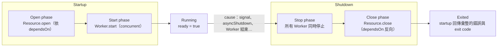
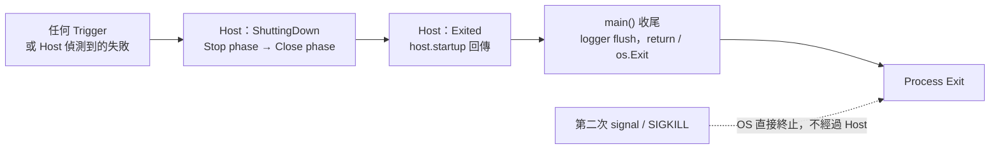
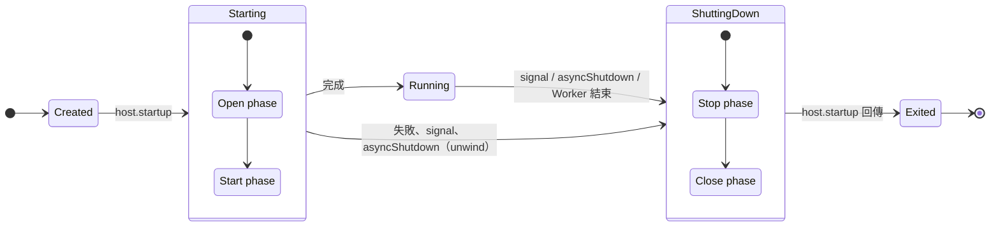
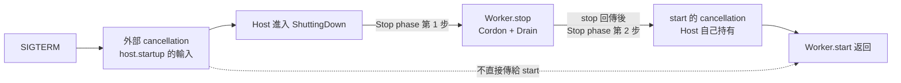
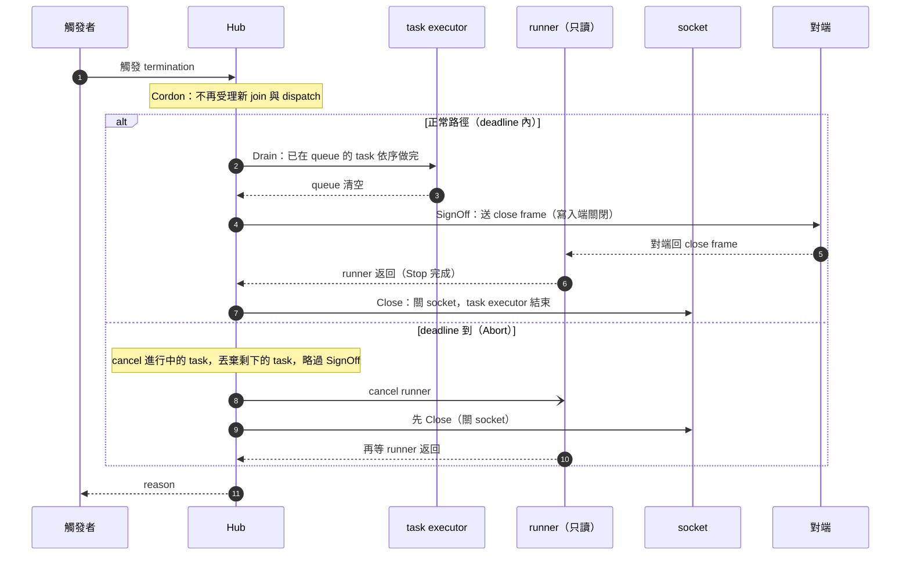
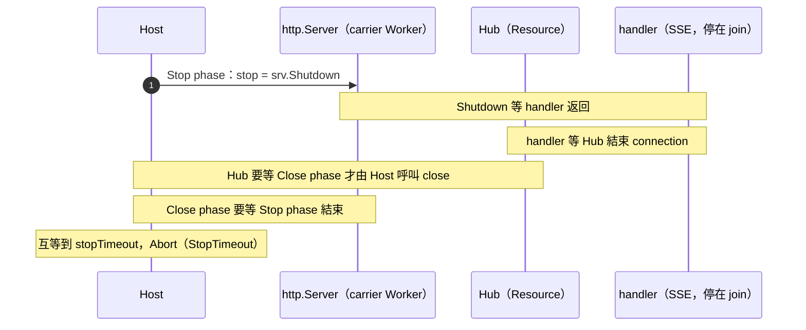

# App Lifecycle Spec v2.2

> 單一檔案、分層閱讀的規格書。
>
> - **Normative（必須遵守）**：
>   - Part B（Core）
>   - Part C（Hub）
>   - Part E（Conformance）
>   - §3.4 的 REQ-001 至 REQ-008（位於 Part A，但是 normative）
> - **Informative（說明與理由）**：
>   - Part A 其餘部分
>   - Part D（ADR）
> - **Binding（語言實作）**：Part F（Go）
>
> prose 與 Part E 的 TEST 衝突時，以 Part E 為準。
>
> ID 的種類與引用規則見 [ID types](#id-types)。

---

## 0. How to read this

**依讀者選路徑**

- App developer（只想把服務接上來）：
  - [§1 One-pager](#1-one-pager) → [§2 Quickstart](#2-quickstart-go) → [§3 User guide](#3-user-guide)
- Engine implementer：
  - §1 → [§4–§8 Core](#part-b-core-reference) → [§9 Hub](#part-c-hub) → [Part E](#part-e-conformance)
- Reviewer / architect：
  - §1 → [Part D ADR](#part-d-decisions) → [§7 Invariants](#7-invariants)
- Test author / 跨語言實作者：
  - §7 → [Part E](#part-e-conformance)
- Go 使用者：
  - §2 → [Part F](#part-f-go-binding)

**文件地圖**

- Part A　Getting started：§1 One-pager、§2 Quickstart、§3 User guide
- Part B　Core reference：§4 Model、§5 Host、§6 Worker stop 與 Consumer Helper、§7 Invariants、§8 Edge cases
- Part C　Hub：§9
  - core 沒有 Hub 專屬機制。
  - Hub 以 helper 註冊成一個 Resource 加一個 trigger Worker。
- Part D　Decisions：§10 ADR、§11 Known costs
- Part E　Conformance：§12 Spec by Example、§13 Unit-level checks 與 coverage
- Part F　Go binding：§14 Mapping 與 API、§15 Patterns、§16 Reference service、§17 Testing 與 layout
- Appendix：A Config reference、B Glossary、C Naming 與 errors、D Changelog

**Conventions**

- MUST / SHOULD / MAY 依 RFC 2119。
- 每條規則只有一個 Home：
  - 其他地方透過 ID 或 § 引用，不複述。
  - ID 的種類與規則見下方 [ID types](#id-types)。
- 語言：
  - prose 用 zh-TW，技術術語用 en-US。
  - 使用中文術語時附英文，例如請求型（request-driven）。
- 預設 time budget：
  - Host：`openTimeout` 15s、`stopTimeout` 15s、`closeTimeout` 10s。
  - Hub：`stopTimeout` 5s、`taskTimeout` 10s。

### ID types

每條規則只有一個 Home，其他地方透過 ID 或 § 引用，不重複定義。

**REQ-nnn（Requirement）**

- 規格要求：
  - 系統必須提供的行為。
  - 使用者（App developer）必須遵守的使用要求。
- 描述：
  - 系統需要提供什麼行為。
  - 使用者或業務期待的結果。
- Home：規則被陳述的那一節。
  - 已編號的使用者要求是 REQ-001 至 REQ-008，Home 在 [§3.4](#34-user-rules)。它們位於 Part A，但是 normative。
  - Host、Worker、Hub 的行為規則尚未逐條編號，以章節 `§` 為 Home（例如 `§5.5`）。
  - 需要時再補上 REQ 編號。

**INV-nnn（Invariant）**

- 系統永遠必須成立的不變條件。
- 描述：
  - 任何流程下都不能違反的限制。
  - 框架對狀態與資源生命週期的保證。
- Home：[§7](#7-invariants)。

**ADR-nnn（Architecture Decision Record）**

- 架構與技術決策紀錄。
- 描述：
  - 為什麼採用此設計。
  - 替代方案與取捨。
  - 決策的狀態（已決定、延後）。
- Home：Part D（[§10](#10-adr)）。

**TEST-…（Test）**

- 用途：驗證 REQ / INV 是否符合。
- 每個 REQ / INV 的驗證都必須涵蓋三類：
  - `N` = Normal，正常
  - `E` = Edge，邊界
  - `F` = Fail，失敗
- 缺少任何一類：
  - 代表測試審視尚未完成。
  - 不代表該規則沒有此情境。
- 子分類：
  - `TEST-N-nnn`：Normal，正常流程驗證。
  - `TEST-E-nnn`：Edge，邊界條件驗證。
  - `TEST-F-nnn`：Fail，失敗條件驗證。
  - `TEST-INTEGRATION-nnn`：跨模組整合驗證（Host、Worker、Hub 或外部元件的組合）。
- Home：Part E。
  - §12 放情境化案例，§13 放單項檢查。
  - 涵蓋狀況彙整在 [§13.5](#135-coverage)。

**編號與引用**

- 編號為三位數，例如 `REQ-001`、`INV-001`、`ADR-001`、`TEST-N-001`。
- 退役的編號不重用。
- Reference Rule：每條規則只有唯一來源（Single Source of Truth）。
  - 其他地方不得複製內容。
  - 只引用 ID 或章節，例如 `REQ-001`、`INV-001`、`ADR-001`、`TEST-N-001`、`§5.5`。
- `§` 在本文件專指章節編號，ID 引用不加 `§` 前綴。
- INV 與 TEST 是對 Home 規則的保證與驗證，不算另一份定義。

---

# Part A: Getting started

## 1. One-pager

### 1.1 What it is

`lifecycle` 是 language-agnostic 的 app lifecycle 管理模型。

- 元件只需要判斷自己是 **Resource**（被呼叫）還是 **Worker**（主動做事）。
- 其餘由 **Host** 決定：
  - startup / shutdown 的順序
  - time budget
  - unwind
  - 錯誤彙整

### 1.2 The model in eight lines

- **Resource**：被呼叫的元件（DB、cache、3rd-party client、Hub）。
  - 生命週期是 `open` → `close`。
  - 以 `dependsOn` 宣告依賴。
  - 沒有依賴關係的 Resource concurrent 執行。
- **Worker**：主動做事的元件（HTTP server、message loop、ticker）。
  - 生命週期是 `start` → `stop`。
  - Worker 之間 concurrent，沒有人依賴它。
- **Host**：startup 與 shutdown 互為鏡像。
  - startup = Open phase → Start phase。
  - shutdown = Stop phase → Close phase。
- **三層責任**：Trigger 提出請求，Host 協調，元件執行（[§4.3](#43-three-layers-and-the-exit-condition)）。
- **入口一對動詞**：
  - `host.startup`：阻塞到 Exited，只接收 cancellation。
  - `host.asyncShutdown`：立即返回，只提出請求。
- **exit code 只由 cause 決定**：
  - cause 是第一個讓 Host 結束正常運行的事件。
  - 之後發生的一切只記 log（[§5.5](#55-cause-and-exit-code)）。
- **Time budget**：
  - Open phase、Stop phase、Close phase 各有 budget，用盡即 Abort。
  - Close phase 一定執行（[§5.7](#57-abort-and-time-budget)）。
- **動態 connection 交給 Hub**：
  - Hub 以 helper 註冊成一個 Resource 加一個 trigger Worker（[§9](#part-c-hub)）。

### 1.3 Lifecycle at a glance



### 1.4 Goals / Non-goals

**Goals**

- 開發者只有兩個註冊動作：`registry.resource`、`registry.worker`。
- Resource 之間的順序由 `dependsOn` 推導，不需手動排序。
- 啟動失敗自動 unwind，每個等待都有上限。
- 長駐服務、CLI、測試共用同一套模型與 build 程式碼。
- Host 只接收 cancellation，不直接依賴 OS signal，所以可以直接測試。
- 任何具備 [§4.4](#44-required-language-primitives) primitive 的語言都能實作。

**Non-goals**

- 失敗後自動重啟（交給 k8s / systemd）。
- Reload：生命週期請求只有 startup request 與 shutdown request。
- 巢狀或動態的子 lifecycle：
  - 由元件自行管理，在 Host 只佔一個註冊。
  - Hub 即為此例。
- 從程式碼自動推導依賴。
- Host 層級的個別元件 timeout。
- request / message 級的資源管理：交給語言的 cancellation 與 scoped cleanup。
- 跨 process 的 push 路由。

---

## 2. Quickstart (Go)

最小可運作的服務包含三個元件：

- MySQL
- 一個依賴 MySQL 的 audit writer
- 一個 HTTP API

完整服務（WebSocket、Kafka）見 [§16](#16-reference-service)。

```go
func main() {
    logger, closeLog := newLogger(cfg.Log)
    ctx, stop := lifecycle.SignalContext(context.Background())

    host := lifecycle.NewHost(lifecycle.HostConfig{Logger: logger})
    err := build(host)
    if err == nil {
        err = host.Startup(ctx) // 阻塞到 Host 進入 Exited
    }

    stop()
    closeLog()                          // REQ-003；必須在 os.Exit 之前
    os.Exit(lifecycle.ExitCode(err))
}

func build(host *lifecycle.Host) error {
    reg := host.Registry()

    db, err := adapters.NewMySQL(cfg.MySQL)
    if err != nil {
        return err
    }
    reg.Resource("mysql", lifecycle.ResourceConfig{
        Open:  db.PingContext,
        Close: lifecycle.Closer(db),
    })

    audit := adapters.NewAuditWriter(db) // 內部有 flush goroutine
    reg.Resource("audit-writer", lifecycle.ResourceConfig{
        Close:     audit.FlushAndStop,   // flush 剩餘資料到 mysql
        DependsOn: []string{"mysql"},    // REQ-001：close 必須早於 mysql
    })

    srv := &http.Server{Addr: cfg.HTTP.Addr, Handler: newMux(db, audit, host.Ready)}
    reg.Worker("api", lifecycle.HTTP(srv)) // Start: ListenAndServe；Stop: srv.Shutdown
    return nil
}
```

**SIGTERM 之後發生什麼**

- `ready` 立即變 false。
- Stop phase：
  - `srv.Shutdown` 關閉 listener，並等 in-flight request 做完。
  - 之後 `api` 的 `Start` 返回，`http.ErrServerClosed` 屬正常。
- Close phase：
  - 先 `audit-writer.Close`（flush 進 mysql），再 `mysql.Close`。
  - 順序由 `DependsOn` 決定。
- `Startup` 回傳，exit code 為 0（cause 是 signal，屬請求型）。

---

## 3. User guide

### 3.1 Resource 還是 Worker？

**判斷方式**

- 有別人呼叫它 → **Resource**。
  - 可以有內部 concurrency unit（flush、health check）。
  - 條件：只處理呼叫者交辦的事，並在 `close` 時結束。
- 沒人呼叫、自己持續做事 → **Worker**。
  - 主動向外拉取工作的（message loop、ticker）一律是 Worker。
- 兩者都不是 → 一般物件，不註冊。

**限制與命名**

- Worker 之間不能有依賴。需要共用時，改成 Resource。
- 名稱在整個 Host 內唯一（Resource 與 Worker 共用），建議 kebab-case。
- Resource 以系統命名（`mysql`、`ws-hub`）。
- Worker 以做的事命名（`api`、`kafka-orders`）。

### 3.2 要不要設 `stop`？

判斷方式：看 `start` 卡住的那一行**接不接受 cancellation**。

- 不接受（`ListenAndServe`、gRPC `Serve`、accept loop）→ **設 `stop`**。
- 接受，但要先 Drain 再停 → **設 `stop`**。
  - 例：批次 Worker 先停止拉取，再寫完 in-flight 的批次。
- 接受，且手上單筆工作做完就能返回 → **留空**，以 cancellation 停止。
- Consumer：用 Consumer Helper。
  - `cordon` 有值才會產生 `stop`（[§6.5](#65-consumer-helper)）。

### 3.3 Hub 怎麼註冊？

- Hub 一律用 Hub registration helper 註冊（Go：`RegisterHub`）。
  - 它一次註冊 Hub 的 Resource 與一個 trigger Worker，兩者成對（[§9.5](#95-config-and-operations)）。
- 不要只用 `registry.resource` 手動註冊 Hub，因為沒有 trigger Worker：
  - SSE、gRPC streaming：Stop phase 會逾時（見 [§9.4](#94-interaction-with-host-the-trigger-worker)）。
  - hijack 的 WebSocket：行為仍正確，但 close frame 要到 Close phase 才送出。
- trigger Worker 是 helper 的實作細節，使用者不需要、也不應該手寫。

### 3.4 User rules

以下八條是對使用者的 normative 要求（REQ-001 至 REQ-008）。[Invariants](#7-invariants) 建立在它們之上。

- **REQ-001**　**在 `dependsOn` 宣告依賴**
  - Resource 在 `open`、執行期或 `close` 會呼叫的其他 Resource，都要列進去。
- **REQ-002**　**單筆工作用 detached context**
  - cancellation 代表「不再拿新工作」。
  - 它不是「中斷 in-flight work」。
- **REQ-003**　**logger 在 lifecycle 外層**
  - 由 entrypoint 建立。
  - `host.startup` 回傳後才 flush。
  - 不註冊為 Resource。
- **REQ-004**　**Hub 的 `dependsOn` 要列出 hook 與 task 會用到的 Resource**
  - 經 helper 傳入。
- **REQ-005**　**Hub 一律以 Hub registration helper 註冊**
  - Resource 與 trigger Worker 成對註冊，不得只手動註冊 Resource。
  - 否則 SSE、gRPC streaming 會讓 Stop phase 與 handler 互等到 `stopTimeout`。
  - Hub 會在第一次 `join` 以 Error 層級 log 提醒（見 [§9.6](#96-behavior-details)）。
  - carrier Worker 不需要、也不應該呼叫 Hub（[§9.4](#94-interaction-with-host-the-trigger-worker)）。
- **REQ-006**　**Hub 的 runner 只讀**
  - 寫入一律透過 `dispatch` / `broadcast`。
- **REQ-007**　**`start` 響應 cancellation 時，回傳 nil 或 `ctx.Err()`**
  - Consumer Helper 會替你做。
- **REQ-008**　**`stop` 必須在 ctx deadline 到時返回**
  - ctx 不會被 cancel，deadline 是唯一的結束訊號。
  - 底層呼叫不接受 ctx 時，自己包一層（範例見 [§15.1](#151-workerconfigstop)）。

### 3.5 Recipes

**自訂請求型（request-driven）shutdown 的 exit code**

- 預設：`asyncShutdown(err)`（err 非空）→ 1。
- 要對應成其他值，或讓某個 cause 以 0 結束：設定 `resolveExitCode`（[§5.5](#55-cause-and-exit-code)）。

**讓關閉階段的錯誤影響 exit code**

- 不使用 Host 決定的 exit code。
- 由 entrypoint 檢查 `host.startup` 回傳的錯誤。

**等 LB 移除 instance 再停**

- 做法一：k8s `preStop` 加 `sleep 5`。
- 做法二：在 HTTP Worker 的 `stop` 內等待後再 `Shutdown`（[§15.1](#151-workerconfigstop)）。
- 框架本身不提供。

**CLI / 一次性任務**

- 註冊 `oneshot` Worker（[§5.9](#59-oneshot)）。

**Consumer 要防 poison message**

- `handle` 的 panic 會讓服務崩潰（fail-fast）。
- 要讓它走 `onError`：在 `handle` 內自行 recover 並回傳錯誤。
- 風險與緩解見 [§6.5](#65-consumer-helper)。

**測試只需要 Resource**

- 不註冊 Worker 即可。
- Host 在 Open phase 完成後進入 Running（[TEST-E-001](#test-e-001-resource-only-host)）。

**回報 build 錯誤**

- `build` 回傳錯誤，不呼叫 `host.startup`。
- 不要用 `asyncShutdown` 回報 build 錯誤。

---

# Part B: Core reference

## 4. Model

### 4.1 Components

**Resource**

- config：`open`、`close`、`dependsOn`。
- 沒有 primary execution。
- 可以有只服務 resource channel 的 subordinate execution：
  - 例：flush、health check、Hub 的 task executor。
  - 它只處理呼叫者交辦的事，並在 `close` 時結束。
- 依賴方向是「呼叫」，不是控制。Resource 之間沒有直接控制關係。

**Worker**

- config：`start`、`stop`（可選）、`oneshot`。
- 啟動與停止的位置：
  - 最後啟動、最先停止。
  - 彼此 concurrent。
  - 沒有人依賴它。
- Worker 自己擁有的資源，在 `start` 內以 scoped cleanup 關閉，不是獨立的註冊單位。
  - 例：Consumer 的 subscription 由 `connect` 在 `start` 內建立，離開 `start` 時 `close(sub)`。

**Worker 的唯一例外：trigger Worker**

- Hub registration helper 會產生一個 trigger Worker（[§9.4](#94-interaction-with-host-the-trigger-worker)）。
- 它的 `start` 只等待 cancellation，`stop` 才是它存在的目的。
- 它只能由 helper 產生，使用者不手寫。

### 4.2 Resource channel and primary execution

元件的本質有兩種，各對應一組成對的 hook。

- **resource channel**：被建立、被持有、被釋放的東西（connection pool、file descriptor、socket）。
  - 對應 Open / Close。
- **primary execution**：主動做事、持續運行直到結束的那條 execution（Worker 的 `start`、connection 的 runner）。
  - 對應 Start / Stop。
  - 停止的完成條件是 execution 已不存在。
- **Shutdown** = 停止 primary execution → 關閉 resource channel。
  - 適用於 Host、Hub 或單一 connection 的整個停止過程。

**各單元怎麼 shutdown**

- Host：Stop phase（所有 Worker）→ Close phase（所有 Resource，`dependsOn` 反向）。
- Worker：
  - 停止 = Cordon → Drain，終點是 `start` 返回。
  - 關閉是 `start` 內的 scoped cleanup，框架不驅動。
- 一般 Resource：沒有 primary execution，停止為空；關閉 = `close`。
- connection 與 Hub：四個 step 全用（[§9.2](#92-the-four-steps-for-connections)）。

**同一個詞的寫法固定**

- **phase**（Host 的階段）：
  - 寫「Open phase」「Start phase」「Stop phase」「Close phase」。
  - 不寫單獨的 Start、Stop。
- **hook**（config 欄位）：
  - 寫 `open`、`start`、`stop`、`close`。
  - 可能與 phase 混淆時，寫明擁有者（例如「Worker 的 `stop`」）。
- **step**（停止流程的步驟）：Cordon、Drain、SignOff、Close step。
- **request**：startup request、shutdown request。
- 描述單一元件動作時，寫「停止」「關閉」，不寫單獨的 Stop、Close。

### 4.3 Three layers and the exit condition

**Trigger**：提出請求。

- 不管理元件，不改變 Host 的 state。
- startup request：entrypoint 呼叫 `host.startup`。
- shutdown request：
  - OS signal 由 entrypoint 轉成 cancellation。
  - HTTP handler、內部事件呼叫 `asyncShutdown(cause)`。
  - 或呼叫外部 cancellation 的 cancel（cause 為空）。

**Host**：決定何時開始、何時停止。

- 它是唯一能轉換 state 的一層。
- 入口只有 cancellation 與 `asyncShutdown`，不認識 signal 或 HTTP。
- 自己偵測到的 Worker 結束與 Open 失敗，也會觸發 shutdown，不經過 Trigger。

**元件**（Resource、Worker）：只接受 Host 驅動，不控制彼此。

一句話：Trigger 提出請求，Host 協調，元件執行。



**退出條件**

- **唯一的退出條件是 Host 已進入 Exited**，不是「是否收到 signal」。
- 收到 signal 只是 Trigger 的一種：
  - 它讓 Host 進入 ShuttingDown。
  - 它不會讓 process 直接結束。
- exit code 由 Host 依 cause 決定（[§5.5](#55-cause-and-exit-code)）。
- 第二次 signal 或 SIGKILL 不屬於正常退出路徑（[§5.7](#57-abort-and-time-budget)）。

### 4.4 Required language primitives

實作語言必須提供以下 primitive：

- **cancellation**：可附 deadline，傳給長時間執行的函式。
- **detached context**：
  - 從現有 cancellation 衍生。
  - 不受上游 cancel 影響。
  - 可另設 deadline。
- **concurrency unit**：同時執行多個 `start` 並等待結束。
- **scoped cleanup**：離開函式時一定執行。
- **panic / exception recovery**：轉成錯誤並附 stack。
- **error aggregation**：多個錯誤合成一個，仍可逐一比對。

**`ctx` 的意思**

- 本文的 `ctx` 泛指語言的 cancellation 加 deadline 載體。
- Go 的 `context.Context` 是其中一例，`ctx` 不是 Go 專屬概念。

**各語言對照**

- Go：context / goroutine / defer / recover / `errors.Join`
- Python：asyncio cancellation / task / try-finally / except / ExceptionGroup
- JVM：interrupt 或 coroutine Job / try-finally

---

## 5. Host

### 5.1 Entry points, states, phases

**Entry points**

- `host.startup(cancellation)`：startup request 的入口。
  - 呼叫後，Host 依序經歷 startup、Running、shutdown。
  - 阻塞到 Exited，回傳彙整的錯誤（帶 exit code）。
  - 只接收 cancellation。
- `host.asyncShutdown(cause)`：shutdown request 的入口。
  - 只提出請求，立即返回（語意見 [§5.5](#55-cause-and-exit-code)）。
- `host.ready()`：只反映 Host state（[§5.8](#58-signal-and-readiness)）。

**命名**

- `host.startup` 是整個生命週期的入口。
- 「startup = Open phase → Start phase」只是它的第一段流程。

**States**

- **Created**：只有此 state 允許註冊。
- **Starting**：執行 Open phase、Start phase。
- **Running**：`ready = true`。
- **ShuttingDown**：
  - 進入時立即 `ready = false`。
  - 執行 Stop phase、Close phase。
- **Exited**：`host.startup` 已回傳。

**Phases**

- **Open phase**：依 `dependsOn` 呼叫 Resource 的 `open`。
- **Start phase**：concurrent 啟動所有 Worker 的 `start`。
- **Stop phase**：對所有 Worker concurrent 停止。
- **Close phase**：依 `dependsOn` 反向呼叫 Resource 的 `close`。

**Time budget 的範圍**

- Open phase、Stop phase、Close phase 各有 time budget。
- Start phase 只 launch concurrency unit，沒有 budget。



- Starting 期間收到失敗、signal 或 `asyncShutdown`：
  - 直接進入 ShuttingDown。
  - 只停止並 close 已啟動的部分（[§5.4](#54-startup-failure-and-unwind)）。

### 5.2 Registry and registration errors

**註冊的時機**

- 只有 Created state 允許註冊。

**programming error**（註冊內容與依賴宣告的錯誤）

- 不 panic。Registry 依種類記錄錯誤。
- `host.startup` 一開始以彙整的錯誤回傳，**不啟動任何元件**。
- 好處：錯誤能走 structured logger 與 exit code 流程。

**錯誤種類**

- `InvalidResource`：
  - 重名。
  - `dependsOn` 指向不存在的名稱。
  - `dependsOn` 形成循環。
- `InvalidWorker`：
  - 重名。
  - 第二個 oneshot。
  - 必填欄位為空。

**補充**

- 名稱跨種類重名：錯誤種類依後註冊的那一個。
- `dependsOn` 的錯誤只能在 `host.startup` 時檢查，因為允許先註冊依賴者。

**其他註冊相關的規則**

- `host.startup` 之後註冊：
  - 該次註冊被忽略。
  - 錯誤寫 log，並加入 `host.startup` 回傳的錯誤。
  - 錯誤種類依被註冊的元件。
- 第二次 `host.startup`：回傳 `AlreadyStarted`。
- build 的錯誤不屬於 Host（[§5.5](#55-cause-and-exit-code)）。

### 5.3 Startup: Open phase and Start phase

註冊順序不影響執行順序。

**Open phase：執行順序**

- Resource 依 `dependsOn` 排序 `open`。
- 沒有依賴關係者 concurrent。
- 全部共用 `openTimeout`。
- 有依賴關係的 `open` 串成 critical path，所以 `openTimeout` 要涵蓋最長的那條鏈。

**Open phase：`open` 做什麼**

- `open` 可使用 `dependsOn` 列出的 Resource。
  - 例：`mysql` 宣告 `dependsOn: ["redis"]`，`mysql.open` 先讀 Redis 取得 DSN。
- `open` 建立自己的 resource channel（pool、ping、載入檔案）。
- `open` 也做 channel 建好之後的初始化（驗證 schema 版本、載入設定）。

**Open phase：不做什麼**

- 不檢查 3rd-party 服務。
- 不做一次性的共享狀態預熱。
  - 例：把資料寫進 Redis。
  - 這類工作不屬於 app 啟動流程，改用 [oneshot](#59-oneshot)。

**Open phase：失敗時**

- `open` 失敗時，要自行清理已建立的 channel。Open 失敗的那一個不會被 close。
- 失敗的 `open` 的依賴者，不會開始 `open`。

**Start phase**

- 所有 Resource `open` 完成後，才 concurrent 啟動 Worker。
  - 所以 Worker 不會看到未 open 的 Resource。
- Worker 啟動失敗（例如 port 衝突）：就是一般的 Worker 結束（[§5.5](#55-cause-and-exit-code)）。
- 沒有任何 Worker 是合法的：
  - Open phase 完成後直接進入 Running。
  - 等待 cancellation 或 `asyncShutdown`（[TEST-E-001](#test-e-001-resource-only-host)）。

### 5.4 Startup failure and unwind

**unwind**：啟動失敗時，依反向順序停止並 close 已啟動的部分（類比 stack unwinding）。

**Open 失敗時**（任一 `open` 回傳錯誤或 panic）

- Host cancel 進行中的 `open`，並且不再啟動尚未開始的 `open`。
- Host 等進行中的 `open` 全部返回後，才 close 已成功 open 的 Resource。
- 一定要等：不等的話，依賴者可能還在使用 dependency，dependency 卻已經被 close。
- 多個 Resource 同時失敗時，第一個成為 cause。

**Open phase 期間收到 signal 或 `asyncShutdown`**

- 一樣走 unwind，但 cause 是請求型（request-driven）。
- `open` 收到的 ctx 衍生自 `host.startup` 的 ctx。
  - 所以外部 cancellation 會直接 cancel 進行中的 `open`。
  - Worker 的 `start` 不同，見 [§6.2](#62-two-different-cancellations)。
- `open` 因 cancel 而回傳 cancellation 錯誤：視為正常，不列入錯誤。
- 被 cancel 但仍成功返回的 `open`：視為已 open，會被 close。
- 回傳錯誤的 `open`：不會被 close。

**unwind 的 close 怎麼算時間**

- 一律依 `dependsOn` 反向。
- 共用 `closeTimeout`，從 unwind 開始計時。
- Open 失敗不經過 Stop phase，所以不使用 `stopTimeout`。

**Worker 有沒有啟動，決定有沒有 Stop phase**

- Open 失敗，或 Open phase 期間收到 shutdown request：
  - Worker 從未啟動（包含 Hub 的 trigger Worker）。
  - 所以沒有 Stop phase。
- Start phase 期間收到失敗、signal 或 `asyncShutdown`：
  - 已啟動的 Worker 依 [§5.6](#56-shutdown-stop-phase-and-close-phase) 進入 Stop phase（共用 `stopTimeout`）。
  - 之後進入 Close phase（INV-004）。

### 5.5 Cause and exit code

這一節是 cause、Worker 結束判定、`asyncShutdown`、exit code 的唯一 home。

#### Cause

**定義**

- **cause** 是第一個讓 Host 結束正常運行（或結束啟動）的事件。
- 第一個事件成為 cause。之後的事件寫 log，並加入回傳的錯誤。

**請求型（request-driven）**：Trigger 提出的請求。

- cancellation（外部 signal）：cause 為空。
- `asyncShutdown(cause)`：cause 可為空，也可為使用者自訂的錯誤。
- oneshot 成功：cause 為空。

**失敗型（failure-driven）**：Host 偵測到的失敗，cause 是錯誤。

- Open 失敗（含 `open` panic）。
- Worker 在 shutdown 開始前結束：
  - 回傳 nil：記為 `UnexpectedExit`。
  - 回傳錯誤。
  - `start` panic。
  - oneshot 失敗：cause 為該錯誤。
- `Interrupted`：oneshot 尚未完成時收到 cancellation。
- programming error（[§5.2](#52-registry-and-registration-errors)）。

#### Worker 結束的判定

判定只看兩件事：shutdown 開始了沒有，以及 `start` 回傳什麼。

**shutdown 開始前結束**

- 一律視為異常，成為 cause。
- 若沒有錯誤（回傳 nil），記為 `UnexpectedExit`。

**進入 ShuttingDown 之後結束**，看 `start` 的回傳值：

- 正常（不列入錯誤）：nil、cancellation 錯誤、語言 mapping 明列的 sentinel。
- 其餘一律異常：
  - 加上元件名稱，列入回傳的錯誤。
  - **但不成為 cause。**
  - Drain 期間的真實錯誤也屬於這一類。

**補充**

- 有沒有設定 `stop`，不影響上面的判定。
- `stop` 還沒回傳、`start` 就先結束時，判定方式相同，Host 仍會等 `stop` 回傳。

#### `asyncShutdown(cause)`

**行為**

- 只提出請求就立即返回，不等 shutdown 完成。
- 返回只代表請求已提出。要等結果，看 `host.startup` 是否返回。

**為什麼不阻塞**

- 呼叫者常常正是 shutdown 要等的對象：
  - 管理端 HTTP handler：它是 `srv.Shutdown` 等待的 in-flight request。
  - Worker 的 concurrency unit：它是 Stop phase 等待返回的 `start`。
- 阻塞會讓兩邊互等到 `stopTimeout`。
- 對照 Hub 的 `shutdown(ctx)`：
  - 它由 Host 呼叫，Host 本來就要等它，所以可以阻塞。

**重複呼叫**

- 可重複、可並行呼叫。
- 只有第一個事件成為 cause。
- shutdown 開始後再呼叫：只寫 log。

**`cause` 參數**

- `asyncShutdown(nil)` 允許：
  - 代表任務順利完成、正常關閉。
  - 預設 exit code 0。
- `asyncShutdown(err)`（err 非空）：
  - err 成為 cause，並列入回傳的錯誤。
  - 預設 exit code 為 1。
  - 要改用 `resolveExitCode` 對應。
- cancellation 與 `asyncShutdown(nil)` 的 cause 都是空，無法互相區分。
  - 需要區分時，傳入使用者自訂的非空 cause（例如 sentinel）。
  - 再由 `resolveExitCode` 對應。

**在 `host.startup` 之前呼叫**

- cause 被記錄。
- `host.startup` 不啟動任何元件，直接以該 cause 回傳。
- 仍是請求型。

**注入方式**

- 以函式參照（Go 的 method value）注入需要它的元件。
- 元件不必 import `lifecycle`。

#### Exit code

一句話：exit code 只由 cause 決定，cause 之後發生的事只記 log。

**請求型 cause**

- 有設定 `resolveExitCode`：
  - 以 cause（可為空）呼叫它。
  - 回傳 exit code 就採用。
  - 回傳「沒有對應」就走預設。
- 預設：
  - 空 cause → 0。
  - 非空 cause → 1。非空 cause 本身也會列入回傳的錯誤。
- 想讓某個非空 cause 以 0 結束，必須在 `resolveExitCode` 明確回傳 0。
- `resolveExitCode` 的限制：
  - Host 進入 Exited 時，只對請求型 cause 呼叫一次。
  - 必須是純函式，不做 I/O、不阻塞。
  - panic 會依一般規則 recover 成錯誤，exit code 為 1。

**失敗型 cause**

- 錯誤自帶 exit code：取其值。
- `Interrupted`：130。
- 其他：1。

**cause 之後的事件**

- 包含 `StopTimeout`、`CloseTimeout`、`stop` / `close` 的錯誤、其他 Worker 的結束。
- 仍列入 `host.startup` 回傳的錯誤與 log，但**不影響 exit code**。
- 例：signal 觸發 shutdown，Stop phase 逾時。
  - exit code 0，錯誤與 log 含 `StopTimeout`。
- 例：Worker 因 port 衝突結束（cause），其他元件 close 失敗。
  - exit code 由 port 衝突的錯誤決定。
- 例：oneshot 被 Ctrl-C 中斷後，Stop phase 又逾時。
  - exit code 130。

**為什麼不區分啟動失敗與運作中失敗**（[ADR-002](#adr-002-exit-code-is-decided-by-cause-only)）

- Start phase 只 launch concurrency unit。
- Worker 失敗與 Host 轉為 Running 的先後不確定。
- 以 Running 為界線會有 race。穩定的界線是「cause 是誰」。
- 需要區分時，由 Worker 以自帶 exit code 的錯誤標明（例如 port 衝突回傳 exit code 2）。

**entrypoint 怎麼使用 `host.startup` 的回傳值**

- 回傳 nil：沒有錯誤，exit code 為 0。
- 回傳非 nil：
  - exit code 以 `ExitCode(err)` 為準。
  - 可能是 0（例如 cause 為空、關閉階段只有逾時）。
- `resolveExitCode` 回傳非 0 但沒有任何錯誤時：回傳一個只帶 exit code 的錯誤。

**build 的錯誤**（例如 config 讀不到）

- `build` 回傳錯誤，不呼叫 `host.startup`。
- 由 entrypoint 以 `ExitCode(err)` 處理：自帶 exit code 取其值，其他為 1。

### 5.6 Shutdown: Stop phase and Close phase

**Stop phase：整體**

- 進入時 `ready` 已為 false。
- 所有 Worker concurrent 停止，共用 `stopTimeout`。
- Resource 不會被 close，仍然存活。
- Stop phase 在所有 Worker 的 `start` 返回後結束。
- 用盡 `stopTimeout`：走 Abort。

**Stop phase：每個 Worker 的停止序列**

單向執行，不會反過來：

1. 設定了 `stop` 就先呼叫它，並等它回傳。沒有則略過。
2. 對 `start` 送出 cancellation。
   - 沒有 `stop` 時，它是唯一的停止訊號。
   - 有 `stop` 時，它只是保險。
3. 等 `start` 返回。

**Stop phase：Worker 之間**

- 各 Worker 的停止序列彼此沒有順序保證，因為 Worker 之間沒有依賴。
- 其中一個 `stop` 阻塞，不會延後其他 Worker 的 `stop`。
- Hub 的 connection 也在這個階段結束：
  - 由 Hub 的 trigger Worker 的 `stop` 觸發（[§9.4](#94-interaction-with-host-the-trigger-worker)）。

**Close phase**

- Resource 依 `dependsOn` 反向 `close`，共用 `closeTimeout`。
- 一個 Resource 要等所有依賴它的 Resource 都 close 後才 close。
- 無依賴關係者 concurrent。
- 每個 `close` 在獨立 concurrency unit 執行，並 recover。

**Exited**

- `host.startup` 回傳彙整的錯誤。
- logger 在 lifecycle 外層，`host.startup` 回傳後才 flush。
- 若語言的 process exit 會略過 scoped cleanup，收尾寫在它之前。

### 5.7 Abort and time budget

**Abort** 是 time budget 用盡時的升級，不是另一條路徑。

**Abort 的行為**

- 放棄等待該 phase（或該 connection termination）尚未完成的工作。
- 略過尚未執行的 SignOff。
- 繼續下一個 phase。
  - **Close phase 一定執行。**
  - 剩下的 `close` 仍會呼叫，並傳入已到期的 deadline。
- 錯誤含 `StopTimeout` 或 `CloseTimeout`。
  - 它們屬於關閉階段的錯誤，不影響 exit code。
- connection 的 Abort 見 [§9.3](#93-connection-termination-pipeline)。

**不屬於 Abort 的情況**

- 啟動失敗（unwind）。
- 使用者函式 panic（recover 成錯誤）。
- 第二次 signal 或 SIGKILL（process 直接終止）。

**Time budget**

```
stopTimeout + closeTimeout + log flush < terminationGracePeriodSeconds
Hub.stopTimeout < Host.stopTimeout
```

- 預設 15 + 10 = 25s，小於 k8s 預設 30s。
- Stop phase 的長度，是所有 Worker 的 `stop` 中最長的那個。
  - 含 Hub 的 trigger Worker 做的 termination。
- 在 Worker 的 `stop` 內加入等待時，要同步調高 `stopTimeout` 與 `terminationGracePeriodSeconds`。

### 5.8 Signal and readiness

**Signal**

- entrypoint 把 SIGINT、SIGTERM 轉為 cancellation。
- 第一次 signal 後立即解除攔截。
- 第二次 signal 走 OS 預設行為，直接終止 process。

**Readiness**

- `ready` 只反映 Host state：
  - 不檢查依賴健康。
  - 不代表 listener 已綁定，因為 Worker 無法在 Open phase 提前綁定 port。
  - shutdown 開始時立即轉 false。
- 不提供 liveness。
  - 原因：綁定依賴的 liveness 會在依賴短暫故障時引發整批重啟。

### 5.9 Oneshot

**基本規則**

- 一個 Host 最多一個 oneshot。
- 可與一般 Worker 共存。
- 任務完成後，其他 Worker 正常停止。

**結果與 cause**

- 成功：請求型，cause 為空。
- 失敗：cause 為該錯誤。
- 被 signal 中斷：`Interrupted`（130）。

**時間限制**

- `stopTimeout` 不限制任務執行時間。
- 需要上限時，在 `start` 內設 deadline。

**多個子指令**

- signal、logger、exit code 在最外層。
- 每個子指令各建一個 Host。

**寫 oneshot 的建議**

- 參數錯誤在建立 Host 前處理。
- 進度寫 stderr。
- 長任務定期檢查 cancellation。
- 設計成可重跑。

---

## 6. Worker stop and Consumer Helper

### 6.1 Cordon and Drain

Worker 只走兩個 step。Hub 的 connection 另有 SignOff 與 Close step，見 [§9.2](#92-the-four-steps-for-connections)。

- **Cordon**：我方停止「受理」新工作。
  - 新工作包含新 request、broker 新投遞的訊息。
  - 已受理的不受影響（借用 k8s `cordon`）。
  - listener、pull、subscription 都在這一步停止。
- **Drain**：讓已受理、尚未完成的工作（**in-flight work**）做完（借用「排乾」）。
  - Cordon 已擋住新的受理，所以不會再有新的進來。
  - in-flight work 用 detached context 做完。
  - Resource 仍可用。
- in-flight work 的例子：處理中的 HTTP request、已收到但還沒 ack 的訊息。

**Worker 沒有的東西**

- 沒有 SignOff。
- 沒有框架驅動的 Close step：`start` 返回即結束。

**完成條件**

- 停止的完成條件是 primary execution 已不存在（`start` 返回）。

### 6.2 Two different cancellations

Host 手上有兩個名字很像的 cancellation。

- **外部 cancellation**：`host.startup` 的輸入。
  - 唯一作用是通知 Host「開始 shutdown」。
- **`start` 的 cancellation**：Host 為每個 Worker 另外建立、自己持有。
  - Worker 的 `start` 收到的是這一個。
  - Host 只在 Stop phase 第 2 步（`stop` 回傳之後）才送出。
- 兩者沒有連動：SIGTERM 到達時，`start` 的 ctx 不會被 cancel。



**為什麼分開**（以設了 `cordon` 的 Consumer 為例）

- 如果合併（SIGTERM 直接 cancel `receive`）：
  - broker 已投遞、躺在 client 緩衝區的訊息，沒人處理。
  - 這些訊息要等 close 之後才重新投遞。
  - `stop` 裡的 Cordon 與 Drain 還沒做就結束了。
- 分開之後，流程是：
  1. Host 先呼叫 `stop`（`cordon` 取消訂閱）。
  2. `receive` 繼續收完緩衝區的訊息，並 `handle`。
  3. `stop` 回傳。
  4. Host 才送出 cancellation（此時 `start` 通常已返回）。
- 順序是 **Cordon → Drain → cancellation**，不能讓 cancellation 跑在前面。
- 沒有 `stop` 的 Worker 沒有這個問題，因為 cancellation 本身就是它的停止訊號。

**cancellation 的作用**

- 目的：告訴 `start`「不再拿新工作，然後返回」。
- 它不會中斷 in-flight work，單筆工作用 detached context 做完（REQ-002）。

**有設定 `stop`**

- Cordon 與 Drain 已經由 `stop` 完成，cancellation 只是保險。
- 保險在兩種情況下有用：
  - `start` 裡除了被 `stop` 解除的阻塞呼叫，還有接受 ctx 的其他迴圈或 concurrency unit。
  - `stop` 提前回傳錯誤：
    - Host 仍會送出 cancellation，接受 ctx 的 `start` 還有機會自己返回。
    - 沒有這份保險，`start` 只能等到 deadline 走 Abort。

**沒有 `stop`**

- cancellation 是唯一的停止訊號。
- `start` 裡接受 ctx 的阻塞呼叫因它返回，這就是 Cordon。
- 手上 in-flight 的那一筆用 detached context 做完，這就是 Drain。

**例：`http.Server`**

- `start` 是 `ListenAndServe`，不接受 ctx。
- `stop` 是 `Shutdown`：
  - 一被呼叫，`ListenAndServe` 就先返回。
  - `Shutdown` 繼續等 request 做完才回傳。
- `stop` 回傳後，Host 才送出 cancellation，此時 `start` 早已結束。

### 6.3 Two ways to stop

**`stop` 為空（預設）**

- Host 送出 cancellation。
- 阻塞呼叫因 cancellation 返回 = Cordon。
- in-flight work 用 detached context 做完 = Drain。
- `cordon` 為空的 Consumer 屬於這種。

**設定 `stop`**

- Host 呼叫 `stop()`（Cordon + Drain），回傳後才送出 cancellation。
- `cordon` 有值的 Consumer 屬於這種，Helper 替你產生 `stop`。

**共同點**

- 兩種最後都是 `start` 返回。
- 何時設定 `stop`：見 [§3.2](#32-要不要設-stop)。

### 6.4 `stop` semantics

**執行順序**

1. 呼叫 `stop`。
   - 傳入的 context 不會被 cancel。
   - deadline 是 Stop phase 的結束時間。
2. `stop` 回傳（或 deadline 到）後，才對 `start` 送出 cancellation。
3. 等待 `start` 結束。

**結果判定**

- `start` 結束的判定見 [§5.5](#55-cause-and-exit-code)。
- `stop` 自己的錯誤也列入結果。

**deadline**

- `stop` 必須在 ctx deadline 到時返回（REQ-008）。
- 忽略 deadline 的 `stop`：
  - Host 到期後放棄等待。
  - 它的 concurrency unit 留到 process 結束（[INV-010](#7-invariants)）。

**不該用 `stop` 做的事**

- 不用 `stop` 關閉 Worker 自己的資源：改用 scoped cleanup。
- 不用 `stop` 關閉共用資源：那是 Resource。

**`stop` 需要的物件在 `start` 內才建立時**

- Consumer：改用 Consumer Helper。`stop` 與 `start` 在 Helper 內共享 subscription。
- 非 consumer 的情況：自己用 closure 共享。

### 6.5 Consumer Helper

#### 它是什麼

- Consumer Helper 是 Worker `start` 的固定模板。
  - 以 `ConsumerConfig` 產生一個 `WorkerConfig`。
  - 仍以 `registry.worker` 註冊。
  - 沒有自己的停止模型。
- Helper 擁有 for loop，使用者只提供每一步的函式。
- ack / nack 與是否可重試屬於業務邏輯，由 `handle` 與 `onError` 決定。
- Kafka、AMQP、NATS 都適用。

**名詞與適用範圍**

- **consumer**：message loop 的角色（receive → handle），是一種 Worker。可用 Helper 產生，也可手寫。
- 模板固定「依序 receive → handle」。
- 批次、concurrent 處理或特殊停止順序套不進去時：
  - 多次呼叫 Helper，註冊多個 Worker。
  - 或手寫成一般 Worker。

#### 展開成 Worker

- `start`：固定迴圈，離開時 `close(sub)`（scoped cleanup）。
- `stop`：
  - `cordon` 為空：不產生 `stop`。
  - `cordon` 有值：產生 `stop`。
- `oneshot`：永遠 false。

```
connect → receive（start 的 ctx）→ handle（detached context）→ receive …
                                   └ 失敗 → onError：空或回傳空 → 繼續；回傳錯誤 → start 返回該錯誤
receive 回報 ok == false → start 返回 nil
任何路徑離開 start → close(sub)
```

#### Config

- `connect`：必填。
  - 在 `start` 內建立 subscription。
  - 刻意不叫 `open`，因為 `open` 保留給 Open phase 的 Resource hook。
- `receive(sub)`：必填。
  - 取得下一則訊息，或回報 subscription 已結束。
- `handle(sub, msg)`：必填。
  - 處理單筆，並自行決定是否 ack。
  - 收到 detached context。
- `onError(sub, msg, err)`：可為空。
  - 空：忽略並繼續下一則。
  - 收到與 `handle` 相同的 context。
- `cordon(sub)`：可為空。
  - 空：不產生 `stop`，cancel 阻塞中的 `receive` 就是 Cordon。
  - 有值：產生 `stop`。
- `close(sub)`：可為空。
  - 空：使用 subscription 本身的關閉方法（若有）。
- `handleTimeout`：可為 0。
  - 0：不另設 deadline。

#### `cordon` 有值時

**為什麼要有 `stop`**

- 只 cancel 本地的 `receive` 不夠：broker 仍持續投遞，訊息會留在 client 緩衝區。
- 設定 `cordon`（取消訂閱，通知 broker 停止投遞）之後：
  - Drain 是 `receive` 到 subscription 結束。
  - 並 `handle` 完已經收到的訊息。

**Helper 產生的 `stop`**

1. 若 `connect` 尚未完成，等它完成（或 ctx deadline）。
2. 若 `connect` 成功，呼叫 `cordon(sub)`。
3. 等 `start` 的迴圈結束，或 ctx deadline。
   - 迴圈結束的條件：`receive` 回報 `ok == false`，且最後一筆 `handle` 完成。

#### 規則

**停止方式**

- 只有 [§6.3](#63-two-ways-to-stop) 的兩種，Helper 不新增第三種。

**context 怎麼給**

- `receive` 直接使用 `start` 的 ctx。
- `handle` 與 `onError` 使用 detached context，`handleTimeout` 套用在其上。
- `cordon` 為空：
  - cancellation 是唯一停止訊號。
  - cancel `receive` 就是 Cordon。
- `cordon` 有值：
  - cancellation 要等 `stop` 回傳才送。
  - Drain 期間 `receive` 不會被 cancel，所以能收完緩衝區的訊息。

**`start` 結束的判定**

- 與一般 Worker 相同（[§5.5](#55-cause-and-exit-code)）。
- shutdown 開始前結束一律異常，包含 `receive` 回報 `ok == false`。

**`receive` 回傳錯誤時**

- `start` 的 ctx 已被 cancel：
  - `start` 返回 `ctx.Err()`，原錯誤寫 log。
  - library 把 cancel 翻成自己錯誤的差異，由 Helper 吸收。
- ctx 沒被 cancel：
  - 原錯誤原樣返回，並列入結果。

**`stop` 在 `connect` 完成前到達**

- 不進入迴圈。
- `connect` 若成功，仍會呼叫 `cordon`（若有）與 `close`。

**其他**

- 訊息依序處理。

#### panic 的處理（[ADR-011](#adr-011-consumer-panics-are-fail-fast)）

**行為**

- `receive`、`handle`、`onError` 發生 panic 時，不經過 `onError`，直接離開 `start`。
- Host 依 INV-011 recover 成帶元件名稱的錯誤，再依 [§5.5](#55-cause-and-exit-code) 判定。
  - shutdown 開始前發生就成為 cause（見 [TEST-F-004](#test-f-004-panic-isolation)）。
- 這是刻意的 fail-fast。

**風險**

- 會讓 `handle` panic 的訊息（poison message）使服務崩潰。
- 重啟後 broker 重新投遞同一則訊息，會再次 panic，形成 crash loop。

**緩解**

- 在 `handle` 內自行 recover 並回傳錯誤，它就會走 `onError`。
  - 例：送 DLQ 後回傳 nil。
- 依 broker 的能力設定重投遞上限或 DLQ。
  - Kafka 沒有內建，需要在應用層處理。
- 監控服務的重啟次數。

---

## 7. Invariants

遵守 [User rules](#34-user-rules) 的前提下，框架保證：

- **INV-001　static topology 固定**
  - `host.startup` 之後，Resource / Worker 集合不變。
  - connection 增減只發生在 roster。
- **INV-002　啟動順序**
  - Resource `open`（依 `dependsOn`）→ Worker（concurrent）→ ready。
- **INV-003　shutdown 順序**
  - not ready → Stop phase（所有 Worker 同時停止）→ Close phase（Resource `close`，`dependsOn` 反向）。
  - 每個 Worker 內：`stop` 回傳（或 deadline 到）先於對其 `start` 送出 cancellation。
- **INV-004　unwind**
  - 已啟動的都會被停止。
  - open 失敗的那一個不會被 close。
- **INV-005　下游存活**
  - dependency 比依賴者先完成 `open`、晚 `close`。
  - 所有 Resource 比所有 Worker 活得久。
- **INV-006　Stop phase 期間所有 Resource 都不會被 close**
  - Resource 與其 `dependsOn` 維持 open 到 Close phase。
  - Hub 在 trigger Worker 的 `stop` 開始後，停止受理新工作（`dispatch` 回傳 `NotAccepting`）。
  - connection 不是 Resource，它的 Close step 可以發生在 Stop phase。
- **INV-007　connection 的 Drain → SignOff → runner 返回 → Close step**
  - 已接受的 task 一定在 SignOff 前完成，之後不再執行 task。
  - runner 一定在 socket 關閉前返回。
- **INV-008　single writer**
  - 同一 connection 的 task 依序執行。
  - SignOff 不與 task 並行。
- **INV-009　exactly once**
  - 每個已 open 的 Resource 的 `close`，剛好一次。
  - 每條交給 `join` 的 connection 的 Close step，剛好一次。
- **INV-010　終止有界**
  - 每個等待都有 budget，用盡即 Abort 並繼續。
  - 例外：
    - 同時忽略 cancellation 與 connection close 的 runner。
    - 忽略 deadline 的 `stop`（REQ-008）。
  - 例外的 concurrency unit 留到 process 結束，但 `shutdown` 與 `host.startup` 仍會返回。
- **INV-011　exception isolation**
  - 使用者函式 panic 轉為帶元件名稱與 stack 的錯誤。
  - 單一 connection 的 panic 只結束該 connection。
- **INV-012　exit code 由 cause 決定**
  - 請求型：經 `resolveExitCode`。
    - 無對應時：空 cause → 0，非空 cause → 1。
  - 失敗型：依錯誤本身。
  - 關閉階段的錯誤不影響 exit code。

**Abort 的影響**

budget 用盡走 Abort 時：

- INV-005 不保證：
  - 被放棄的 Worker 可能用到已 close 的 Resource。
  - Close phase 逾時時，dependency 可能早於依賴者 close。
- INV-007 不保證。
- INV-006 不受影響。

**Coverage**

- 各 INV 與 REQ 在 N / E / F 三類的測試涵蓋，彙整在 [§13.5](#135-coverage)。

---

## 8. Edge cases (Host)

規則的 home 在各節。這裡只列容易被問到的情況與出處。

- `host.startup` 之前呼叫 `asyncShutdown`：[§5.5](#55-cause-and-exit-code)。
- 啟動前或啟動中收到 signal 或 `asyncShutdown`：[§5.4](#54-startup-failure-and-unwind)。
- `stop` 尚未回傳，`start` 就先結束：[§5.5](#55-cause-and-exit-code)。
- 沒有任何 Worker：[§5.3](#53-startup-open-phase-and-start-phase)。
- 名稱跨種類重名：[§5.2](#52-registry-and-registration-errors)。
- 被放棄的 Worker（Abort 之後）在 Close phase 用到已 close 的 Resource：
  - 錯誤只寫 log。
  - 原因：INV-005 在 Abort 後不保證。

---

# Part C: Hub

> Hub 在模組內邏輯獨立：**Hub 核心不引用 Host 或 Registry**。
>
> - Hub 與 Registry 唯一的連接是 Hub registration helper（[§9.5](#95-config-and-operations)），它放在 Hub 核心之外。
> - core（Part B）沒有任何 Hub 專屬機制。
> - 對 Host 來說，Hub 只是一個 Resource 加一個 trigger Worker（[§9.4](#94-interaction-with-host-the-trigger-worker)）。
> - 只讀 Part B 的人可以跳過這一整個 Part。

## 9. Hub

### 9.1 Why Hub and where it sits

**為什麼需要 Hub**

- Host 管 static topology。
- WebSocket、SSE、gRPC streaming 的 connection 在執行期隨時增減，不能逐一向 Host 註冊。
- Hub 集中管理這些 dynamic connections，不影響 static topology。

```
Host  ← static topology：host.startup 之後不再增減
├── Resource
│   ├── mysql、redis、3rd-party client
│   └── Hub
│       └── roster  ← dynamic connections，不向 Host 註冊
└── Worker
    ├── HTTP server：WebSocket / SSE handler 以 join 交給 Hub（carrier Worker）
    ├── message loop：需要時經 Hub dispatch
    ├── ticker loop
    └── ws-hub-shutdown：helper 註冊的 trigger Worker，與 Hub 成對
```

**Hub 的位置**

- Hub 是 static topology 與 dynamic connections 唯一的接點。
  - 對 Host：它是 Resource（`close` 即 Hub 的 `shutdown`）。
  - 內部：以 roster 管 connection。
- **Hub 是 Resource 中唯一的特例**：
  - 它管理的 connection 擁有 execution（runner）。
  - 所以 `close` 必須先停止這些 execution，實作是 `shutdown`。
  - Host 在 Close phase 呼叫 `close`，等於呼叫 `hub.shutdown`。

**怎麼註冊**

- 以 Hub registration helper 註冊，一次註冊兩個元件：
  - 一個 Resource（`close` = `shutdown`）。
  - 一個 trigger Worker（`stop` = `shutdown`）。
- trigger Worker 的作用：使 termination 在 Stop phase 一開始就進行（見 [§9.4](#94-interaction-with-host-the-trigger-worker)）。

**Hub 的名詞**

- **roster**：Hub 內部的 connection 名冊（不指 Hub 本身）。
- **runner**：connection 的讀取迴圈。
  - 只讀。
  - 是 connection 的 primary execution。
- **task**：派發給 connection 的寫入工作。
- **task executor**：依提交順序逐一執行 connection 的 task 的 concurrency unit。
  - 屬於 `close` 時結束的 subordinate execution。
- **termination**：Hub 對單一 connection 走完四個 step 的過程。
  - 保證 Close step 剛好一次。
- **reason**：connection 的終止原因。對應 Host 的 cause。
- **push**：經 Hub 送給 client 的資料。
- **carrier Worker**：handler 以 `join` 把 connection 交給 Hub 的 Worker。
  - 例：WebSocket / SSE 的 HTTP server、server streaming 的 gRPC server。
- **shutdown（Hub）**：Hub 自己的停止與關閉（對每條 connection）。
  - `shutdown(ctx)` 阻塞。
  - 可重複、可並行呼叫：第一次觸發，其餘只等待。

### 9.2 The four steps for connections

只有同時有 execution 與 resource channel 的單位，才走完四個 step，也就是 Hub 管理的 connection。

- resource channel：socket。
- execution：runner。

**四個 step**

- **Cordon**：我方停止「受理」新工作（新 connection、新 `dispatch`），已受理的不受影響。
  - 只管是否受理，不管 stream 的讀寫。
  - runner 在 Drain 期間仍讀得到對端訊息。
  - 其回覆若經 `dispatch`，會被 `NotAccepting` 拒絕（[ADR-008](#adr-008-dispatch-is-rejected-from-the-stop-phase)）。
- **Drain**：讓已受理、未完成的工作做完（已排進 queue 的 task）。
  - runner 讀到的 inbound 訊息不是 Drain 的等待對象。
- **SignOff**：我方關閉 stream 的**寫入端**，宣告之後不再傳送。
  - 讀取端仍開著，等對端回應。
  - 可省略。
- **Close step**：同時關閉讀寫兩端，銷毀自己擁有的 resource channel。

**完成條件**

- 停止的完成條件是 runner 返回。
- Close step 在停止完成之後，才關閉 resource channel。Abort 除外。

**Cordon 與 SignOff：差別是方向**

- Cordon 管「受理」：
  - 不碰已建立 stream 的讀寫。
  - 例：HTTP/2 GOAWAY（請不要再對我開新 stream）。
- SignOff 管「傳送」：
  - 已建立的 stream 上停止傳送資料。
  - 例：WebSocket close frame（我不會再傳資料了）。
  - 它是應用層的 half-close（類似 TCP `shutdown(SHUT_WR)`）。
  - 對端回 close frame 是協定的連帶行為，不是請求。
- 兩者都可能通知對端，所以不能用「有沒有通知」分類。

**SSE 的情況**

- SSE 是單向流，SignOff 只是寫一個下線事件。
- 防止 client 自動重連打回來的是 Cordon：
  - Hub 不再接受 `join`。
  - 加上 `ready = false`，讓 LB 不再導流。

**順序**

- close frame 之後不可再送資料（RFC 6455）。
- 所以 SignOff 在 Drain 之後。

**各單位走哪些 step**

- Worker：Cordon → Drain，由 Host 在 Stop phase 觸發。
- 一般 Resource：只有 Close step，由 Host 在 Close phase 呼叫 `close`。
- Hub：對每條 connection 走完四個 step。
  - trigger Worker 的 `stop`（= `shutdown`）讓它在 Stop phase 開始時提早觸發。
  - Close phase 的 `close`（第二次呼叫）只等待殘留的 connection，到期 Abort。

### 9.3 Connection termination pipeline

shutdown(connection) = 停止流程 → Close step。

```
Opening ─open 成功→ Live ─觸發→ Stop：Cordon → Drain → SignOff → runner 返回
   │                                                      └ SignOff 之後 cancel runner 並等它返回
   │                           → Close：關 socket、task executor 結束
   ├─ open 失敗 → Close（runner 尚未啟動，Stop 為空，不呼叫 signOff）
   ├─ open 期間 Hub 開始 shutdown → SignOff（reason = ShuttingDown）→ Close（runner 尚未啟動）
   └─ join 時 Hub 已在 shutdown → Close（回傳 NotAccepting，不呼叫 signOff）
                      deadline 到 → Abort：略過 SignOff，cancel runner，先 Close（關 socket），再等 runner 返回
```

**觸發 termination 的事件**

- `kick`
- 頂替（同 id 新 connection）
- `shutdown`
- runner 結束
- 對端斷線
- queue 滿
- panic



**設計理由**（[ADR-010](#adr-010-termination-order-stop-before-close-step)）

- **open 成功才登記 roster**：
  - open 期間不會有 task 寫入。
  - 失敗也不會頂替舊 connection。
- **runner 只讀**：
  - 寫入一律是 task。
  - 同一 connection 依提交順序執行。
- **停止先於 Close step**：
  - 等 runner 返回再關 socket，runner 不會讀到已關閉的 socket 而產生雜訊錯誤。
  - `join` 回傳時，也保證 runner 已結束。
- **SignOff 在 cancel runner 之前**：
  - 有些 library 在 read 被 cancel 時，會自行 close connection。
- **每條 connection 獨立走完**：
  - 不互相拖累，不用全域 barrier。

### 9.4 Interaction with Host: the trigger Worker

#### 問題

**前提**

- Hub 是 Resource，依 INV-005 它比所有 Worker 活得久。
- Host 要到 Close phase 才呼叫它的 `close`（= `shutdown`）。

**兩類 connection**，差別在 server 有沒有把 handler 視為 in-flight work：

- **server 追蹤型**：SSE、gRPC server streaming。
  - handler 停在 `join`，屬於 `http.Server` / gRPC server 的 in-flight work。
  - `srv.Shutdown`、`GracefulStop` 會等它返回。
- **hijack 型**：被 server 接管的 WebSocket。
  - 不再是 in-flight work，`srv.Shutdown` 不等它。

**各自的後果**

- server 追蹤型：四方互等，直到 `stopTimeout` 走 Abort。
  - Stop phase 等 handler。
  - handler 等 Hub。
  - Hub 等 Close phase。
  - Close phase 等 Stop phase。
- hijack 型：不會互等，但 Hub 若只在 Close phase 才開始 termination：
  - client 會晚收到 1001。
  - connection 會佔用 `closeTimeout`。

**根本原因**

- Host 只有 Worker 的 `stop` 會在 Stop phase 一開始被呼叫。
- Resource 沒有這個時機。



#### 解法

Hub 以 Hub registration helper 註冊，一次註冊兩個元件，兩者成對（[§9.5](#95-config-and-operations)）。

**Resource**（名稱 `<name>`）

- `close` = `hub.shutdown`。
- `dependsOn` 由使用者經 helper 傳入（REQ-004）。

**trigger Worker**（名稱 `<name>-shutdown`）

- 存在的理由：利用 Worker 的 `stop` 會在 Stop phase 一開始被呼叫這件事。
- `start`：
  - 阻塞到收到 cancellation。
  - 之後回傳 nil 或 `ctx.Err()`。
  - 不做其他任何事。
- `stop`：
  - 呼叫 `hub.shutdown(ctx)`。
  - 阻塞到所有 connection 走完 Close step（或 Abort）。
- 它不會在 shutdown 前自行結束。若結束，依 [§5.5](#55-cause-and-exit-code) 是 `UnexpectedExit`。

**與其他 Worker 的時序**

- 它的 `stop` 與其他 Worker 的 `stop` 同時開始（[§5.6](#56-shutdown-stop-phase-and-close-phase)），例如 carrier Worker 的 `srv.Shutdown`。
- 所以 connection 的 termination 與 carrier Worker 的停止同時進行。
- Close phase 的 `close`（第二次 `shutdown`）只等待殘留的 connection。

**定位**

- 這個 Worker 是 Worker 定義（主動做事）的唯一例外。
- 它只能由 helper 產生，使用者不手寫（[ADR-003](#adr-003-hub-shutdown-is-triggered-by-a-helper-registered-worker)）。

#### 使用規則

**一律用 helper 註冊（REQ-005）**

只手動註冊 Resource 時，沒有 trigger Worker：

- server 追蹤型（SSE、gRPC streaming）：
  - Stop phase 逾時。
  - 見 [TEST-INTEGRATION-001](#test-integration-001-sse-and-the-stop-phase-deadlock) 的 variant。
- hijack 型（WebSocket）：
  - 仍正確。
  - 但 termination 晚到 Close phase 才開始，client 晚收到 1001，並佔用 `closeTimeout`。
  - 見 [TEST-INTEGRATION-002](#test-integration-002-termination-timing-of-hijacked-websocket) 的 variant。

**偵測漏用 helper**

- 漏用 helper 時，Hub 在第一次 `join` 以 Error 層級寫 log 提醒，不阻止運作（[§9.6](#96-behavior-details)）。
- 只能在 `join` 偵測，原因：
  - 手動註冊時 Hub 不知情。
  - 它只是一個被當成函式傳出去的 `shutdown`，啟動時沒有任何機會檢查。

**已接受的取捨**（[ADR-008](#adr-008-dispatch-is-rejected-from-the-stop-phase)）

- trigger Worker 的 `stop` 開始後，Stop phase 期間 Hub 不再受理 `dispatch` 與 `broadcast`。
- 一律被 `NotAccepting` 拒絕，包括：
  - consumer 在 Drain 時處理的最後一批訊息。
  - 處理中的 HTTP request（例如 `POST /notify`）。
- 不保證送達。
- 這類 client 本來就靠重連補資料（例如 SSE 的 `Last-Event-ID`）。

**其他**

- carrier Worker 不需要、也不應該呼叫 Hub。
- `Hub.stopTimeout < Host.stopTimeout` 仍須成立（[§5.7](#57-abort-and-time-budget)）。

#### 執行流程

```
Stop phase ：所有 Worker 的 stop 同時開始
             api              ：srv.Shutdown（等 in-flight request）
             ws-hub-shutdown  ：stop = Hub.shutdown → 每條 connection Stop（Cordon → Drain → SignOff → runner 返回）→ Close
             → server 追蹤型：handler 全部返回 → srv.Shutdown 回傳
               hijack 型：srv.Shutdown 不等它，由 ws-hub-shutdown 的 stop 等到它們走完
             → 所有 Worker 的 stop 返回、cancellation 送出、所有 start 返回，Stop phase 結束
Close phase：ws-hub.close（= Hub.shutdown，第二次呼叫，只等待殘留的 connection）
```

### 9.5 Config and operations

**Config**

- `open(conn)`：可為空。
  - 空：不做 handshake。
- `signOff(conn, reason)`：可為空。
  - 空：略過 SignOff。
  - reason 為空代表 runner 正常結束。
- `close(conn)`：可為空。
  - 空：使用 connection 本身的關閉方法（若有）。
- `queueSize`：0 → 256。
- `taskTimeout`：0 → 10s。
  - 套用於 `open` 與每個 task。
- `stopTimeout`：0 → 5s。
  - 範圍是 Cordon 到 Close step。
- `logger`：可為空。

**Operations**

- `join(peerCancellation, id, conn, runner) → reason`
  - 取得 conn 的所有權。
  - 在呼叫端阻塞執行 runner，直到 connection 完全關閉。
- `kick(id, reason)`、`kickMany(ids, reason)`
  - 觸發 termination，立即返回。
  - reason 為空時用 `Kicked`。
  - 不在 roster 時回傳 `ConnNotFound`（Opening 中的 connection 也不在 roster，見 [§9.8](#98-kick-and-opening-connections)）。
- `dispatch(ids, maxConcurrency, task)`、`broadcast(maxConcurrency, task)`
  - 排入 queue，立即返回。
  - shutdown 後回傳 `NotAccepting`。
- `exists(id)`
  - 只反映 roster（Live 的 connection）。
- `shutdown(ctx)`
  - 停止接受 `join` 與 dispatch。
  - 觸發所有 connection 的 termination。
  - 阻塞到所有 connection 走完 Close step。
  - ctx 到期或被 cancel：Abort 剩餘的 connection。
  - 可重複、可並行呼叫。

**Hub registration helper**

- 形式：`registerHub(registry, name, hub, options)`。
  - `options` 目前只有 `dependsOn`（REQ-004）。
- 效果是兩次註冊，加上把 Hub 標記為已註冊（registered）：
  - `registry.resource(name, { close: hub.shutdown, dependsOn })`
  - `registry.worker(name + "-shutdown", { start: 等待 cancellation 後返回, stop: hub.shutdown })`
  - 標記 `registered`：供 `join` 偵測沒有成對註冊的情況（[§9.6](#96-behavior-details)）。
- 它是 Hub 與 Registry 唯一的連接。
  - 放在 Hub 核心之外。
  - Hub 核心仍不引用 Registry。
- 它是「Helper 不接收 Registry」慣例的例外：
  - 原因：兩個註冊必須成對，不能交給使用者各寫一半。
  - 它沒有新增註冊動作，內部仍只呼叫 `registry.resource` 與 `registry.worker`。
- 名稱衝突（Resource 或 Worker 重名）依 [§5.2](#52-registry-and-registration-errors) 回報。

### 9.6 Behavior details

#### join

**依情況回傳**

- Hub 已在 shutdown：close conn，回傳 `NotAccepting`。
- `open` 失敗（`taskTimeout`）：close conn，回傳錯誤。
- `open` 期間 Hub 開始 shutdown：
  - `signOff(ShuttingDown)` → close。
  - 回傳 `NotAccepting`。

**正常路徑**

1. 登記 roster（同 id 舊 connection 以 `Replaced` 終止）。
2. 啟動 task executor。
3. 執行 runner。
4. termination。
5. 回傳 reason。

**保證**

- `join` 一經呼叫，conn 的 `close` 保證剛好一次。

**偵測漏用 helper**

- 條件：Hub 沒有被標記為 registered（不是經 helper 註冊）。
- 行為：第一次 `join` 以 Error 層級寫一則 log。
  - 事件名稱：`hub.not_registered`。
  - 每個 Hub 最多寫一次（並行的 `join` 也只寫一次）。
  - `join` 照常運作，不回傳錯誤。
- 在 Host 外單獨使用 Hub（例如 Hub 的單元測試）也會寫這則 log，可以忽略。目前沒有關閉開關。

#### Termination

**deadline**

- 每條 connection 的 deadline = 觸發時間 + `stopTimeout`。
- 任何一次進行中的 `shutdown` 呼叫，其 ctx 到期或被 cancel 時，尚未結束的 connection 也立即 Abort。

**Abort 的動作**

1. cancel 進行中的 task。
2. 丟棄剩下的 task。
3. 略過 SignOff。
4. cancel runner。
5. close。
6. 再等 runner 結束。

**SignOff 與 reason**

- `signOff` 對每種 reason 都會被呼叫，是否真的送出由使用者決定。
- reason 的種類：
  - `kick` 給的值（空時 `Kicked`）
  - `Replaced`
  - `ShuttingDown`
  - `Disconnected`（`peerCancellation` 觸發，例如 HTTP request 的 cancellation）
  - runner 的錯誤（正常結束為空）
  - `SlowConnection`
  - panic 錯誤

#### Dispatch

**執行順序與並行**

- 同一 connection 的 task 依提交順序逐一執行。
- 不同 connection concurrent。
- `maxConcurrency` 限制單次呼叫的 concurrent 數。
  - 各次呼叫分開計算。
  - ≤ 0 不限制。

**timeout**

- task 有 `taskTimeout`。
- termination 開始時不 cancel task，只有 deadline 到才 cancel。

**失敗**

- queue 滿：該 connection 以 `SlowConnection` 終止（不做無上限的 buffer）。
- task 錯誤：寫 log。
- task panic：結束該 connection。

#### Exception isolation

- `open` panic：視為 open 失敗。
- runner / task panic：以帶 stack 的錯誤終止該 connection。
- `signOff` panic：視為錯誤，繼續 close。
- `close` panic：寫 log。

### 9.7 Protocol mapping

- **WebSocket，close frame 與關 socket 分開的 library**
  - `signOff` 送 close frame。
  - `close` 關 socket。
- **WebSocket，兩者合一的 library**
  - 合一的呼叫放 `signOff`。
  - `close` 用不做 handshake 的強制 close。
- **SSE**
  - runner 等待 cancellation。
  - `signOff` 寫下線事件並 flush。
  - `close` 留空。
- **gRPC server streaming**
  - runner 等待 cancellation。
  - `signOff` 送最後一則訊息，或留空。

### 9.8 kick and Opening connections

**事實**

- Hub 只在 `open` 成功後才登記 roster。
- `open`（handshake）最長 `taskTimeout`。這段期間 connection 是 Opening，不在 roster。
- `kick`、`kickMany`、`exists` 只看 roster，對 Opening 中的 connection 一律當作「不存在」。
- `ConnNotFound` 的意思是「不在 roster」，不等於「不在線上」。

**會發生什麼**

```
t0  user-42 通過 auth，Upgrade 完成，join 開始，open（handshake）進行中
t1  管理端封鎖 user-42，呼叫 kick("user-42") → ConnNotFound（不在 roster）
t2  open 成功，登記 roster → user-42 Live，被封鎖的使用者連上線了
```

**決定**（[ADR-007](#adr-007-kick-does-not-track-opening-connections)）

- 不改 Hub 的機制。
- `kick` 的語意只涵蓋已 Live 的 connection。
- 封鎖由驗證層負責。

**封鎖的做法**

1. 先寫入封鎖狀態，再呼叫 `kick`。
   - 封鎖狀態是 source of truth（例如 DB 或 Redis）。
   - 順序不能反過來。
2. handler 在 Upgrade 之前的驗證檢查封鎖狀態，擋住之後新的連線。
3. 補洞：在 Hub 的 `open(conn)` hook 內再檢查一次。
   - 回傳錯誤時，`join` close conn 並回傳該錯誤。
   - 該 hook 用到的 Resource 要列進 Hub 的 `dependsOn`（REQ-004）。
4. 硬保證：`kick` 回傳 `ConnNotFound` 後，等 `taskTimeout` 加一小段餘裕，再 `kick` 一次。
   - 封鎖狀態寫入之後才開始的 `open` hook，會被第 3 步擋下。
   - 在寫入之前就開始 hook 的 connection，最晚在寫入後 `taskTimeout` 內 `open` 結束。
   - 它不是登記進 roster，就是失敗，所以第二次 `kick` 一定看得到它。

**沒做到的**

- 只做第 1、2 步：
  - 已通過 auth、尚在 handshake 的 connection 會短暫連上線。
  - 最長一個 `taskTimeout`，直到下一次 `kick`。
- 做到第 3 步但沒有第 4 步：
  - 仍有一個極小的空窗。
  - 空窗介於 `open` hook 檢查完與登記 roster 之間。
- 若需要不靠重試的保證：
  - 必須讓 Hub 追蹤 Opening 中的 id。
  - `kick` 命中時，在 `open` 完成後立刻以 `Kicked` 終止。
  - 目前不採用。

### 9.9 Edge cases (Hub)

- 同 id 快速重連：open 成功才頂替。
- 頂替與 `kick` 同時發生：只觸發一次，reason 為先到者。
- `shutdown` 之後才 `join`：close 後回傳 `NotAccepting`。
- Hub 只以 `registry.resource` 手動註冊（沒有 trigger Worker）：
  - 見 [§9.4](#94-interaction-with-host-the-trigger-worker) 的使用規則。
  - 見 [TEST-INTEGRATION-001](#test-integration-001-sse-and-the-stop-phase-deadlock)、[TEST-INTEGRATION-002](#test-integration-002-termination-timing-of-hijacked-websocket) 的 variant。
- `kick` 時 connection 還在 Opening：
  - 回傳 `ConnNotFound`。
  - connection 之後仍會登記成功（[§9.8](#98-kick-and-opening-connections)）。

---

# Part D: Decisions

每個 ADR 只記 Context、Decision、Consequences。規則本身的 home 在 Part B / C，這裡不複述。

## 10. ADR

### ADR-001 Two cancellations are kept separate

- **Context**：
  - SIGTERM 若直接 cancel `start`，`start` 會在 `stop` 之前被 cancel。
  - Cordon → Drain 的順序因此被破壞。
- **Decision**：
  - Host 自己持有每個 Worker `start` 的 cancellation。
  - 只在 Stop phase 第 2 步送出（[§6.2](#62-two-different-cancellations)）。
- **Consequences**：
  - Worker 的停止順序固定為 Cordon → Drain → cancellation。
  - 代價：使用者需要理解「外部 cancellation」與「`start` 的 cancellation」是兩個東西。

### ADR-002 Exit code is decided by cause only

- **Context**：
  - 多個事件幾乎同時發生（Worker 崩潰與 signal）時，exit code 不能依賴誰的 log 先印出來。
  - 一次乾淨的 signal 關閉，也不該只因 Stop phase 逾時就被視為失敗。
- **Decision**：
  - 只有第一個讓 Host 結束正常運行的事件（cause）決定 exit code。
  - cause 之後的一切只記 log，並列入回傳的錯誤（[§5.5](#55-cause-and-exit-code)）。
  - 不區分啟動失敗與運作中失敗。
- **Consequences**：
  - 不會因 Running 界線的 race 而不穩定。
  - 關閉階段的錯誤只能從 log 與回傳的錯誤看到。需要時由 entrypoint 自行檢查。
  - 請求型 shutdown 的預設：空 cause → 0，非空 cause → 1。要改成其他值，設定 `resolveExitCode`。

**`resolveExitCode` 保留（v2.1 決定）**

- 若改成由 entrypoint 各自 `errors.Is` 判斷：
  - 長駐服務、每個 CLI 子指令、測試都要重複同樣的 cause → exit code 對應。
  - 「exit code 由 Host 決定」的保證也會變弱。
- 放在 `HostConfig` 只需定義一次，所有 entrypoint 共用同一份。
- 代價：
  - 多一個 hook。
  - 它的限制：純函式、不做 I/O、只呼叫一次、panic 時 exit code 為 1。

**預設值修訂（v2.2）**

- v2.1 以前：請求型 shutdown 的預設一律是 0，包含 `asyncShutdown(err)`。
  - 問題：帶著錯誤的關閉看起來成功。
- 改為：非空 cause 預設 1。
- 需要「帶 cause 但以 0 結束」的情況（例如 drain 請求）：在 `resolveExitCode` 明確回傳 0。
- 未採用的做法：維持預設 0，靠使用者設定 `resolveExitCode`。
  - 缺點：忘了設定就吞掉錯誤。

### ADR-003 Hub shutdown is triggered by a helper-registered Worker

- **Context**：
  - server 追蹤型 connection 讓 Stop phase、handler、Hub、Close phase 互等（[§9.4](#94-interaction-with-host-the-trigger-worker)）。
  - Host 只有 Worker 的 `stop` 會在 Stop phase 開始時被呼叫，Resource 沒有這個時機。
- **Decision**：
  - core 不為 Resource 新增 Stop phase 的 hook。
  - Hub registration helper 同時註冊 Hub 的 Resource 與一個 trigger Worker，後者的 `stop` 呼叫 `hub.shutdown`。
  - 歷史：v2 曾採 Resource 的 `onStop` phase 通知；v2.1 改為此做法。
- **Consequences**：
  - core 的 Resource 只有 open / close。Stop phase 只有 Worker 的 `stop`。
  - 不再需要「phase 通知不是 verb」的區分，ResourceConfig 少一個欄位。
  - 代價：Worker 的定義（主動做事）有一處例外。trigger Worker 什麼都不做，只借用 `stop` 的時機。
  - 兩者必須成對：
    - 成對由 helper 保證，不是 Host 保證。
    - 繞過 helper 只手動註冊 Resource，SSE 與 gRPC streaming 會在 Stop phase 逾時（[TEST-INTEGRATION-001](#test-integration-001-sse-and-the-stop-phase-deadlock) 的 variant）。
  - 若將來有別的 Resource 也需要「Stop phase 一開始就被通知」，要重新評估：
    - 再做一個 helper。
    - 或回到 Resource 的 hook。

**偵測（v2.2）**

- Hub 在第一次 `join` 發現沒有經 helper 註冊，以 Error 層級寫 log（`hub.not_registered`），不阻止運作。
- 未採用的做法：
  - `join` 回傳錯誤：會讓原本能運作的 hijack WebSocket 設定直接失敗。
  - `shutdown` 改為不公開：使用者無法自訂關閉順序，也與 shutdown 是公開操作的設計衝突。

### ADR-004 Hub lives in the same module but is independent

- **Context**：
  - Hub 是動態 connection 的管理者。
  - 它與 Host 的 static topology 責任不同。
- **Decision**：
  - Hub 在同一個模組，但 Hub 核心不引用 Host 或 Registry。
  - Hub registration helper 放在核心之外，是 Hub 與 Registry 唯一的連接。
  - 對 Host，Hub 是一個 Resource（`close` = `shutdown`）加一個 trigger Worker。
- **Consequences**：
  - Hub 核心可獨立理解與測試。
  - 獨立性在 Go 不由編譯器保證，改由自動化檢查守住（[§17.3](#173-go-specific-caveats)）。

**維持單一 package（v2.1 決定）**

- Hub 只在自己的服務內使用，不單獨發布。
- 拆開只會多一個 import 與一組不同的 sentinel 命名空間。
- 日後若 Hub 需要單獨使用或發布，再拆成獨立 package。
  - 因為 Hub 核心本來就不引用 Host 或 Registry，拆分是機械式改動。

### ADR-005 `asyncShutdown` never blocks

- **Context**：呼叫者常是 shutdown 要等的對象，阻塞會互等到 `stopTimeout`。
- **Decision**：`asyncShutdown(cause)` 只提出請求並立即返回（[§5.5](#55-cause-and-exit-code)）。
- **Consequences**：
  - 返回不代表已停止。
  - 要等結果，看 `host.startup` 是否返回。

### ADR-006 Shutdown-phase errors do not affect the exit code

- **Context**：避免乾淨的 signal 關閉，只因 Stop phase 逾時或某個 `close` 失敗就觸發告警或重啟。
- **Decision**：見 ADR-002。`StopTimeout`、`CloseTimeout` 等屬於關閉階段的錯誤。
- **Consequences**：
  - 監控不能只看 exit code。
  - 需要時，由 entrypoint 檢查回傳的錯誤。

### ADR-007 `kick` does not track Opening connections

- **Context**：
  - Hub 只在 `open` 成功後才登記 roster。
  - 目的：避免 open 期間有 task 寫入，也避免失敗的新 connection 頂替舊的。
- **Decision**：不追蹤 Opening 中的 id，封鎖由驗證層負責（[§9.8](#98-kick-and-opening-connections)）。
- **Consequences**：
  - 已通過 auth、尚在 handshake 的 connection 可能短暫連上線（最長一個 `taskTimeout`）。
  - 好處：少一個結構。

### ADR-008 Dispatch is rejected from the Stop phase

- **Context**：Hub 為了讓 connection 能在 Stop phase 結束，在 trigger Worker 的 `stop` 開始時就停止受理。
- **Decision**：
  - Stop phase 期間，`dispatch`、`broadcast` 一律回傳 `NotAccepting`。
  - 各 protocol 的 Cordon 時機一致。
- **Consequences**：
  - 最後一批 push 不保證送達（已接受）。
  - runner 在 Drain 期間讀到 inbound 訊息，其回覆也會被拒絕。
  - client 需要靠重連補資料。

### ADR-009 Programming errors are returned, not panicked

- **Context**：panic 無法走 structured logger，也會跳過 `main` 的收尾。
- **Decision**：
  - Registry 記錄錯誤。
  - `host.startup` 一開始以彙整的錯誤回傳，不啟動任何元件（[§5.2](#52-registry-and-registration-errors)）。
- **Consequences**：開發期錯誤與一般錯誤走同一條 exit code 流程。

### ADR-010 Termination order: Stop before Close step

- **Context**：SignOff 送出 close frame 後，runner 還要繼續讀，才收得到對端回應。
- **Decision**：
  - 等 runner 返回（停止完成）再關 socket（Close step）。
  - SignOff 在 cancel runner 之前。
- **Consequences**：
  - 不採「送完 close frame 就直接 close」，原因：
    - 接收緩衝區若有未讀資料，直接關 socket 可能送出 RST。
    - 對端會看到 1006 而非 1001。
    - close frame 也可能被丟掉。
  - 代價：
    - 無回應的對端，最多多佔這條 connection 到 `stopTimeout`，到期走 Abort。
    - 每條 connection 獨立，不拖累其他。

### ADR-011 Consumer panics are fail-fast

- **Context**：
  - Consumer 的 `handle` 是業務程式碼，可能 panic。
  - panic 可以讓服務崩潰，也可以轉成錯誤交給 `onError`。
- **Decision**：
  - `receive`、`handle`、`onError` 的 panic 不經過 `onError`，直接離開 `start`。
  - 由 Host recover，並依 [§5.5](#55-cause-and-exit-code) 判定。
  - shutdown 開始前發生時成為 cause，exit code 為 1。
- **Consequences**：
  - 好處：
    - panic 是程式 bug，立刻暴露，不會被當成一般業務錯誤悄悄吞掉。
    - 與 INV-011 一致。
    - `onError` 的語意維持「處理失敗」，不混入「程式崩潰」。
  - 風險：poison message 會造成 crash loop（見 [§6.5](#65-consumer-helper) 的風險與緩解）。
  - 想要「panic 進 DLQ」的人，自己在 `handle` 內 recover 並回傳錯誤。這是使用者的明確選擇，不是框架預設。
- **Alternative（未採用）**：把 panic 轉成錯誤交給 `onError`。
  - 原因：bug 會被當成一般業務錯誤處理，可能被默默送進 DLQ 而沒人發現。

### ADR-012 Harness contract now, scenario format later

- **Status**：
  - Accepted。
  - scenario 檔案格式：Deferred。
- **Context**：
  - Part E 宣稱 TEST 是語言無關的 source of truth。
  - 要讓不同語言真的能跑同一份案例，需要共同的測試原語。
  - 目前只有 Go 一個實作，但之後可能有第二個語言。
- **Decision**：
  - 現在定義 harness contract，內容包含：
    - scripted component
    - event recorder
    - 斷言詞彙
    - virtual time
    - event-triggered actions
    - scripted peer
    - 見 [§12.0](#120-test-conventions)
  - scenario 檔案格式（把 TEST 轉成資料，例如 YAML，讓每個語言只寫一個 runner）延後。
- **Consequences**：
  - contract 成本低，且讓「語言無關」有具體內容。
  - 檔案格式要等真的有第二個 runner，才知道設計對不對。
- **Deferred**：scenario 檔案格式。
  - 觸發條件：第二個語言的實作開始。
  - 做法：
    - 先以 TEST-N-001、TEST-F-001、TEST-N-003 試做，驗證 contract 夠用。
    - 再擴到全部。
  - 在那之前，Part E 的案例以文字描述為準。

---

## 11. Known costs

**Host 與 Resource**

- Worker 無法在 Open phase 提前綁定 port，`ready` 可能短暫為 true。
- Worker 之間不能有依賴。需要共用時，改用 Resource。
- 有依賴關係的 `open` 串成 critical path。Resource 多或依賴鏈長時，要調高 `openTimeout`。
- `dependsOn` 要手動宣告。
  - 漏宣告時，close 順序可能錯誤。
  - 例：buffered writer 晚於 MySQL close。
- build 整包建立基礎設施，部分指令或測試也會啟動全部 Resource。
- 框架不提供「shutdown 前等待 LB 移除」（[§3.5](#35-recipes)）。
- 同一 process 的 Worker 失敗會互相影響。需要隔離時，拆成不同 binary。

**Worker 與 Consumer**

- 以下情況的 concurrency unit 會留到 process 結束：
  - 同時忽略 cancellation 與 connection close 的 runner。
  - 忽略 deadline 的 `stop`。
- 設定了 `cordon` 的 Consumer：
  - Drain 受 Stop phase 的 budget 限制。
  - broker 不結束 subscription 就會走 Abort。
- Helper 吸收 cancel 當下 `receive` 的錯誤。與 cancel 同時發生的真實錯誤只留在 log。
- Drain 期間的真實錯誤會列入回傳的錯誤，但不影響 exit code。
  - `start` 仍要自己把 library 的停止錯誤轉成 nil 或 `ctx.Err()`。
- `handle` 的 panic 是 fail-fast，poison message 可能造成 crash loop（[ADR-011](#adr-011-consumer-panics-are-fail-fast)）。

**Hub**

- hijack 的 WebSocket 不被 `srv.Shutdown` 等待：
  - 經 helper 註冊時，termination 在 Stop phase 內走完。
  - 只手動註冊 Resource 時，可能延伸到 Close phase。
- Hub 漏用 helper（只手動註冊 Resource）時：
  - SSE 與 gRPC streaming 會逾時。
  - 成對註冊由 helper 保證，不是 Host 保證。
  - 第一次 `join` 會以 Error 層級 log 提醒，但不會阻止運作。
- trigger Worker 是 Worker 定義（主動做事）的一個例外，只能由 helper 產生。

**決策狀態**

- 曾列為 open question 的項目都已決定，記錄在 Part D 的 ADR：
  - `resolveExitCode`：見 [ADR-002](#adr-002-exit-code-is-decided-by-cause-only)。
  - trigger Worker：見 [ADR-003](#adr-003-hub-shutdown-is-triggered-by-a-helper-registered-worker)。
  - Hub 獨立性：見 [ADR-004](#adr-004-hub-lives-in-the-same-module-but-is-independent)。
  - conformance harness：見 [ADR-012](#adr-012-harness-contract-now-scenario-format-later)。

---

# Part E: Conformance

> Part E 是 source of truth。
>
> - 案例的類型由 ID 決定（TEST-N、TEST-E、TEST-F、TEST-INTEGRATION，見 [ID types](#id-types)）。
> - 每個案例以 **Force → Covers → Given / When / Then** 描述。
> - 不含任何語言特定語法，任何語言都能轉成單元或整合測試。
> - Go 的對應見 [§17.1](#171-conformance-in-go)。

## 12. Spec by Example

### 12.0 Test conventions

**Baseline topology**（名稱僅為示意）

- Resource：`mysql`、`redis`、`audit-writer`、`payment-api`、`ws-hub`（`close` 是 `hub.shutdown`）。
- Worker：
  - `api`（HTTP、SSE、WebSocket）。
  - `kafka-orders`（`cordon` 為空的 Consumer）。
  - `ws-hub-shutdown`（Hub registration helper 註冊的 trigger Worker，`stop` 是 `hub.shutdown`）。
- `ws-hub` 與 `ws-hub-shutdown` 一律以 helper 成對註冊。case 另有說明時除外。
- timeout 為預設值（見 [§0](#0-how-to-read-this)）。
- 除非特別說明，case 建立在 baseline 上。

**斷言規則**

- 順序、並行、時間的斷言與測試原語，見下方 Harness contract。
- exit code 斷言：對 `host.startup` 的回傳值取 exit code（nil → 0）。

#### Harness contract

要宣稱通過 Part E，harness 與實作必須提供以下原語。形式依語言自訂，語意必須一致。

**Scripted component**

- 每個 Resource / Worker 的 hook，由一份 script 決定行為。
- script 的動作：
  - `succeed`、`succeedAfter(d)`
  - `fail(err)`、`failAfter(d, err)`
  - `blockUntilCancel`：阻塞到 ctx 被 cancel，之後回傳 cancellation 錯誤
  - `blockIgnoringCancel(d)`：忽略 cancellation 與 deadline，d 之後才返回（用於 TEST-F-003 卡住的 `stop`）
  - `panic(msg)`

**Event recorder**

- 每個 hook 呼叫的開始與結束，各記一筆 `(seq, time, component, hook, kind, result)`。
- `seq` 單調遞增，是順序斷言的唯一依據。
- `time` 只用於時間斷言。
- `kind` ∈ `begin | end`。
- `result` ∈ `ok | error(kind) | cancelled | panic`。

**斷言詞彙**

- `before(a, b)`：a 的 `end.seq` 小於 b 的 `begin.seq`。
- `concurrent(a, b)`：a、b 的區間互相重疊。
  - 條件：a.begin 早於 b.end，且 b.begin 早於 a.end。
- `neverCalled(component, hook)`、`exactlyOnce(component, hook)`。
- `logged(level, event)`：被測元件以指定層級寫出指定事件的 log。
  - 以穩定的事件名稱比對（例如 `hub.not_registered`），不比對訊息全文。
  - harness 需要能捕捉 log 的層級與事件名稱。
- `finishedWithin(a, d)`：以虛擬時間量測。
- `startupResult`：`host.startup` 回傳的錯誤。
  - 以錯誤種類比對（`InvalidResource`、`StopTimeout` …），不比對訊息文字。
  - 元件錯誤的包裝格式（`<kind> "<name>": <operation>: <err>`）是 normative。
- `exitCode`、`readyTimeline`（`ready` 何時轉 true、何時轉 false）。

**Virtual time**

- 所有 timeout、deadline、scripted delay，都由可控的時間來源驅動。
- 測試不得使用真實 sleep。
- 實作 **MUST** 讓測試做得到這點：
  - 提供 clock 注入點。
  - 或使用語言原生的虛擬時間（Go：`testing/synctest`）。

**Event-triggered actions**

- 測試可以宣告「當某個 recorder 事件發生時，執行某個動作」。
- 用途：排出 case 裡的 t0、t1 時序。
- 動作包含：
  - 外部 cancellation（= signal，cause 為空）
  - `asyncShutdown(cause)`
  - 推進時間
  - `kick`
  - `dispatch`
  - 讓 fake client 連入或離開

**Scripted peer**（Hub 的 case 用）

- fake connection 的對端，行為可編排：
  - handshake 成功或失敗
  - 收到 close frame 後 d 之後才回應
  - 永遠不回應
  - 停止讀取
- 並記錄 Hub 寫出的每個 frame 的順序。

**Out-of-process cases**

- 第二次 signal、SIGKILL 需要真正的 process 才能驗證。
  - 涉及：TEST-F-003 的 variant、TEST-E-006 的 C。
- 不放進單元 harness，改以 process-level 測試驗證。

#### Scenario 草圖

informative，不是格式規範。TEST-F-001 用上述原語大致長這樣。檔案格式本身尚未定義（[ADR-012](#adr-012-harness-contract-now-scenario-format-later)）。

```yaml
case: TEST-F-001
baseline: default
resources:
  mysql: { dependsOn: [redis] }
script:
  redis.open: succeed
  mysql.open: blockUntilCancel          # payment-api 失敗時它還在 open
  payment-api.open: failAfter(1s, E)
steps:
  - startup
  - advanceClock: 1s
expect:
  - before: [mysql.open, redis.close]   # unwind 等進行中的 open 返回才開始 close
  - exactlyOnce: [redis.close]
  - neverCalled: [mysql.close, payment-api.close, api.start, kafka-orders.start, ws-hub-shutdown.start]
  - startupResult: { contains: E }
  - exitCode: 1
```

### 12.1 Host: startup and registration

#### TEST-N-001 Resource dependency order

- **Force**：
  - `mysql` 的 DSN 要先從 `redis` 讀。
  - `audit-writer` 關閉時，要把剩餘資料 flush 進 `mysql`。
  - 沒有依賴的 Resource 不該被迫排隊。
- **Covers**：INV-002、INV-003、INV-005、REQ-001；§5.3、§5.6。
- **Given**：
  - baseline。
  - `mysql` 宣告 `dependsOn: [redis]`。
  - `audit-writer` 宣告 `dependsOn: [mysql]`。
  - `redis.open` 需要 2s。
- **When**：Trigger 呼叫 `host.startup`。
- **Then**：
  - `redis.open`、`payment-api.open`、`ws-hub.open` 同時開始（concurrent）。
  - `mysql.open` 在 `redis.open` 完成後才開始。
  - `audit-writer.open` 在 `mysql.open` 完成後才開始。
  - 所有 `open` 完成後，Worker 才 `start`。
  - `ready` 在那之後才為 true。
- **When**：收到 cancellation（cause 為空）。
- **Then**：
  - `audit-writer.close` → `mysql.close` → `redis.close` 嚴格依序。
  - `payment-api.close`、`ws-hub.close` 與這條鏈並行，互不阻塞。

#### TEST-F-001 Open failure and unwind

- **Force**：
  - 部分 Resource 已 open，不能洩漏。
  - 依賴者還在用 dependency 時，dependency 不能先被關掉。
- **Covers**：INV-004、INV-005、INV-009、INV-012；§5.4。
- **Given**：
  - baseline，且 `mysql` 宣告 `dependsOn: [redis]`。
  - t=0 開始 Open phase。
  - t=1s `payment-api.open` 回傳錯誤 E。
  - 此時 `redis` 已完成，`mysql.open` 還在進行。
- **When**：`payment-api.open` 失敗。
- **Then**：
  - cause 是 E（失敗型）。其後的事件只寫 log。
  - `mysql.open` 收到 cancel。Host 等它返回才開始 close。
  - `mysql.open` 若成功返回：視為已 open，並被 close。
  - `mysql.open` 若回傳錯誤：不被 close（自行清理）。
  - `redis.close` 在 `mysql.open` 返回之後。
    - `mysql` 若已 open，則在 `mysql.close` 之後。
  - `payment-api` 不被 close。
  - 沒有任何 Worker 啟動（含 `ws-hub-shutdown`）。
  - unwind 的 close 共用 `closeTimeout`。
  - `host.startup` 回傳 E，exit code 1。

#### TEST-F-002 Registration errors and build errors

- **Force**：開發期錯誤不能 panic（會跳過 logger 與收尾），但要在任何元件啟動之前失敗。
- **Covers**：INV-001；§5.2、§5.5、ADR-009。
- **Given / When / Then**：
  - **A**　註冊兩個名為 `mysql` 的 Resource，且 `audit-writer` 的 `dependsOn` 寫成不存在的 `mysqll`。
    - `host.startup` 立即回傳。
    - 沒有任何 `open` 或 `start` 被呼叫。
    - 回傳的錯誤可比對到每一個 `InvalidResource`。
    - exit code 1。
    - 錯誤經 structured logger 輸出，沒有 panic。
  - **B**　`build` 讀 config 失敗。
    - `host.startup` 不被呼叫。
    - exit code 依 `ExitCode(err)`（自帶 code 取其值，否則 1）。
  - **C**　第二次呼叫 `host.startup`。
    - 回傳 `AlreadyStarted`。
  - **D**　`host.startup` 之後註冊元件（INV-001）。
    - 該次註冊被忽略。
    - 錯誤寫 log，並加入 `host.startup` 的結果。

#### TEST-E-001 Resource-only Host

- **Force**：測試常只想驗證 handler 函式，需要 Resource 但不需要真的啟動 server 或 consumer，也不想占用 port。
- **Covers**：INV-002；§5.3。
- **Given**：
  - 只註冊 Resource（`mysql`、`redis`），不註冊任何 Worker。
  - 以測試輔助啟動。
- **When**：Open phase 完成。
- **Then**：
  - Resource 依 `dependsOn` open（順序同 TEST-N-001）。
  - 沒有 Worker 啟動，沒有 listener。
  - `ready` 為 true，啟動輔助返回，測試可直接使用 Resource。
  - 測試結束以 cancellation 觸發 shutdown（cause 為空）：
    - Resource 依 `dependsOn` 反向 close。
    - `host.startup` 回傳 nil。
  - 若測試用 helper 註冊 Hub，會多一個 trigger Worker（仍沒有 listener）。
    - shutdown 時它的 `stop` 呼叫 `hub.shutdown`。
- **Variant**：只註冊 `audit-writer`、漏掉它 `dependsOn` 的 `mysql`。
  - `host.startup` 立即回傳 `InvalidResource`。
  - 沒有任何 `open` 被呼叫，測試失敗。
  - 結論：子集合必須包含它們 `dependsOn` 的 Resource。

### 12.2 Worker: stopping

#### TEST-N-002 Two ways to stop a Worker

- **Force**：
  - `ListenAndServe` 類的呼叫不接受 cancellation。
  - 沒有 unsubscribe 的 client 無法 unsubscribe。
  - 兩者無法用同一種方式停止。
- **Covers**：INV-003、REQ-002、REQ-007、REQ-008；§6.3。
- **Given**：
  - baseline。
  - SIGTERM 到達時，`api` 有一個還要 3s 的 HTTP request。
  - `kafka-orders` 正在處理一則還要 2s 的訊息。
- **When**：SIGTERM。
- **Then**：
  - 新的 HTTP 連線立刻被拒絕。那個 request 在 3s 內完成。
  - `kafka-orders`：
    - 處理中的訊息做完並 commit。
    - 之後的 `receive` 被 cancel，`start` 回傳 cancellation 錯誤。
  - server-closed sentinel 與 cancellation 錯誤都不列入錯誤。
  - Stop phase 約 3s，沒有 `StopTimeout`。
  - exit code 0。

#### TEST-N-003 External cancellation is not forwarded to `start`

- **Force**：若 SIGTERM 直接 cancel `start`，Cordon、Drain 的順序就亂了。
- **Covers**：INV-003；§6.2、ADR-001。
- **Given**：
  - `api` 設定 `stop`（graceful shutdown）。
  - recorder 記錄事件順序。
- **When**：t0 外部 cancellation 觸發。
- **Then**：
  - t1：Host 進入 ShuttingDown，`ready = false`。
  - t2：Host 呼叫 `api.stop`。
    - `stop` 執行期間，`start` 的 ctx **不得**處於已 cancel 狀態。
  - t3：`stop` 回傳。
  - t4：Host 對 `start` 送出專屬 cancellation（保險）。
  - `start` 回傳 server-closed sentinel，不列入錯誤。
  - 事件順序：`stop` 呼叫 → `stop` 回傳 → `start` 的 ctx 被 cancel。

#### TEST-F-003 Stop-phase timeout escalates to Abort; Close phase always runs

- **Force**：不能無限等一個卡住的 Worker，但 Close phase 一定要走，否則 Resource 洩漏。
- **Covers**：INV-010、INV-012；§5.7。
- **Given**：
  - `kafka-orders` 覆寫 baseline，設定了 `cordon`，但 broker 不結束 subscription。
  - t0 收到 SIGTERM。
- **When**：Stop phase 用盡 `stopTimeout`。
- **Then**：
  - t0+15s 後 Stop phase Abort。回傳的錯誤與 log 含 `StopTimeout`。
  - Close phase 照常 close 全部 Resource。
  - 被放棄的 Worker 留在背景到 process 結束。
  - `host.startup` 仍返回。
  - exit code 0（cause 是 signal）。
- **Variant**：t0+5s 收到第二次 SIGTERM。
  - OS 預設行為直接終止 process。
  - Host 不介入，不執行 close，也不屬於 Abort。
  - （out-of-process，見 [§12.0](#120-test-conventions)）

#### TEST-F-004 Panic isolation

- **Force**：單一元件的 panic 不能讓 process 在沒有收尾的情況下崩潰，錯誤也不能失去元件資訊。
- **Covers**：INV-011；§5.5。
- **Given**：baseline。
- **When / Then**：
  - **A**　`kafka-orders` 的 `handle` 在執行期 panic。
    - 錯誤帶元件名稱 `kafka-orders` 與 stack。
    - 它是 shutdown 開始前結束的 Worker，成為 cause（失敗型）。
    - 其餘元件依序進入 Stop phase、Close phase。
    - exit code 1。
    - `handle` 的 panic 不經過 `onError`（[§6.5](#65-consumer-helper) 的風險與緩解）。
  - **B**　Hub 的某個 task panic，此時還有 100 條其他 connection。
    - 只有該 connection 以帶 stack 的錯誤終止。
    - `signOff` 照常呼叫，Close step 剛好一次。
    - 其他 connection 與 Host 不受影響。

### 12.3 Hub: long-lived connections

#### TEST-INTEGRATION-001 SSE and the Stop-phase deadlock

- **Force**：
  - SSE 的 handler 停在 `join`，是 server shutdown 要等的 in-flight request。
  - handler 等 Hub，Hub 又要等 Close phase。
- **Covers**：INV-003、INV-006；§9.4、REQ-005、ADR-003。
- **Given**：
  - baseline。
  - 一個 SSE client 連線中，handler 阻塞於 `join`。
- **When**：收到 SIGTERM，進入 Stop phase。
- **Then**：
  - Host 同時呼叫 `api.stop`（server graceful shutdown）與 `ws-hub-shutdown.stop`。
  - `ws-hub-shutdown.stop` 觸發 termination：
    - client 收到下線事件（SignOff）。
    - handler 返回。
    - server shutdown 回傳。
  - Stop phase 在 budget 內完成，**不得**產生 `StopTimeout`。
  - exit code 0。
- **Variant**：Hub 只以 `registry.resource` 手動註冊（沒有 `ws-hub-shutdown`）。
  - server shutdown 等 handler，handler 等 Hub，互等到 `stopTimeout`。
  - Stop phase Abort，錯誤與 log 含 `StopTimeout`。
  - Close phase 的 `ws-hub.close` 才結束 connection。
  - exit code 仍為 0（cause 是 signal）。

#### TEST-INTEGRATION-002 Termination timing of hijacked WebSocket

- **Force**：
  - server shutdown 不等 hijack 的 WebSocket。
  - Hub 若只在 Close phase 才開始，client 會晚收到 close frame，並佔用 `closeTimeout`。
- **Covers**：REQ-005；§9.4。
- **Given**：
  - 一條 WebSocket 連線中。
  - `kafka-orders` 還要 3s 才能 Drain 完。
  - 比較兩種註冊方式：Hub 以 helper 註冊，與只以 `registry.resource` 手動註冊（沒有 trigger Worker）。
- **When**：收到 SIGTERM。
- **Then**：
  - 以 helper 註冊：
    - t≈0 client 就收到 close frame 1001。
    - connection 在 Stop phase 內走完 Close step。
  - 只手動註冊 Resource：
    - Stop phase 因 server shutdown 不等它而先結束。
    - 1001 在 Close phase 才送出，比 helper 註冊時晚約 3s。
  - 兩種都沒有 `StopTimeout`，exit code 0。

#### TEST-E-002 Dispatch is rejected during the Stop phase

- **Force**：
  - Hub 提早停止受理，是為了讓 connection 能在 Stop phase 結束。
  - 但同時還有工作要透過 Hub 推送。
- **Covers**：INV-006；§9.4、ADR-008。
- **Given**：
  - baseline（`ws-hub` 以 helper 註冊）。
  - SIGTERM 後 1s，`kafka-orders` 仍在處理最後一則訊息，其 `handle` 呼叫 `hub.dispatch`。
  - 同時有處理中的 `POST /notify` 呼叫 `hub.broadcast`。
- **When**：兩個呼叫發生。
- **Then**：
  - 兩個呼叫都回傳 `NotAccepting`。Hub 不排入任何新 task。
  - `handle` 把錯誤回傳：
    - 訊息不 commit，重啟後由 broker 重新投遞。
    - push 沒有送達，client 靠重連補資料。
  - 錯誤只寫 log，不阻塞 shutdown。
  - exit code 0。

#### TEST-N-004 Connection termination order

- **Force**：
  - close frame 之後不可再送資料。
  - runner 不能讀到已關閉的 socket。
  - 寫入不能並行。
- **Covers**：INV-007、INV-008、INV-009、REQ-006；§9.3。
- **Given**：一條 WebSocket 的 queue 裡有 3 個已接受的 task。
- **When**：對它 `kick("user-1", empty)`。
- **Then**：
  - 3 個 task 依提交順序、一次一個執行完。
  - `signOff` 在第 3 個 task 完成後剛好呼叫一次。
    - reason 為 `Kicked`。
    - 送 policy-violation 類 close frame（例如 1008）。
  - 對端回應 close frame 後，runner 才返回。
  - 之後 socket 才進入 Close step，剛好一次。
  - `join` 回傳 reason `Kicked`。
  - `exists("user-1")` 為 false。
  - close frame 之後沒有任何寫入。

#### TEST-F-005 Unresponsive peer

- **Force**：不回應的對端，不能讓這條 connection 與整個 shutdown 無限期卡住。
- **Covers**：INV-007、INV-010；§9.3。
- **Given**：
  - 對某 connection 觸發 termination。
  - `signOff` 已送出 close frame，但對端永遠不回應。
  - 其他 connection 正常。
- **When**：connection 的 deadline（Hub 的 `stopTimeout`，5s）到。
- **Then**：
  - 這條 connection Abort：
    - 略過尚未執行的 SignOff。
    - 先關 socket，再等 runner 返回。
    - `join` 回傳。
  - 其他 connection 不受影響，各自正常結束。
  - 若是 `hub.shutdown(ctx)` 觸發：
    - `shutdown` 在所有 connection 結束後返回。
    - 耗時小於 Host 的 `stopTimeout`。

#### TEST-E-003 Same-id reconnect and replacement

- **Force**：新 connection 的 handshake 還沒成功前，不能把舊 connection 踢掉。
- **Covers**：INV-009；§9.3、§9.6。
- **Given**：
  - `user-1` 已有 Live 的 connection A。
  - 新 connection B 的 `open` hook 失敗。
  - 之後 connection C 成功。
- **When**：B、C 依序 `join`。
- **Then**：
  - B 的 `join` 回傳該錯誤，conn 被 close。
  - A 仍 Live，`exists("user-1")` 為 true。
  - C 成功後：
    - A 以 `Replaced` 終止（`signOff`、Close step 各一次）。
    - roster 只剩 C。
  - 頂替與 `kick` 同時發生時，只觸發一次，reason 為先到者。

#### TEST-E-004 `kick` against an Opening connection

- **Force**：Opening 的 connection 不在 roster，`kick` 看不到它，被封鎖的使用者可能短暫連上線。
- **Covers**：REQ-004；§9.8、ADR-007。
- **Given**：t0 `user-42` 通過 auth，`join` 開始，`open` hook 檢查封鎖狀態（尚未寫入，通過）。
- **When**：
  - t1：管理端寫入封鎖狀態並 `kick("user-42")`。
  - t2：`open` 成功。
- **Then**：
  - t1 的 `kick` 回傳 `ConnNotFound`。
  - t2 `user-42` 登記進 roster，短暫 Live。
  - 等 `taskTimeout`（10s）加餘裕後第二次 `kick`：在 roster 內，以 `Kicked` 終止。
  - 封鎖狀態寫入之後才開始的 `join`：`open` hook 重查失敗，`join` close conn 並回傳錯誤。

#### TEST-F-006 Slow connection

- **Force**：不讀資料的 client 不能讓 queue 無限成長，也不能拖慢其他 connection。
- **Covers**：INV-008；§9.6。
- **Given**：
  - `queueSize` 為 256。
  - 某 client 停止讀取。
- **When**：`broadcast` 在短時間內送出超過 256 個 task。
- **Then**：
  - 該 connection 以 `SlowConnection` 終止。
    - `signOff` 被呼叫，reason 為 `SlowConnection`。
    - Close step 剛好一次。
  - `broadcast` 立即返回，沒有阻塞。
  - 其他 connection 的 task 照常依序執行。

### 12.4 Triggers and exit code

#### TEST-F-007 Shutdown-phase errors only go to the log

- **Force**：一次乾淨的 signal 關閉，不該只因 Stop phase 逾時或某個 `close` 失敗就被視為失敗。
- **Covers**：INV-012；§5.5、ADR-002、ADR-006。
- **Given**：
  - `kafka-orders` 的 Stop phase 逾時（設定同 TEST-F-003）。
  - `redis.close` 回傳 connection-reset 錯誤。
- **When**：SIGTERM 觸發 shutdown（請求型，cause 為空，`resolveExitCode` 未設定）。
- **Then**：
  - `host.startup` 回傳非 nil 的錯誤，可比對到 `StopTimeout` 與 `resource "redis": close: ...`。
  - log 含這兩個錯誤。
  - exit code 0。

#### TEST-E-005 The first event wins

- **Force**：多個事件幾乎同時發生，exit code 不能依賴誰的 log 先印出來。
- **Covers**：INV-012；§5.5。
- **Given**：baseline。
- **When / Then**：
  - **A**　t0 `api` 因 port 衝突回傳自帶 exit code 2 的錯誤，t0+10ms 收到 SIGTERM。
    - cause 是 port 衝突的錯誤（失敗型）。
    - exit code 2。
    - SIGTERM 寫 log。
  - **B**　t0 先收到 SIGTERM，t0+10ms `api` 在 Drain 期間回傳錯誤。
    - cause 為空（signal）。
    - exit code 0。
    - `api` 的錯誤只寫 log、列入回傳的錯誤。
  - 兩種情況下，其餘元件都依序進入 Stop phase、Close phase。

#### TEST-F-008 Worker start failure (port conflict)

- **Force**：
  - Start phase 只 launch concurrency unit。
  - Worker 失敗與 Host 轉為 Running 的先後不確定，不能用 Running 當界線。
- **Covers**：INV-012；§5.5、ADR-002。
- **Given**：`api` 的 port 已被占用，serve 呼叫在 Start phase 後立刻回傳 address-in-use 錯誤。
- **When**：`api.start` 返回錯誤。
- **Then**：
  - 不論當下 Host 是 Starting 還是 Running，cause 都是這個錯誤（失敗型），帶元件名稱 `api`。
  - `ready` 可能短暫為 true 後轉 false。
  - 其餘元件依序進入 Stop phase、Close phase。
  - exit code 為 1。
    - 若 Worker 回傳自帶 exit code 的錯誤，則取其值。

#### TEST-N-005 Oneshot succeeds

- **Force**：CLI 需要用 exit code 表達結果。
- **Covers**：INV-012；§5.5、§5.9。
- **Given**：`backfill` 為 oneshot Worker，正常跑完。
- **Then**：
  - 其他 Worker 正常停止。
  - Resource 反向 close。
  - exit code 0。

#### TEST-F-009 Oneshot fails

- **Force**：CLI 失敗時，exit code 要反映錯誤。
- **Covers**：INV-012；§5.5、§5.9。
- **Given**：`backfill` 為 oneshot Worker，回傳錯誤。
- **Then**：
  - cause 是該錯誤。
  - exit code 1 或錯誤自帶的 code。

#### TEST-E-006 Oneshot is interrupted

- **Force**：被 Ctrl-C 中斷時，資源仍要正確收尾。
- **Covers**：INV-012；§5.5、§5.9。
- **Given**：`backfill` 為 oneshot Worker，跑到一半。
- **When**：Ctrl-C，且之後 Stop phase 逾時。
- **Then**：
  - cause 是 `Interrupted`，exit code 130。
  - 回傳的錯誤與 log 仍含 `StopTimeout`。
  - 第二次 Ctrl-C 由 OS 直接終止 process（out-of-process，見 [§12.0](#120-test-conventions)）。

#### TEST-N-006 `asyncShutdown` does not block

- **Force**：
  - 呼叫者常是 shutdown 要等的對象。
  - 若 `asyncShutdown` 阻塞到 shutdown 完成，兩邊會互等。
- **Covers**：INV-012；§5.5、ADR-005。
- **Given**：管理端 handler `POST /admin/shutdown`。
- **When / Then**：
  - **A**　handler 呼叫 `asyncShutdown(empty)` 後回傳 202。
    - 呼叫立即返回。
    - `api` 的 graceful shutdown 不需要等到 `stopTimeout`。
    - Host 進入 ShuttingDown，`ready` 轉 false，依序進入 Stop phase、Close phase。
    - exit code 0。
  - **B**　Worker 偵測到不可恢復的錯誤，呼叫 `asyncShutdown(ErrFatalConfig)`。
    - 設定 `resolveExitCode` 把它對應成 3：exit code 3。
    - 沒設定 `resolveExitCode`：exit code 為 1（非空 cause 的預設）。
    - 錯誤列入回傳的錯誤與 log。

#### TEST-E-007 `asyncShutdown` after shutdown has begun

- **Force**：shutdown 開始後的重複請求，不能改變結果。
- **Covers**：INV-012；§5.5。
- **Given**：shutdown 已開始。
- **When**：再呼叫 `asyncShutdown`。
- **Then**：
  - 只寫 log。
  - 不改變 cause。

---

## 13. Unit-level checks

這些項目不需要完整情境，每項一組斷言，與 §12 互補，語言無關。

- 每項的類型由 ID 決定（N / E / F）。
- 每項標明 Covers。

### 13.1 Config

- **TEST-F-010**　必填欄位為空
  - 範圍：Worker 的 `start`、Consumer 的 `connect` / `receive` / `handle`。
  - `host.startup` 回傳 `InvalidWorker`。
  - 不啟動任何元件。
  - Covers：§5.2
- **TEST-E-008**　可為空的欄位為空或 0
  - 行為符合 [Appendix A](#appendix-a-config-reference) 的預設。
  - 預設包含：預設 timeout、立即成功、使用 closer 的 fallback。
  - Covers：Appendix A

### 13.2 Host

- **TEST-E-009**　Open phase 期間收到 cancellation 或 `asyncShutdown`
  - 進行中的 `open` 收到 cancel。
  - unwind 等所有進行中的 `open` 返回後，才 close。
  - `open` 回傳 cancellation 錯誤：不列入錯誤。
  - 被 cancel 但仍成功返回的 `open`：會被 close。
  - Covers：INV-004、INV-005
- **TEST-N-007**　close 的順序
  - 依 `dependsOn` 反向。
  - 無依賴關係者 concurrent。
  - Covers：INV-003、INV-005
- **TEST-F-011**　`dependsOn` 名稱不存在或循環
  - `host.startup` 回傳 `InvalidResource`。
  - 不啟動任何元件。
  - Covers：§5.2
- **TEST-N-008**　shutdown 中 Worker 的正常回傳
  - 回傳 nil、cancellation 錯誤、明列 sentinel：不列入錯誤。
  - Covers：§5.5
- **TEST-F-012**　Worker 的異常回傳
  - shutdown 前回傳 nil：`UnexpectedExit`。
  - shutdown 中回傳其他錯誤：列入結果，且不成為 cause。
  - Covers：§5.5
- **TEST-N-009**　`stop` 與 `start` 的順序
  - `stop` 先於 `start` 的 cancellation。
  - `stop` 被呼叫後，`start` 的回傳依 §5.5 判定。
  - `stop` 的錯誤保留。
  - Covers：INV-003；§6.4
- **TEST-F-013**　`stop` 忽略 ctx deadline
  - Host 到期後放棄等待，並繼續 Close phase。
  - `host.startup` 仍返回。
  - Covers：INV-010、REQ-008
- **TEST-N-010**　Stop phase 內的 Worker 並行
  - 所有 Worker 同時開始停止，沒有順序保證。
  - 其中一個 `stop` 阻塞，不延後其他 Worker 的停止。
  - Stop phase 在所有 `start` 返回後結束。
  - Covers：INV-003
- **TEST-N-011**　oneshot 成功
  - 回傳 nil。
  - Covers：INV-012；§5.9
- **TEST-F-014**　oneshot 失敗
  - 回傳該錯誤。
  - 第二個 oneshot：`InvalidWorker`。
  - Covers：INV-012；§5.2、§5.9
- **TEST-E-010**　oneshot 被中斷
  - 被 signal 中斷：`Interrupted`（130）。
  - 被其他錯誤中斷：不記錄 `Interrupted`。
  - 被 signal 中斷且 Stop phase 逾時：錯誤含 `Interrupted` 與 `StopTimeout`，exit code 130。
  - Covers：INV-012；§5.9
- **TEST-F-015**　同名註冊與註冊時機
  - 同名註冊：回傳後註冊的那一個的種類。
  - Created 以外的註冊：被忽略，錯誤寫 log 並列入 `host.startup` 的結果。
  - Covers：INV-001；§5.2
- **TEST-F-016**　逾時後的 close
  - Stop phase 逾時：仍 close 全部 Resource（含 `StopTimeout`）。
  - Close phase 逾時：剩餘 `close` 收到已過期 ctx（含 `CloseTimeout`）。
  - Covers：INV-010
- **TEST-N-012**　`ready` 的範圍
  - `ready` 只在 Running 為 true。
  - Covers：§5.8
- **TEST-F-017**　panic 與重複 startup
  - 所有 panic 都被 recover，並帶元件名稱。
  - 第二次 `host.startup` 回傳 `AlreadyStarted`。
  - Covers：INV-011；§5.2
- **TEST-N-013**　請求型 exit code
  - 範圍：cancellation、`asyncShutdown`、oneshot 成功。
  - 經 `resolveExitCode`。
  - 沒有設定或沒有對應時：空 cause → 0，非空 cause → 1。
  - 非空 cause 列入回傳的錯誤。
  - Covers：INV-012
- **TEST-F-018**　失敗型 exit code
  - 範圍：Open 失敗、Worker 結束、programming error。
  - 不經過 `resolveExitCode`。
  - 自帶 exit code 取其值，其他 1，`Interrupted` 130。
  - `resolveExitCode` panic：1。
  - Covers：INV-012
- **TEST-E-011**　`host.startup` 之前呼叫 `asyncShutdown`
  - 不啟動任何元件，直接以該 cause 回傳。
  - `asyncShutdown(empty)` 正常關閉，exit code 0。
  - Covers：INV-012；§5.5
- **TEST-E-020**　`resolveExitCode` 把非空 cause 對應成 0
  - 例：drain 請求。
  - exit code 0。
  - 非空 cause 仍列入回傳的錯誤。
  - Covers：INV-012
- **TEST-E-012**　exit code 與回傳值
  - exit code 為 0 且沒有任何錯誤：回傳 nil。
  - `resolveExitCode` 回傳非 0 而沒有任何錯誤：回傳只帶 exit code 的錯誤。
  - Covers：INV-012
- **TEST-F-019**　關閉階段的錯誤不影響 exit code
  - signal 觸發 + Stop phase 逾時：0，回傳的錯誤含 `StopTimeout`。
  - 失敗型 cause + Close phase 逾時：1（來自 cause）。
  - Covers：INV-012

### 13.3 Consumer Helper

- **TEST-N-014**　`cordon` 為空
  - cancel `receive`。
  - in-flight 的 `handle` 用 detached context 完成後，`start` 返回 nil。
  - Covers：REQ-002、REQ-007
- **TEST-N-015**　`cordon` 有值
  - `stop` 先呼叫 `cordon`。
  - `receive` 持續到 `ok == false`。
  - `stop` 在最後一筆 `handle` 完成後才回傳。
  - Covers：§6.5
- **TEST-E-013**　`stop` 先於 `connect` 完成
  - 不進入迴圈。
  - `connect` 成功時，仍呼叫 `cordon`（若有）與 `close`。
  - Covers：§6.5
- **TEST-F-020**　`receive` 回傳錯誤
  - ctx 被 cancel 後回傳任意錯誤：`start` 返回 `ctx.Err()`，不列入結果。
  - ctx 未被 cancel 時的錯誤：原樣回傳並列入結果。
  - Covers：REQ-007
- **TEST-N-016**　stop 之後 `receive` 結束
  - `receive` 回報已結束，或回傳 cancel 錯誤：不列入錯誤。
  - Covers：REQ-007
- **TEST-F-021**　錯誤列入結果
  - `onError` 回傳的錯誤：列入結果。
  - `receive` 的其他錯誤：列入結果。
  - Covers：§6.5
- **TEST-N-017**　`handle` 的 ctx
  - 不受 cancel 影響。
  - `handleTimeout` 生效。
  - Covers：REQ-002
- **TEST-E-014**　`onError` 三種行為
  - 空。
  - 回傳 nil。
  - 回傳錯誤。
  - Covers：§6.5
- **TEST-F-022**　`handle` panic
  - 不呼叫 `onError`。
  - `start` 以帶元件名稱與 stack 的錯誤離開（[ADR-011](#adr-011-consumer-panics-are-fail-fast)）。
  - Covers：INV-011；§6.5

### 13.4 Hub

- **TEST-N-018**　termination 的順序
  - 停止流程（Cordon → Drain → SignOff → runner 返回）→ Close step。
  - Close step 在所有路徑上剛好一次。
  - Covers：INV-007、INV-009
- **TEST-N-019**　正常路徑的 socket 關閉時機
  - 先等 runner 返回，再關 socket。
  - Covers：INV-007
- **TEST-F-023**　Abort 的關閉順序
  - deadline 到時，先關 socket，再等 runner。
  - Covers：INV-007、INV-010
- **TEST-E-015**　roster 的頂替與離開
  - open 失敗：不頂替舊 connection。
  - 舊 connection 離開 roster：不刪掉新的。
  - Covers：INV-009；§9.6
- **TEST-N-020**　同一 connection 的 task
  - 不並行，依序執行。
  - SignOff 在所有已接受的 task 之後。
  - Covers：INV-008
- **TEST-F-024**　deadline 到
  - task ctx 被 cancel。
  - SignOff 被略過。
  - Covers：INV-008、INV-010
- **TEST-E-016**　`shutdown` 的重複與並行呼叫
  - 第一次觸發，其餘只等待。
  - 任何一次呼叫的 ctx 到期，剩餘 connection 都 Abort。
  - 無 deadline 的 ctx 仍受 `stopTimeout` 約束，會返回。
  - Covers：INV-010
- **TEST-E-017**　Opening 中的 connection
  - `kick` 與 `exists` 回傳 `ConnNotFound` / false。
  - `open` 成功後，該 connection 正常 Live。
  - Covers：§9.8
- **TEST-F-025**　`open` hook 回傳錯誤
  - `join` close conn，並回傳該錯誤。
  - 不進入 roster。
  - Covers：§9.6
- **TEST-E-018**　Cordon 後的 inbound 訊息
  - runner 仍讀得到 inbound 訊息。
  - 回覆它們的 `dispatch` 回傳 `NotAccepting`。
  - Covers：§9.2；ADR-008
- **TEST-INTEGRATION-003**　helper 註冊與手動註冊的比較
  - SSE + HTTP Worker + 經 helper 註冊的 Hub：在 Stop phase 內完成。
  - Hub 只手動註冊 Resource：出現 `StopTimeout`。
  - hijack 的 WebSocket，經 helper 註冊：termination 在 Stop phase 內走完，Close phase 的 `shutdown` 只等待。
  - hijack 的 WebSocket，只手動註冊 Resource：仍正確，但 termination 晚到 Close phase 才開始。
  - Covers：REQ-005、INV-006
- **TEST-N-021**　Hub registration helper 的註冊內容
  - 恰好註冊一個 Resource：`close` = `shutdown`，帶使用者傳入的 `dependsOn`。
  - 恰好註冊一個名為 `<n>-shutdown` 的 Worker：
    - `start` 阻塞到 cancellation，之後回傳 nil 或 cancellation 錯誤。
    - `start` 不會在 shutdown 前結束。
    - `stop` 以 Stop phase 的 ctx 呼叫 `shutdown`。
  - Covers：REQ-005
- **TEST-E-019**　helper 的 `stop`
  - 沒有 connection 時立即返回。
  - Covers：REQ-005
- **TEST-N-022**　經 helper 註冊
  - `join` 不寫 `hub.not_registered` log。
  - Covers：REQ-005
- **TEST-F-027**　Hub 只手動註冊 Resource（沒有 trigger Worker）
  - 第一次 `join` 以 Error 層級寫一則 `hub.not_registered` log。
  - 之後或並行的 `join` 不重複寫。
  - `join` 照常運作，不回傳錯誤。
  - Covers：REQ-005
- **TEST-F-026**　helper 註冊的錯誤
  - 名稱重名：依 §5.2 回報 `InvalidResource` / `InvalidWorker`。
  - `stop` 的錯誤：以 `worker "<n>-shutdown": stop: ...` 列入結果，且不成為 cause。
  - Covers：REQ-005；§5.2、§5.5

### 13.5 Coverage

**怎麼讀**

- 由各 TEST 的 Covers 欄位彙整。
- 每個 REQ / INV 都必須有 N / E / F 三類。
- 缺少的類別標為「審視未完成」：
  - 代表測試尚待補。
  - 不代表該規則沒有此情境（見 [ID types](#id-types)）。
- INTEGRATION 不屬於必備三類，只在有內容時列出。

#### INV

- **INV-001**
  - N：—
  - E：—
  - F：TEST-F-002、TEST-F-015
  - **審視未完成：缺 N、E**
- **INV-002**
  - N：TEST-N-001
  - E：TEST-E-001
  - F：—
  - **審視未完成：缺 F**
- **INV-003**
  - N：TEST-N-001、TEST-N-002、TEST-N-003、TEST-N-007、TEST-N-009、TEST-N-010
  - E：—
  - F：—
  - INTEGRATION：TEST-INTEGRATION-001
  - **審視未完成：缺 E、F**
- **INV-004**
  - N：—
  - E：TEST-E-009
  - F：TEST-F-001
  - **審視未完成：缺 N**
- **INV-005**
  - N：TEST-N-001、TEST-N-007
  - E：TEST-E-009
  - F：TEST-F-001
- **INV-006**
  - N：—
  - E：TEST-E-002
  - F：—
  - INTEGRATION：TEST-INTEGRATION-001、TEST-INTEGRATION-003
  - **審視未完成：缺 N、F**
- **INV-007**
  - N：TEST-N-004、TEST-N-018、TEST-N-019
  - E：—
  - F：TEST-F-005、TEST-F-023
  - **審視未完成：缺 E**
- **INV-008**
  - N：TEST-N-004、TEST-N-020
  - E：—
  - F：TEST-F-006、TEST-F-024
  - **審視未完成：缺 E**
- **INV-009**
  - N：TEST-N-004、TEST-N-018
  - E：TEST-E-003、TEST-E-015
  - F：TEST-F-001
- **INV-010**
  - N：—
  - E：TEST-E-016
  - F：TEST-F-003、TEST-F-005、TEST-F-013、TEST-F-016、TEST-F-023、TEST-F-024
  - **審視未完成：缺 N**
- **INV-011**
  - N：—
  - E：—
  - F：TEST-F-004、TEST-F-017、TEST-F-022
  - **審視未完成：缺 N、E**
- **INV-012**
  - N：TEST-N-005、TEST-N-006、TEST-N-011、TEST-N-013
  - E：TEST-E-005、TEST-E-006、TEST-E-007、TEST-E-010、TEST-E-011、TEST-E-012、TEST-E-020
  - F：TEST-F-001、TEST-F-003、TEST-F-007、TEST-F-008、TEST-F-009、TEST-F-014、TEST-F-018、TEST-F-019

#### REQ

- **REQ-001**
  - N：TEST-N-001
  - E：—
  - F：—
  - **審視未完成：缺 E、F**
- **REQ-002**
  - N：TEST-N-002、TEST-N-014、TEST-N-017
  - E：—
  - F：—
  - **審視未完成：缺 E、F**
- **REQ-003**
  - N：—
  - E：—
  - F：—
  - **審視未完成：缺 N、E、F**
- **REQ-004**
  - N：—
  - E：TEST-E-004
  - F：—
  - **審視未完成：缺 N、F**
- **REQ-005**
  - N：TEST-N-021、TEST-N-022
  - E：TEST-E-019
  - F：TEST-F-026、TEST-F-027
  - INTEGRATION：TEST-INTEGRATION-001、TEST-INTEGRATION-002、TEST-INTEGRATION-003
- **REQ-006**
  - N：TEST-N-004
  - E：—
  - F：—
  - **審視未完成：缺 E、F**
- **REQ-007**
  - N：TEST-N-002、TEST-N-014、TEST-N-016
  - E：—
  - F：TEST-F-020
  - **審視未完成：缺 E**
- **REQ-008**
  - N：TEST-N-002
  - E：—
  - F：TEST-F-013
  - **審視未完成：缺 E**

---

# Part F: Go binding

> Part F 只描述 Go 的對應與寫法。行為規格以 Part B / C / E 為準。

## 14. Go mapping and API

### 14.1 Mapping

**Primitive 對應**

- cancellation / deadline → `context.Context`，函式第一個參數 `ctx`。
- detached context → `context.WithoutCancel` + `context.WithTimeout`。
- concurrency unit → goroutine + `sync.WaitGroup`。
- scoped cleanup → `defer`。
- panic recovery → `recover()` + `debug.Stack()`。
- error aggregation → `errors.Join`，以 `errors.Is` / `errors.As` 比對。

**Host 的 context**

- `start` 的 cancellation：
  - 每個 Worker 的 ctx 由 `context.WithCancel(context.WithoutCancel(ctx))` 建立，不受外部 ctx 影響。
  - Host 保存 cancel 函式，在 Stop phase 第 2 步才呼叫（[§6.2](#62-two-different-cancellations)）。
- Resource 的 `Open` 收到的 ctx 衍生自 `Startup` 的 ctx（[§5.4](#54-startup-failure-and-unwind)）。

**錯誤處理**

- programming error → `error`，不 panic。
  - Registry 依種類記錄 `ErrInvalidResource` 或 `ErrInvalidWorker`。
  - `Host.Startup` 一開始以 `errors.Join` 回傳。
- Worker 結束的正常回傳值：
  - `nil`
  - `errors.Is(err, context.Canceled)`
  - `http.ErrServerClosed`
- 這份清單是封閉的，要增加屬於 spec 變更。
- 其他 library 的停止錯誤（`net.ErrClosed`、gRPC 的 `codes.Canceled`）：由 `start` 自己轉成 nil 或 `ctx.Err()`。

**Trigger 如何接到 Host**

- OS signal：由 `SignalContext` 轉成 cancellation。
- HTTP handler 等內部 Trigger，有兩種做法：
  - 以 method value 注入 `host.AsyncShutdown`。
  - 或持有 `SignalContext` 回傳的 cancel 函式，請求正常 shutdown（cause 為空）。

**命名**

- package：只有 `lifecycle`。
  - Hub 型別加 `Hub` 前綴（`HubConfig`、`NewHub`、`HubTask`）。
  - 測試輔助為 `StartForTest`。
- 註冊：
  - `(*Registry).Resource(name, ResourceConfig)`
  - `(*Registry).Worker(name, WorkerConfig)`
  - Helper 回傳 `WorkerConfig`，不接收 Registry。
  - 唯一的例外是 `RegisterHub`（Hub 的 Resource 與 trigger Worker 必須成對註冊）。
- Helper 發現的設定錯誤（必填欄位為 nil）：
  - 產生的 `WorkerConfig` 帶著該錯誤（unexported 欄位）。
  - 由 `Registry.Worker` 記錄為 `ErrInvalidWorker`。
- config 欄位 PascalCase。
  - 函式欄位為 nil、數值欄位為 0 時，套用註解寫明的行為。
- 錯誤：
  - `ErrXxx` sentinel。
  - 自帶 exit code 的錯誤實作 `ExitCode() int`。
  - `Host.Startup` 回傳的錯誤帶著 exit code，`errors.Is` / `errors.As` 仍可比對其中每一個錯誤。
- `Close` 形狀：`func(ctx context.Context) error`。
  - 轉接 Helper：`Closer`（`io.Closer`）、`NoErr`（`func()`）。
- `AsyncShutdown` / `Ready` 以 method value 注入，元件不必 import `lifecycle`。

**與標準函式庫的名詞對照**

- `http.Server.Shutdown` 只相當於停止流程（Cordon + Drain）。
- 它的 `Close` 是立即強制關閉，對應 Abort。
- 兩者都與本文件的 Close phase、Close step 不同。

### 14.2 lifecycle API

```go
package lifecycle

type HostConfig struct {
    Logger       *slog.Logger  // nil: slog.Default()
    OpenTimeout  time.Duration // 0: 15s
    StopTimeout  time.Duration // 0: 15s
    CloseTimeout time.Duration // 0: 10s
    // nil: 請求型 shutdown 用預設（空 cause → 0，非空 → 1）；失敗型不經過它。
    // Host 進入 Exited 時對請求型 cause 呼叫一次（cause 可為 nil）；ok == false 表示沒有對應，走預設；不做 I/O、不阻塞。
    ResolveExitCode func(cause error) (code int, ok bool)
}

type ResourceConfig struct {
    Open      func(ctx context.Context) error // nil: 立即成功；可使用 DependsOn 的 Resource；失敗時自行清理
    Close     func(ctx context.Context) error // nil: Close phase 不做事
    DependsOn []string                        // nil: 沒有 dependency；不存在或循環時 Startup 回傳 ErrInvalidResource
}

type WorkerConfig struct {
    Start   func(ctx context.Context) error // 必填，阻塞到停止；nil 時 Worker() 記錄 ErrInvalidWorker
    Stop    func(ctx context.Context) error // nil: 以 cancel ctx 停止
    Oneshot bool
}

type Host struct{ /* unexported */ }

func NewHost(cfg HostConfig) *Host
func (h *Host) Registry() *Registry
func (h *Host) Startup(ctx context.Context) error // 阻塞到 Exited；回傳彙整的錯誤，帶 exit code
func (h *Host) AsyncShutdown(cause error)         // cause 可為 nil；立即返回，只提出請求
func (h *Host) Ready() bool

type Registry struct{ /* unexported */ }

func (r *Registry) Resource(name string, cfg ResourceConfig)
func (r *Registry) Worker(name string, cfg WorkerConfig)

// entrypoint
func SignalContext(parent context.Context) (context.Context, context.CancelFunc)
func ExitCode(err error) int // nil → 0；err 帶 ExitCode() → 其值；其他 → 1

// Helper：模板型，回傳 WorkerConfig，以 reg.Worker(name, ...) 註冊
func HTTP(srv *http.Server) WorkerConfig // Start: ListenAndServe；Stop: srv.Shutdown
func Consumer[S, M any](cfg ConsumerConfig[S, M]) WorkerConfig

// Helper：其他
func ReadyHandler(ready func() bool) http.Handler // ready 200，否則 503
func Closer(c io.Closer) func(ctx context.Context) error
func NoErr(f func()) func(ctx context.Context) error

type ConsumerConfig[S, M any] struct {
    Connect       func(ctx context.Context) (S, error)                         // 必填
    Receive       func(ctx context.Context, sub S) (msg M, ok bool, err error) // 必填；ctx 是 start 的 ctx；ok == false 代表 subscription 已結束
    Handle        func(ctx context.Context, sub S, msg M) error                // 必填；detached context；是否 ack 由 Handle 決定
    OnError       func(ctx context.Context, sub S, msg M, err error) error     // nil: 忽略並繼續
    Cordon        func(ctx context.Context, sub S) error                       // nil: 無 stop，cancel Receive 即 Cordon
    Close         func(sub S) error                                            // nil: S 實作 io.Closer 時呼叫 Close()
    HandleTimeout time.Duration                                                // 0: 不另設 deadline
}

var (
    ErrAlreadyStarted  = errors.New("lifecycle: Startup called more than once")
    ErrInvalidResource = errors.New("lifecycle: invalid resource")
    ErrInvalidWorker   = errors.New("lifecycle: invalid worker")
    ErrStopTimeout     = errors.New("lifecycle: stop timeout")
    ErrCloseTimeout    = errors.New("lifecycle: close timeout")
    ErrUnexpectedExit  = errors.New("lifecycle: worker exited unexpectedly")
    ErrInterrupted     error // ExitCode() 回傳 130
)
```

### 14.3 Hub API

```go
package lifecycle // hub.go：不引用 Host、Registry

type HubConfig[C any] struct {
    Open        func(ctx context.Context, conn C) error               // nil: 不做 handshake
    SignOff     func(ctx context.Context, conn C, reason error) error // nil: 略過 SignOff
    Close       func(conn C) error                                    // nil: C 實作 io.Closer 時呼叫 Close()
    QueueSize   int                                                   // 0: 256
    TaskTimeout time.Duration                                         // 0: 10s
    StopTimeout time.Duration                                         // 0: 5s
    Logger      *slog.Logger                                          // nil: slog.Default()
}

type HubTask[C any] func(ctx context.Context, id string, conn C) error

type Hub[C any] struct{ /* unexported */ }

func NewHub[C any](cfg HubConfig[C]) *Hub[C]

func (h *Hub[C]) Join(rctx context.Context, id string, conn C, runner func(ctx context.Context, conn C) error) error
func (h *Hub[C]) Kick(id string, reason error) error
func (h *Hub[C]) KickMany(ids []string, reason error) int
func (h *Hub[C]) Dispatch(ids []string, maxConcurrency int, task HubTask[C]) error
func (h *Hub[C]) Broadcast(maxConcurrency int, task HubTask[C]) error
func (h *Hub[C]) Exists(id string) bool
func (h *Hub[C]) Shutdown(ctx context.Context) error // 阻塞；可重複、可並行呼叫

// hub_register.go：Hub 核心之外；Hub 與 Registry 唯一的連接
type HubRegistration struct {
    DependsOn []string // Hub 的 Open hook 與 task 會用到的 Resource（REQ-004）；成為 Resource 的 DependsOn
}

// 註冊 Resource（name，Close = hub.Shutdown）與 trigger Worker（name + "-shutdown"，Stop = hub.Shutdown），
// 並把 hub 標記為 registered，供 Join 偵測漏用 helper（以 HubConfig.Logger 寫 Error 層級 log，見 §9.6）
func RegisterHub[C any](reg *Registry, name string, hub *Hub[C], opts HubRegistration)

var (
    ErrNotAccepting   = errors.New("lifecycle: hub not accepting")
    ErrConnNotFound   = errors.New("lifecycle: connection not found")
    ErrKicked         = errors.New("lifecycle: connection kicked")
    ErrReplaced       = errors.New("lifecycle: replaced by a new connection with the same id")
    ErrShuttingDown   = errors.New("lifecycle: hub shutting down")
    ErrDisconnected   = errors.New("lifecycle: peer disconnected")
    ErrSlowConnection = errors.New("lifecycle: connection too slow, task queue full")
)
```

### 14.4 Test helper API

```go
// StartForTest 以真正的 Host 啟動並等到 ready；t.Cleanup 時走完整個 shutdown，
// 啟動或 shutdown 失敗都讓測試失敗。
func StartForTest[T any](t testing.TB, cfg HostConfig, build func(host *Host) (T, error)) T
```

---

## 15. Go patterns

### 15.1 `WorkerConfig.Stop`

判斷方式見 [§3.2](#32-要不要設-stop)。

下面四個例子依序是 HTTP、gRPC、TCP accept loop、批次 Worker。

```go
// HTTP：ListenAndServe 不接受 ctx；Stop 後回傳的 http.ErrServerClosed 屬正常
// 承載 SSE / gRPC streaming 時，Hub 以 RegisterHub 註冊（REQ-005），這裡不需要接線
reg.Worker("api", lifecycle.WorkerConfig{
    Start: func(context.Context) error { return srv.ListenAndServe() },
    Stop:  srv.Shutdown,
})

// gRPC：GracefulStop 會等所有 stream；deadline 到時改用 Stop 強制關閉（REQ-008）
reg.Worker("grpc", lifecycle.WorkerConfig{
    Start: func(context.Context) error { return gs.Serve(ln) },
    Stop: func(ctx context.Context) error {
        done := make(chan struct{})
        go func() { gs.GracefulStop(); close(done) }()
        select {
        case <-done:
            return nil
        case <-ctx.Done():
            gs.Stop()
            return ctx.Err()
        }
    },
})

// 自己的 TCP accept loop：關閉 listener 讓 Accept 回傳
reg.Worker("tcp-ingest", lifecycle.WorkerConfig{
    Start: func(context.Context) error {
        if err := acceptLoop(ln); !errors.Is(err, net.ErrClosed) {
            return err
        }
        return nil // listener 被 Stop 關閉，屬正常停止
    },
    Stop: lifecycle.Closer(ln),
})

// 先 Drain 再停：批次 Worker 先停止拉取，寫完並 commit in-flight 的這批
reg.Worker("kafka-batch", lifecycle.WorkerConfig{
    Start: c.Start,
    Stop: func(ctx context.Context) error {
        c.StopFetching()           // Cordon
        return c.FlushPending(ctx) // Drain
    },
})
```

**等待 LB 移除**

- 做法一：在 HTTP Worker 的 `Stop` 內等待後再 `Shutdown`。等待期間 server 仍照常服務。
- 做法二：不動程式碼，用 k8s `preStop` 加 `sleep 5`。

```go
Stop: func(ctx context.Context) error {
    select {
    case <-time.After(5 * time.Second):
    case <-ctx.Done():
    }
    return srv.Shutdown(ctx)
},
```

### 15.2 Consumer: Helper or hand-written

**怎麼選**

- 用 Consumer Helper：迴圈結構固定，要統一的停止行為與錯誤處置。
- 手寫：需要批次或 concurrent 處理。

**需要先通知 broker 停止投遞時**

- 設定 `Cordon`。
- 讓 `Receive` 把已收到的訊息收完。

```go
Cordon: func(ctx context.Context, sub *mq.Subscription) error {
    return sub.Unsubscribe(ctx)
},
Receive: func(ctx context.Context, sub *mq.Subscription) (mq.Message, bool, error) {
    select {
    case msg, ok := <-sub.Messages():
        return msg, ok, nil // Unsubscribe 後已收到的訊息送完，channel 關閉，ok == false
    case <-ctx.Done(): // ctx 在 stop（含 Cordon）回傳前不會被 cancel
        return mq.Message{}, false, ctx.Err()
    }
},
```

**手寫成一般 Worker**

自己負責迴圈與 REQ-002、REQ-007：

```go
reg.Worker("kafka-orders", lifecycle.WorkerConfig{Start: func(ctx context.Context) error {
    r := kafka.NewReader(kafka.ReaderConfig{Brokers: cfg.Brokers, GroupID: cfg.Group, Topic: cfg.Topic})
    defer r.Close()
    for {
        msg, err := r.FetchMessage(ctx) // cancel ctx = Cordon
        if err != nil {
            return err
        }
        mctx, cancel := context.WithTimeout(context.WithoutCancel(ctx), cfg.MsgTimeout) // REQ-002
        err = order.Handle(mctx, msg)
        if err == nil {
            err = r.CommitMessages(mctx, msg)
        }
        cancel()
        if err != nil {
            return err
        }
    }
}})
```

### 15.3 CLI

**基本做法**

- 單一指令：只換 build。
- 多個子指令：每個子指令各建一個 Host。

```go
func buildBackfill(host *lifecycle.Host) error {
    reg := host.Registry()
    infra, err := NewInfra(cfg, reg)
    if err != nil {
        return err
    }
    job := NewBackfillJob(NewService(infra).Order, cfg.Backfill)
    reg.Worker("backfill", lifecycle.WorkerConfig{Start: job.Start, Oneshot: true})
    return nil
}

// cobra：signal、logger、exit code 在 main
func runHost(cmd *cobra.Command, cfg lifecycle.HostConfig, build func(*lifecycle.Host) error) error {
    host := lifecycle.NewHost(cfg)
    if err := build(host); err != nil {
        return err
    }
    return host.Startup(cmd.Context())
}
```

**exit code 的對應**

- 在 `HostConfig` 定義一次。
- 長駐服務與所有子指令共用同一份 cfg。
- 不在每個 entrypoint 重複 `errors.Is`（[ADR-002](#adr-002-exit-code-is-decided-by-cause-only)）。

```go
cfg := lifecycle.HostConfig{
    Logger: logger,
    ResolveExitCode: func(cause error) (int, bool) { // 只處理請求型 cause；純函式
        switch {
        case errors.Is(cause, ErrFatalConfig):
            return 3, true
        case errors.Is(cause, ErrDrainRequested):
            return 0, true // 明確以 0 結束；沒有這一行，非空 cause 預設為 1
        }
        return 0, false // 沒有對應：走預設（空 cause → 0，非空 → 1）
    },
}
```

- 失敗型 cause 不經過它：
  - 由錯誤自帶 `ExitCode()`。
  - 同樣只需定義在錯誤型別上一次。

**執行結果**

- 完成：Open phase → backfill → Close phase → exit 0。
- Ctrl-C：exit 130。
- 需要 exit code 2：回傳實作 `ExitCode() int { return 2 }` 的錯誤。

**只需要部分基礎設施的指令**

- 例：`migrate` 只需要 MySQL。
- 直接呼叫 `adapters` 的 constructor，並自行註冊。

**共享狀態的一次性預熱**

- 例：`app warmup`。
- 同樣是這個模式：註冊需要的 Resource，加一個 `Oneshot: true` 的 Worker。
- 以 k8s Job 或 pre-deploy hook 執行。
- app 本身不得把預熱當正確性前提（cache miss 要能 read-through）。

---

## 16. Reference service

這個服務包含：

- HTTP API
- WebSocket push（gorilla/websocket）
- Kafka（Consumer Helper）
- 依賴 MySQL、Redis、3rd-party API

最小版本見 [§2](#2-quickstart-go)。`main` 同 §2，這裡只列 `build` 的其餘部分。

### 16.1 Infra

- 執行順序只看 `DependsOn`，與註冊順序無關。
- `adapters` 不 import `lifecycle`。

```go
func NewInfra(cfg Config, reg *lifecycle.Registry) (*Infra, error) {
    db, err := adapters.NewMySQL(cfg.MySQL)
    if err != nil {
        return nil, err
    }
    reg.Resource("mysql", lifecycle.ResourceConfig{Open: db.PingContext, Close: lifecycle.Closer(db)})

    rdb := adapters.NewRedis(cfg.Redis)
    reg.Resource("redis", lifecycle.ResourceConfig{
        Open:  func(ctx context.Context) error { return rdb.Ping(ctx).Err() }, // 只檢查自己
        Close: lifecycle.Closer(rdb),
    })

    audit := adapters.NewAuditWriter(db) // 內部有 flush goroutine
    reg.Resource("audit-writer", lifecycle.ResourceConfig{
        Close:     audit.FlushAndStop,
        DependsOn: []string{"mysql"}, // close 必須早於 mysql
    })

    pay := adapters.NewPaymentClient(cfg.Payment)
    reg.Resource("payment-api", lifecycle.ResourceConfig{Close: lifecycle.NoErr(pay.CloseIdleConnections)}) // 不檢查 3rd-party

    wsHub := lifecycle.NewHub(lifecycle.HubConfig[*websocket.Conn]{SignOff: wsSignOff}) // Close 為 nil：*websocket.Conn 實作 io.Closer
    // Resource "ws-hub"（Close = Shutdown）加 trigger Worker "ws-hub-shutdown"（Stop = Shutdown），成對註冊（REQ-005）
    lifecycle.RegisterHub(reg, "ws-hub", wsHub, lifecycle.HubRegistration{}) // hook 與 task 不呼叫其他 Resource，DependsOn 為空

    return &Infra{MysqlDB: db, Redis: rdb, Audit: audit, Payment: pay, Hub: wsHub}, nil
}

// wsSignOff 在 Drain 之後送 close frame，不關 socket。
func wsSignOff(ctx context.Context, c *websocket.Conn, reason error) error {
    var ce *websocket.CloseError
    if errors.As(reason, &ce) || errors.Is(reason, lifecycle.ErrDisconnected) {
        return nil // 對端已送 close frame（gorilla 已自動回應），或已不在
    }
    code, text := websocket.CloseNormalClosure, "normal closure"
    switch {
    case errors.Is(reason, lifecycle.ErrShuttingDown):
        code, text = websocket.CloseGoingAway, "server shutting down"
    case errors.Is(reason, lifecycle.ErrKicked), errors.Is(reason, lifecycle.ErrReplaced):
        code, text = websocket.ClosePolicyViolation, "session ended"
    case errors.Is(reason, lifecycle.ErrSlowConnection):
        code, text = websocket.CloseTryAgainLater, "too slow"
    }
    deadline, _ := ctx.Deadline() // Hub 給的 ctx 一定帶 deadline
    return c.WriteControl(websocket.CloseMessage, websocket.FormatCloseMessage(code, text), deadline)
}
```

### 16.2 Workers

```go
func RegisterWorkers(cfg Config, infra *Infra, svc *Service, reg *lifecycle.Registry, ready func() bool) {
    mux := http.NewServeMux()
    mux.Handle("/readyz", lifecycle.ReadyHandler(ready))
    mux.Handle("/ws", wsHandler(infra.Hub))
    handler.Mount(mux, svc)

    srv := &http.Server{Addr: cfg.HTTP.Addr, Handler: mux, ReadHeaderTimeout: 5 * time.Second}
    reg.Worker("api", lifecycle.HTTP(srv))

    reg.Worker("kafka-orders", lifecycle.Consumer(lifecycle.ConsumerConfig[*kafka.Reader, kafka.Message]{
        Connect: func(context.Context) (*kafka.Reader, error) {
            return kafka.NewReader(kafka.ReaderConfig{Brokers: cfg.Kafka.Brokers, GroupID: cfg.Kafka.Group, Topic: cfg.Kafka.Topic}), nil
        },
        Receive: func(ctx context.Context, r *kafka.Reader) (kafka.Message, bool, error) {
            msg, err := r.FetchMessage(ctx) // 停止時被 cancel，回傳 context.Canceled，屬正常
            return msg, err == nil, err
        },
        Handle: func(ctx context.Context, r *kafka.Reader, msg kafka.Message) error {
            if err := svc.Order.Handle(ctx, msg); err != nil { // 依需要可能呼叫 Hub.Dispatch
                return err
            }
            return r.CommitMessages(ctx, msg) // 是否 commit 由業務決定
        },
        OnError: func(ctx context.Context, _ *kafka.Reader, msg kafka.Message, err error) error {
            return svc.Order.OnFailed(ctx, msg, err) // 送 DLQ 後回傳 nil；無法處理才回傳錯誤
        },
        HandleTimeout: cfg.Kafka.MsgTimeout,
        // Cordon nil：kafka-go 沒有 unsubscribe，以 cancel FetchMessage 停止拉取
        // Close nil：*kafka.Reader 實作 io.Closer
    }))
}

func wsHandler(h *lifecycle.Hub[*websocket.Conn]) http.HandlerFunc {
    up := websocket.Upgrader{}
    return func(w http.ResponseWriter, r *http.Request) {
        userID, ok := auth.UserID(r) // 驗證在升級之前
        if !ok {
            http.Error(w, "unauthorized", http.StatusUnauthorized)
            return
        }
        conn, err := up.Upgrade(w, r, nil)
        if err != nil {
            return
        }
        _ = h.Join(r.Context(), userID, conn, func(_ context.Context, c *websocket.Conn) error {
            for { // REQ-006：只讀
                if _, _, err := c.ReadMessage(); err != nil {
                    return err
                }
            }
        })
    }
}
```

### 16.3 Execution order

```
Startup：mysql、redis、payment-api、ws-hub concurrent open
         → audit-writer open（dependsOn mysql）
         → api、kafka-orders、ws-hub-shutdown concurrent 啟動 → ready

Shutdown：ready=false
  Stop  ：以下同時進行
          api              srv.Shutdown（等 in-flight request）
          ws-hub-shutdown  stop = Hub.Shutdown → 每條 connection Stop → Close
          kafka-orders     cancel FetchMessage，做完 in-flight 那筆並 commit
  Close ：ws-hub.close（第二次呼叫，只等待殘留的 connection）、payment-api.close、
          audit-writer.close、redis.close 並行 → mysql.close（在 audit-writer 之後）
```

- WebSocket 是 hijack 的，`srv.Shutdown` 不等它。
- `ws-hub-shutdown` 的 `Stop` 在 Stop phase 開始時，就讓 connection 的 shutdown 與 `srv.Shutdown` 同時進行（[§9.4](#94-interaction-with-host-the-trigger-worker)）。

---

## 17. Testing, layout, caveats

### 17.1 Conformance in Go

**對應方式**

- 每個 TEST 對應一個 table-driven test（或子測試）。
- test name 含 TEST ID。
  - 例：`TestConformance/TEST-INTEGRATION-001_sse_stop_phase`、`TestHost/TEST-N-010`。
  - [§12](#12-spec-by-example)、[§13](#13-unit-level-checks) 的項目同理。

**Harness**

- Go 的 harness 實作 [§12.0](#120-test-conventions) 的 contract。
- Event recorder 以 channel 或 mutex 保護的 slice 實作。
- 虛擬時間使用 `testing/synctest`。
  - Go 1.25 起正式提供，使用前請確認你的 Go 版本。
  - 因此 `HostConfig`、`HubConfig` 不需要 clock 注入點。

**Coverage 檢查**

- 維護 REQ / INV → TEST 的 coverage（[§13.5](#135-coverage) 即來源）。
- CI 檢查每個 REQ / INV 在 N / E / F 三類都至少有一個 TEST，缺少的列為審視未完成。

**out-of-process 的 case**

- 範圍：TEST-F-003 variant、TEST-E-006 C 的第二次 signal。
- 另起 process 測試。例如以 `os/exec` 啟動測試用 binary 並送 signal。

**衝突時**

- prose 與測試不一致時，以測試為準。

### 17.2 Application-level tests

```go
func TestOrderService(t *testing.T) {
    infra := lifecycle.StartForTest(t, lifecycle.HostConfig{CloseTimeout: 2 * time.Second},
        func(host *lifecycle.Host) (*Infra, error) { return NewInfra(testCfg, host.Registry()) })
    svc := NewService(infra)
    // ...
}
```

- 與正式啟動共用 `NewInfra`、`NewService`，只是不呼叫 `RegisterWorkers`。
- timeout 設短。
- logger 寫到 `t.Log`。
- HTTP / WebSocket handler 用 `httptest.NewServer` 測。
  - 不註冊 HTTP Worker，避免 port 衝突。

### 17.3 Go-specific caveats

**Hub 獨立性**（[ADR-004](#adr-004-hub-lives-in-the-same-module-but-is-independent)）

- 問題：Hub 與核心在同一個 package，「Hub 核心不引用 Host、Registry」編譯器不會檢查。要靠自動化檢查守住。
- `depguard` 之類以 import path 為單位的 lint **無法**做到這件事，因為同一個 package 內的引用不經過 import。
- 做法：
  - 寫一個測試，用 `go/parser`（或 `go/types`）掃描 `hub*.go`（排除 `hub_register.go`）。
  - 出現 `Host`、`Registry`、`HostConfig`、`ResourceConfig`、`WorkerConfig` 這些識別字就失敗。
  - 放進 CI。
- `hub_register.go` 是唯一被允許同時引用 Hub 與 Registry 的檔案。

**process exit**

- `os.Exit` 不執行 `defer`。
- 收尾（`stop()`、`closeLog()`）寫在它之前。

**net/http**

- `Shutdown` 不等待被 hijack 的 connection。
- 由 `ws-hub-shutdown` 的 `Stop` 在 Stop phase 處理。

**gorilla/websocket**

- `SignOff` 用 `WriteControl(CloseMessage, ...)`。
- `Close` 留空。
- `ReadMessage` 不接受 ctx：收到對端 close frame 或 socket 被關閉後才回傳。
- 只允許一個 writer，由 Hub 的單一 task executor 保證。

**coder/websocket**

- `Close(code, reason)` 放 `SignOff`。
- Hub 的 `Close` 用 `CloseNow()`。
- `Read(ctx)` 在 ctx 被 cancel 時，會自行 close connection。
  - 所以 SignOff 必須在 cancel runner 之前（[§9.3](#93-connection-termination-pipeline)）。

**SSE**

- `C` 包住 `http.ResponseWriter` 與 `http.Flusher`。
- runner 等待 `<-ctx.Done()`。
- 對端斷線時，`r.Context()` 被 cancel，reason 為 `lifecycle.ErrDisconnected`。

### 17.4 File layout

```
pkg/lifecycle/
  config.go       // HostConfig、ResourceConfig、WorkerConfig、ConsumerConfig、錯誤
  host.go         // Host、state machine、Startup、AsyncShutdown、Ready
  registry.go     // Registry、註冊驗證、dependsOn 驗證（名稱、循環）與凍結
  open.go         // Resource Open 依 DependsOn
  stop.go         // Worker concurrent 停止
  close.go        // 依 dependsOn 反向 close
  signal.go       // SignalContext、ExitCode
  helpers.go      // HTTP、Consumer、ReadyHandler、Closer、NoErr
  hub.go          // Hub、HubConfig、NewHub、Join、Kick、Shutdown
  hub_conn.go     // 單一 connection：queue、task goroutine、termination pipeline
  hub_dispatch.go // Dispatch、Broadcast
  hub_register.go // RegisterHub：Hub 與 Registry 唯一的連接（Hub 核心之外）
  testing.go      // StartForTest
```

---

# Appendices

## Appendix A: Config reference

**HostConfig**（皆可為空）

- `logger`：預設 logger。
- `openTimeout`：0 → 15s。
- `stopTimeout`：0 → 15s。
- `closeTimeout`：0 → 10s。
- `resolveExitCode`：可為空。
  - 空：請求型 shutdown 用預設（空 cause → 0，非空 → 1）。
  - 設定後：可回傳對應的 exit code，或回傳「沒有對應」走預設。
  - 失敗型不經過它（[§5.5](#55-cause-and-exit-code)）。

**ResourceConfig**

- `open`：可為空。
  - 空：立即成功。
  - 可使用 `dependsOn` 的 Resource。
  - 失敗時自行清理。
- `close`：可為空。
  - 空：Close phase 不做事（極少見）。
- `dependsOn`：可為空。
  - 空：沒有 dependency。
  - 名稱不存在或循環是 programming error。

**WorkerConfig**

- `start`：必填。Worker 的主迴圈，阻塞到停止。
- `stop`：可為空。
  - 空：以 cancellation 停止。
- `oneshot`：預設 false。

**其他 config**

- **ConsumerConfig**：見 [§6.5](#65-consumer-helper)。
- **HubConfig** 與 Hub registration helper：見 [§9.5](#95-config-and-operations)。

**Operations**

- `host.startup(cancellation)`
- `host.asyncShutdown(cause)`
- `host.ready()`
- `registry.resource(name, config)`
- `registry.worker(name, config)`

**Helpers**

- 模板型：
  - 以被產生的東西命名，回傳 `WorkerConfig`，以 `registry.worker` 註冊。
  - 例：`HTTP`（`start` = serve，`stop` = graceful shutdown）、`Consumer`。
- 轉接型：
  - 以被轉接的形狀命名，把既有的關閉方法轉成 `close`。
  - 例：`Closer`、`NoErr`。
- 註冊型：
  - 一次註冊多個必須成對的元件。
  - 例：`registerHub`（[§9.5](#95-config-and-operations)）。
  - 它是唯一接收 Registry 的 helper。

## Appendix B: Glossary

每個 term 一行。完整定義以 home § 為準。

**Components**

- **Host**：管理 static topology 的 lifecycle 引擎（[§4.3](#43-three-layers-and-the-exit-condition)）。
- **Trigger**：提出生命週期請求的來源，不管理元件（§4.3）。
  - 例：entrypoint 的 `host.startup`、OS signal、HTTP handler、內部事件。
- **Registry**：Host 提供的註冊入口。`host.startup` 之後 frozen（[§5.2](#52-registry-and-registration-errors)）。
- **Resource**：被呼叫的元件。`open` → `close`（[§4.1](#41-components)）。
- **Worker**：主動做事的元件。`start` → `stop`（§4.1）。
- **consumer / Consumer Helper**：
  - consumer：message loop 的角色（是一種 Worker）。
  - Consumer Helper：產生 `WorkerConfig` 的固定模板（[§6.5](#65-consumer-helper)）。
- **Hub**：管理 dynamic connections 的 Resource。
  - 經 helper 另附一個 trigger Worker。
  - Hub 核心不知道 Host 存在（[§9.1](#91-why-hub-and-where-it-sits)）。
- **carrier Worker**：handler 以 `join` 把 connection 交給 Hub 的 Worker（§9.1）。
- **server 追蹤型 / hijack 型**（[§9.4](#94-interaction-with-host-the-trigger-worker)）：
  - server 追蹤型：handler 被 server 視為 in-flight work 的 connection。
  - hijack 型：被 server 接管、不被等待的 connection。
- **static topology / dynamic connections**（§9.1）：
  - static topology：`host.startup` 之後不再增減的元件集合。
  - dynamic connections：由 Hub 管理、執行期增減的 connection。

**Lifecycle concepts**

- **resource channel / primary execution**（[§4.2](#42-resource-channel-and-primary-execution)）：
  - resource channel：被持有與釋放的資源。
  - primary execution：主動做事的那條 execution。
- **Shutdown**：停止 → 關閉，Host、Hub 或單一 connection 的整個停止過程（§4.2）。
- **phase / hook / step / request**（§4.2）：
  - phase：Host 的階段。
  - hook：元件的 config 欄位。
  - step：停止流程的步驟。
  - request：Trigger 提出的請求。
- **Cordon**：停止受理新工作（[§6.1](#61-cordon-and-drain)）。
- **Drain**：讓已受理、未完成的 in-flight work 做完（§6.1）。
- **SignOff**：關閉 stream 的寫入端，讀取端仍開著。只有 Hub 的 connection 有（[§9.2](#92-the-four-steps-for-connections)）。
- **Close step**：同時關閉讀寫兩端，銷毀自己擁有的 resource channel（§9.2）。
- **in-flight work**：已接受、尚未完成的工作（§6.1）。
- **Abort**：phase 或 connection termination 的 deadline 用盡時的升級（[§5.7](#57-abort-and-time-budget)）。
- **trigger Worker / Hub registration helper**（[§9.4](#94-interaction-with-host-the-trigger-worker)、[§9.5](#95-config-and-operations)）：
  - trigger Worker：與 Hub 的 Resource 成對註冊的 Worker，`stop` 呼叫 `hub.shutdown`。
  - 存在目的：只為借用 Stop phase 一開始的時機。
  - helper：負責成對註冊它們。

**Host**

- **state / phase**（[§5.1](#51-entry-points-states-phases)）：
  - state：Host 目前的狀態。
  - phase：處於某 state 期間，對元件執行的動作。
- **unwind**：啟動失敗時，依反向順序停止並 close 已啟動的部分（[§5.4](#54-startup-failure-and-unwind)）。
- **cause**：第一個讓 Host 結束正常運行（或結束啟動）的事件。分請求型與失敗型（[§5.5](#55-cause-and-exit-code)）。
- **asyncShutdown / resolveExitCode**（§5.5）：
  - asyncShutdown：Trigger 提出 shutdown 請求的非阻塞入口。
  - resolveExitCode：使用者自訂「請求型 cause → exit code」的函式。
- **programming error**：註冊內容與依賴宣告的錯誤等開發期錯誤，不 panic（§5.2）。
- **oneshot**：任務完成後讓 Host 結束的 Worker，一個 Host 最多一個（[§5.9](#59-oneshot)）。
- **外部 cancellation / `start` 的 cancellation**（[§6.2](#62-two-different-cancellations)）：
  - 外部 cancellation：通知 Host 開始 shutdown。
  - `start` 的 cancellation：Host 在 Stop phase 第 2 步才送給 `start`。
- **build / entrypoint**：
  - build：建立並註冊物件的程式碼。
  - entrypoint：程式進入點。

**Hub**

- **roster / runner / task / task executor / termination / reason / push / shutdown（Hub）**：見 §9.1。

**Language primitives**

- **cancellation / deadline / detached context / concurrency unit / scoped cleanup**：見 [§4.4](#44-required-language-primitives)。
- **concurrent / sequential**：
  - concurrent：同時開始並等待全部結束。
  - sequential：前一個完成才開始下一個。
