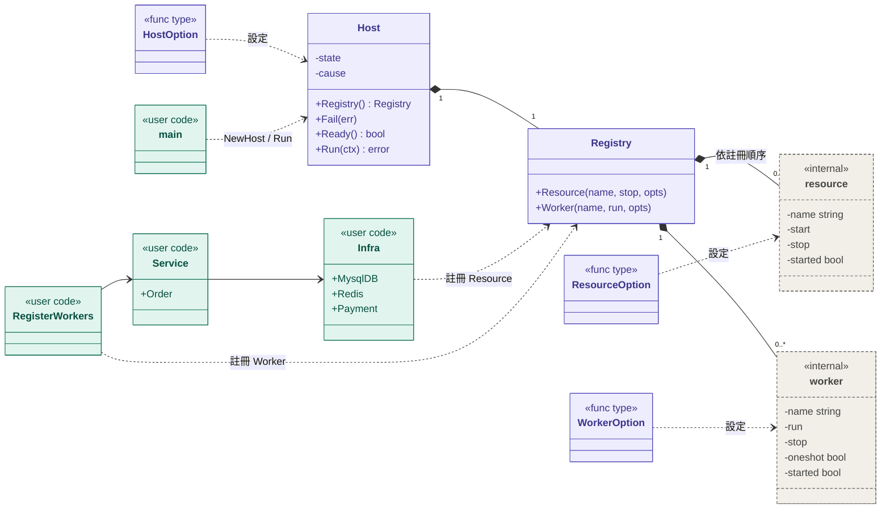
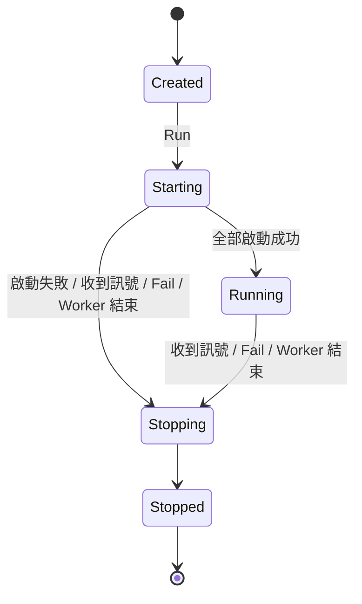
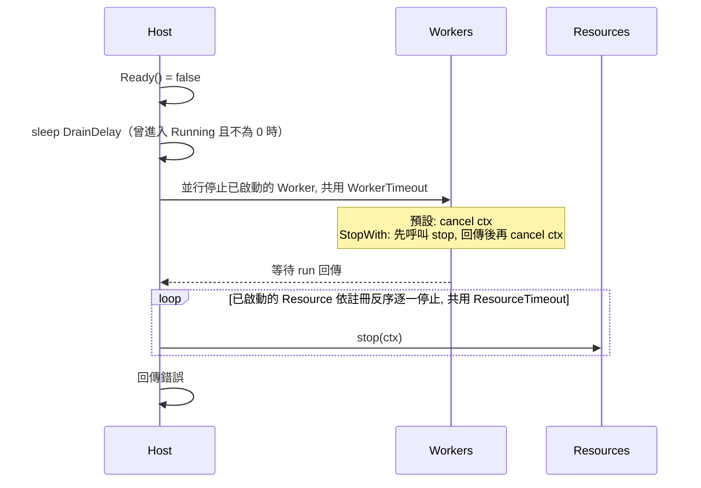

# App Lifecycle Spec

精簡的 Go 應用程式生命週期管理。使用者註冊每個元件時，只需要判斷一件事：它是被別人呼叫的（Resource），還是主動做事的（Worker）？啟停順序、逾時、回滾、訊號、exit code 由框架決定。

---

## 0. 目標與非目標

**目標**

- 只有兩個註冊動詞：`Resource` 與 `Worker`，不需要理解 phase、priority、hook
- 停止順序由元件種類推導，不需要手動排序
- 啟動失敗自動回滾，關閉有分段時間預算
- 長駐服務、CLI 指令、測試使用同一套模型與同一段組裝程式碼
- `main` 是固定範本，每一步都看得見
- 核心 `Run(ctx)` 不依賴 OS signal，可直接測試

**非目標**

- 失敗後自動重啟（交給 k8s / systemd）
- 巢狀或動態的子生命週期（例如每個 partition 一個 consumer）：由元件內部管理，在框架中只佔一個註冊
- 依賴圖分析：Resource 之間的順序由註冊順序決定
- 個別元件的逾時設定
- Request / message 級別的資源管理（交給 `ctx` 與 `defer`）

---

## 1. 心智模型

### 1.1 兩種元件

| 種類 | 判斷方式 | 預設怎麼停 | 例子 |
|---|---|---|---|
| `Resource` | 被別人呼叫 | 呼叫 stop | MySQL、Redis、3rd-party client、buffered writer |
| `Worker` | 主動做事 | cancel ctx | Kafka consumer、HTTP server、ticker loop、CLI 指令的主任務 |

Worker 的位置固定：**最後啟動、最先停止、彼此並行、沒有人依賴它**。

Resource 必填 `stop`，Worker 必填 `run`，其餘行為以 option 調整：

- `StartWith(start)`：Resource 啟動時執行的檢查或初始化（ping、載入檔案），失敗會觸發回滾

- `StopWith(stop)`：Worker 的 `run` 卡住的阻塞呼叫不接受 ctx（例如 `srv.ListenAndServe()`），只能靠呼叫某個方法讓它回傳（第 5 節）
- `Oneshot()`：Worker 會自然完成，完成後整個 Host 正常結束，用於 CLI 指令（第 6 節）

### 1.2 四條規則

1. **依賴順序註冊**：被依賴的 Resource 先註冊。註冊寫在哪裡由使用者決定；第 4 節的範例集中在 `NewInfra` 與 `RegisterWorkers`。
2. **Constructor 不做 I/O**：連線驗證、ping、載入檔案放進 Resource 的 `StartWith`。組裝失敗時因此沒有任何東西需要清理。
3. **Worker 處理單筆工作時用 `context.WithoutCancel(ctx)`**：`ctx` 被 cancel 代表「不要再拿新工作」，不代表「中斷手上的工作」。
4. **Logger 位於生命週期外層**：由 main 建立，在 `Run` 回傳後才 flush 並關閉；不放進 `Infra`，也不註冊為 Resource。Host 在關閉的最後一刻和 `Run` 回傳之後都還要寫 log。

### 1.3 框架保證

- 啟動：Resource 依註冊順序逐一啟動 → Worker 全部啟動 → ready
- 關閉：not ready → drain → Worker 全部並行停止 → Resource 依註冊反序逐一停止
- 任何一步失敗，已啟動的部分都會被正確停止

### 1.4 元件關係



| 顏色 | 範圍 | 型別 |
|---|---|---|
| 紫色 | 套件公開 | `Host`、`Registry`、`HostOption`、`ResourceOption`、`WorkerOption` |
| 灰色虛線（`<<internal>>`） | 套件內部，使用方看不到 | `resource`、`worker` |
| 綠色（`<<user code>>`） | 使用者程式碼（第 4 節範例） | `main`、`Infra`、`Service`、`RegisterWorkers` |


- 全部是組合關係：`Host` 持有一個 `Registry`，`Registry` 持有 `resource` 與 `worker` 註冊項目（內部型別）。`Host` 負責狀態機與觸發關閉，`Registry` 只負責記錄註冊
- `Registry` 由 `Host` 建立並擁有，只能透過 `host.Registry()` 取得；`Run` 開始後凍結
- 只做註冊的程式碼只需要 `*Registry`；`Fail`、`Ready` 以 method value（`host.Fail`、`host.Ready`）傳給需要的地方。圖中的 `Infra`、`Service`、`RegisterWorkers` 是第 4 節範例的結構
- 依賴方向是單向的：`RegisterWorkers` → `Service` → `Infra`，與停止順序（Worker → Resource）一致

---

## 2. 公開 API

完整的公開介面：

```go
package inject

// Registry 記錄已註冊的元件，由 Host 建立並擁有，透過 host.Registry() 取得。
type Registry struct{ /* unexported */ }

// Resource 註冊被呼叫的依賴。stop 在關閉時呼叫，可為 nil（極少見）。
func (r *Registry) Resource(name string, stop func(ctx context.Context) error, opts ...ResourceOption)

// Worker 註冊主動做事的元件，預設以 cancel ctx 停止。
// Worker 自己擁有的資源在 run 內 defer 關閉。
func (r *Registry) Worker(name string, run func(ctx context.Context) error, opts ...WorkerOption)

// 三種 option（HostOption、ResourceOption、WorkerOption）是不同型別，用錯地方會編譯失敗。
// 參數型別不公開，所以只有本套件能建立 option。
type ResourceOption func(*resourceConfig)
func StartWith(start func(ctx context.Context) error) ResourceOption

type WorkerOption func(*workerConfig)
func StopWith(stop func(ctx context.Context) error) WorkerOption
func Oneshot() WorkerOption

// Host 擁有一個 Registry，並管理其中元件的生命週期。
type Host struct{ /* unexported */ }
func NewHost(opts ...HostOption) *Host
func (h *Host) Registry() *Registry
func (h *Host) Run(ctx context.Context) error

// Fail 回報背景偵測到的致命錯誤，觸發整體關閉。
// 需要回報的元件可注入 method value host.Fail（型別為 func(error)），不必依賴 inject 套件。
func (h *Host) Fail(err error)

// Ready 只在 Running 狀態回傳 true。以 method value host.Ready 傳給 ReadyHandler。
func (h *Host) Ready() bool

// HostOption 只能傳給 NewHost。
type HostOption func(*hostConfig)
func WithLogger(l *slog.Logger) HostOption            // 預設 slog.Default()
func WithStartTimeout(d time.Duration) HostOption     // 預設 15s，所有 Resource start 共用
func WithDrainDelay(d time.Duration) HostOption       // 預設 0；在 LB 後方時建議 5s
func WithWorkerTimeout(d time.Duration) HostOption    // 預設 15s，Worker 停止階段的預算
func WithResourceTimeout(d time.Duration) HostOption  // 預設 10s，Resource 停止階段的預算

// main 使用
func SignalContext(parent context.Context) (context.Context, context.CancelFunc)
func ExitCode(err error) int

// Helpers
func HTTP(reg *Registry, name string, srv *http.Server)   // = reg.Worker(name, ListenAndServe, StopWith(srv.Shutdown))
func ReadyHandler(ready func() bool) http.Handler         // 傳入 host.Ready；ready 時 200，否則 503
func Closer(c io.Closer) func(ctx context.Context) error  // 轉接 Close() error
func NoErr(f func()) func(ctx context.Context) error      // 轉接 Close()（無回傳值）

// Errors
var ErrAlreadyRun     = errors.New("inject: Run called more than once")
var ErrStopTimeout    = errors.New("inject: stop timeout")
var ErrUnexpectedExit = errors.New("inject: worker exited unexpectedly")
var ErrInterrupted    error // Oneshot 未完成即被訊號中斷；實作 ExitCode() int，回傳 130
```

測試用的 helper 放在子套件，避免正式程式碼 import `testing`：

```go
package injecttest
func Start[T any](t testing.TB, build func(host *inject.Host) (T, error), opts ...inject.HostOption) T
```

---

## 3. 行為規格

### 3.1 Host 狀態機



這是 **Host 整體**的狀態。Resource 與 Worker 沒有自己的狀態機，框架內部只記錄每個元件「是否已啟動」，用來決定關閉時要停止哪些。

狀態不對外暴露，只透過 `Ready()` 反映：只有 `Running` 為 true。

### 3.2 註冊

- 只允許在 `Created` 狀態註冊，否則 **panic**
- 同名註冊會 panic；註冊第二個 `Oneshot` Worker 會 panic
- Resource 的註冊順序就是依賴順序：被依賴者先註冊。在 `NewInfra` 中由上到下撰寫即可滿足

> 註冊錯誤一定是程式錯誤，因此以 panic 回報，呼叫點不需要處理 error（比照 `http.Handle`）。

### 3.3 啟動

1. 以 `ctx` 衍生出 `startCtx`，套用 `StartTimeout`
2. 依註冊順序**逐一**執行 Resource 的 `StartWith`，傳入 `startCtx`；沒有 `StartWith` 視為成功
3. 第 k 個失敗時，進入關閉，只停止 `[0, k)`。**第 k 個本身的 `stop` 不會被呼叫**，失敗的元件應在 `start` 回傳前自行清理
4. 依註冊順序啟動所有 Worker，每個一個 goroutine
5. 轉為 `Running`

Worker 在所有 Resource 之後才啟動，所以 Worker 的啟動失敗（例如 port 衝突）就是一般的「Worker 結束」觸發，不需要另外的回滾邏輯。

### 3.4 觸發關閉

以下任一事件發生即開始關閉，**只有第一個成為 cause**，之後的事件寫入 log 並加入回傳的錯誤：

- `ctx.Done()`（外部訊號）：cause 為 nil
- `Fail(err)`：cause 為 err
- Worker 在關閉開始前回傳：
  - 一般 Worker：不論 error 是否為 nil 都是異常，nil 包成 `ErrUnexpectedExit`
  - `Oneshot`：回傳 nil 代表完成，cause 為 nil；回傳 error 則 cause 為該 error
- 任何 `start` / `run` panic：recover 後轉為帶 stack 的 error

### 3.5 關閉



從 `Starting` 進入時（啟動失敗或啟動中收到訊號），流程相同，只是 drain 會略過、只停止已啟動的部分。這就是第 3.3 節的回滾。

**Worker 階段**

- 所有 Worker **並行**停止，各自依自己的方式：
  - **預設**：cancel `run` 的 ctx。`run` 回傳 nil 或 `context.Canceled` 視為正常，其他錯誤列入結果
  - **`StopWith`**：見第 5.2 節
- `Oneshot` 尚未完成、且 cause 為 nil（外部訊號）時，記錄 `ErrInterrupted`。cause 為錯誤時不另外記錄，讓 exit code 反映真正的錯誤
- 逾時：記錄未完成的 Worker 與 `ErrStopTimeout`，**仍然進入 Resource 階段**，讓 buffered writer 有機會 flush

**Resource 階段**

- 依註冊反序**逐一**停止：Resource 之間可能有依賴，因此不並行
- 每個 `stop` 在獨立 goroutine 執行並 recover
- 逾時：放棄目前卡住的 `stop`，剩下的 Resource **仍依序呼叫 `stop`，傳入已過期的 ctx**，讓它們做不阻塞的釋放（例如 `sql.DB.Close`）

**時間預算**

```
DrainDelay + WorkerTimeout + ResourceTimeout + log flush < terminationGracePeriodSeconds
```

預設值 0 + 15 + 10 = 25 秒，小於 k8s 預設的 30 秒。啟用 drain、或 log 要送到遠端時，應同步調整。

### 3.6 錯誤與 exit code

- `Run` 回傳 `errors.Join(cause, 其他錯誤...)`；cause 為 nil 且沒有其他錯誤時回傳 nil
- 每個錯誤都標上元件名稱與階段：`resource "mysql": stop: ...`、`worker "kafka-orders": unexpected exit`
- `ExitCode(err)`：nil → 0；錯誤鏈中有實作 `ExitCode() int` 者取第一個找到的值；其餘 → 1
- `Run` 第二次呼叫回傳 `ErrAlreadyRun`

### 3.7 訊號

`SignalContext` 監聽 `SIGINT`、`SIGTERM`。與 `signal.NotifyContext` 不同，**第一次訊號後立即解除攔截**，第二次訊號走 OS 預設行為，直接終止 process。

### 3.8 Readiness

- `Ready()` 只反映生命週期狀態，不檢查依賴的健康
- 關閉開始時立刻轉為 false，之後才 drain，讓 LB 有時間摘除
- 不提供 liveness：綁定依賴狀態的 liveness，會在依賴短暫故障時引發整批重啟

---

## 4. 使用範例：長駐服務

一個同時提供 HTTP API 與消費 Kafka 的服務，依賴 log file、stderr、MySQL、Redis、第三方 API。

### 4.1 main

固定範本：建立 log → 訊號 ctx → Host → 組裝 → 執行 → 收尾 → exit code。

```go
func main() {
    logger, closeLog := newLogger(cfg.Log)
    ctx, stop := inject.SignalContext(context.Background())

    host := inject.NewHost(inject.WithLogger(logger), inject.WithDrainDelay(5*time.Second))
    err := build(host)
    if err == nil {
        err = host.Run(ctx)
    }

    stop()
    closeLog() // 規則 4；必須在 os.Exit 之前呼叫，os.Exit 不會執行 defer
    os.Exit(inject.ExitCode(err))
}

func newLogger(cfg LogConfig) (*slog.Logger, func()) {
    file := &lumberjack.Logger{Filename: cfg.Path, MaxSize: 100}
    w := io.MultiWriter(os.Stderr, file) // stderr 放前面：MultiWriter 遇到第一個錯誤就停止
    return slog.New(slog.NewJSONHandler(w, nil)), func() { _ = file.Close() } // 非同步 logger 在此 flush
}
```

### 4.2 Infra

由上到下就是啟動順序，關閉時反過來。此範例的 `adapters` constructor 不 import `inject`；只要方法簽名是 `func(ctx) error`，就能直接傳給 `reg.Resource`。

```go
type Infra struct {
    MysqlDB *sql.DB
    Redis   *redis.Client
    Payment *adapters.PaymentClient
}

func NewInfra(cfg Config, reg *inject.Registry) (*Infra, error) {
    db, err := adapters.NewMySQL(cfg.MySQL) // 不連線
    if err != nil {
        return nil, err
    }
    reg.Resource("mysql", inject.Closer(db), inject.StartWith(db.PingContext))

    rdb := adapters.NewRedis(cfg.Redis)
    reg.Resource("redis", inject.Closer(rdb), inject.StartWith(func(ctx context.Context) error { return rdb.Ping(ctx).Err() }))

    pay := adapters.NewPaymentClient(cfg.Payment)
    reg.Resource("payment-api", inject.NoErr(pay.CloseIdleConnections)) // 不檢查第三方：它的可用性不應擋住自己的啟動

    return &Infra{MysqlDB: db, Redis: rdb, Payment: pay}, nil
}
```

### 4.3 Service

純粹的組裝，不接觸 `inject` 套件。

```go
type Service struct {
    Order *service.OrderService
}

func NewService(infra *Infra) *Service {
    return &Service{
        Order: service.NewOrderService(repo.NewOrderRepo(infra.MysqlDB), infra.Redis, infra.Payment),
    }
}
```

### 4.4 Worker

Worker 沒有人依賴，不需要 struct。`FetchMessage` 接受 ctx，所以 consumer 使用預設的停止方式。

```go
func RegisterWorkers(cfg Config, svc *Service, reg *inject.Registry, ready func() bool) {
    mux := http.NewServeMux()
    mux.Handle("/readyz", inject.ReadyHandler(ready))
    handler.Mount(mux, svc)
    inject.HTTP(reg, "api", &http.Server{Addr: cfg.HTTP.Addr, Handler: mux, ReadHeaderTimeout: 5 * time.Second})

    reg.Worker("kafka-orders", orderConsumer(cfg.Kafka, svc.Order))
}

func orderConsumer(cfg KafkaConfig, order *service.OrderService) func(ctx context.Context) error {
    return func(ctx context.Context) error {
        r := kafka.NewReader(kafka.ReaderConfig{Brokers: cfg.Brokers, GroupID: cfg.Group, Topic: cfg.Topic})
        defer r.Close() // Worker 擁有的資源；loop 結束後離開 consumer group

        for {
            msg, err := r.FetchMessage(ctx)
            if err != nil {
                return err // 關閉中的 context.Canceled 視為正常
            }
            mctx, cancel := context.WithTimeout(context.WithoutCancel(ctx), cfg.MsgTimeout) // 規則 3
            err = order.Handle(mctx, msg)
            cancel()
            if err != nil {
                // 暫時性錯誤在此重試或送 DLQ；只有致命錯誤才 return
            }
            if err := r.CommitMessages(context.WithoutCancel(ctx), msg); err != nil {
                return err
            }
        }
    }
}
```

### 4.5 build 與執行順序

```go
func build(host *inject.Host) error {
    reg := host.Registry()
    infra, err := NewInfra(cfg, reg)
    if err != nil {
        return err
    }
    RegisterWorkers(cfg, NewService(infra), reg, host.Ready)
    return nil
}
```

- 啟動：mysql ping → redis ping → payment-api → api 與 kafka-orders 同時啟動 → ready
- 關閉：not ready → drain 5s → api（`Shutdown`）與 kafka-orders（cancel ctx）並行停止 → payment-api → redis → mysql → `Run` 回傳 → 關閉 log → exit

### 4.6 測試

測試與正式啟動共用 `NewInfra` 與 `NewService`，只是不呼叫 `RegisterWorkers`。`injecttest.Start` 用真正的 `Host` 啟動，等到 ready 後回傳，並在 `t.Cleanup` 走完整的關閉流程；啟動或關閉失敗都會讓測試失敗。

```go
func TestOrderService(t *testing.T) {
    infra := injecttest.Start(t, func(host *inject.Host) (*Infra, error) {
        return NewInfra(testCfg, host.Registry())
    }, inject.WithResourceTimeout(2*time.Second))
    svc := NewService(infra)
    // ...
}
```

- 逾時設短，卡住時才不會等太久
- 傳入寫到 `t.Log` 的 logger，失敗時才看得到生命週期的 log
- 測試 HTTP handler 用 `httptest.NewServer`，不註冊 HTTP Worker，避免平行測試的 port 衝突

---

## 5. StopWith

### 5.1 什麼時候用

看 `run` 卡住的那一行有沒有接受 ctx：

- **有**：`r.FetchMessage(ctx)`、`sub.Receive(ctx, ...)`、`select` 等待 `ctx.Done()`。cancel 後會回傳 → 用預設方式
- **沒有**：`srv.ListenAndServe()`、`gs.Serve(ln)`、`ln.Accept()`。cancel ctx 毫無作用，`run` 會卡到 `WorkerTimeout` 被放棄 → 用 `StopWith`

另一種情況是「先排空、再停止」：即使 `run` 接受 ctx，cancel 也會打斷正在進行的寫入，這時用 `StopWith` 自行控制停止步驟。

### 5.2 行為

1. 呼叫 `stop(stopCtx)`；`stopCtx` 不會被 cancel，deadline 為 Worker 階段的結束時間
2. `stop` 回傳後（或 `stopCtx` 到期），cancel `run` 的 ctx，確保 `run` 會結束
3. 等待 `run` 回傳

先呼叫 `stop`、後 cancel ctx，是因為選擇 `StopWith` 代表要完全掌控停止流程；同時 cancel 可能打斷排空。

正常結束的判斷：

- `stop` 被呼叫**之後**，`run` 的任何回傳都是正常的，所以 `http.ErrServerClosed` 這類 sentinel error 不需要處理
- `stop` 被呼叫**之前**，`run` 回傳是異常（第 3.4 節）
- `stop` 自己的錯誤列入結果，例如 `Shutdown` 逾時

### 5.3 情境

**HTTP**：`Shutdown` 停止接受新連線並等待處理中的 request。這就是 `inject.HTTP` 的實作。

```go
reg.Worker("api",
    func(context.Context) error { return srv.ListenAndServe() },
    inject.StopWith(srv.Shutdown),
)
```

**gRPC**：`GracefulStop` 不接受 ctx，可能無限等待，deadline 到期時改用 `Stop` 強制關閉。

```go
reg.Worker("grpc",
    func(context.Context) error { return gs.Serve(ln) },
    inject.StopWith(func(ctx context.Context) error {
        done := make(chan struct{})
        go func() { gs.GracefulStop(); close(done) }()
        select {
        case <-done:
            return nil
        case <-ctx.Done():
            gs.Stop()
            return ctx.Err()
        }
    }),
)
```

**不接受 ctx 的阻塞呼叫**：自己寫的 TCP accept loop，只能關閉 listener 讓 `Accept` 回傳。

```go
reg.Worker("tcp-ingest",
    func(context.Context) error { return acceptLoop(ln) },
    inject.StopWith(inject.Closer(ln)),
)
```

**先排空、再停止**：批次 consumer 累積一批才寫入。先停止拉取、把手上這批寫完並 commit，`stop` 回傳後框架才 cancel `c.Run` 的 ctx。

```go
reg.Worker("kafka-batch",
    c.Run,
    inject.StopWith(func(ctx context.Context) error {
        c.StopFetching()
        return c.FlushPending(ctx)
    }),
)
```

### 5.4 不該用的情況

- `run` 已經接受 ctx，而且被中斷也無妨：加上 `StopWith` 只是多一條停止路徑
- 關閉 Worker 擁有的資源：應在 `run` 內 `defer`；`StopWith` 只負責讓 `run` 停下來
- 關閉別人也在用的資源：那是 Resource

---

## 6. CLI 指令

### 6.1 與長駐服務的差異

`migrate`、`backfill`、一次性資料修補等指令和長駐服務共用同一套模型，差別只有：

- **主任務會自然完成**：完成就正常結束，exit code 0 → `Oneshot()`
- **中斷要回報**：Ctrl-C 時任務沒有完成，不應回傳 0 → `ErrInterrupted`
- **不需要 drain**：`DrainDelay` 維持預設的 0

Resource 的啟動、回滾、反序關閉完全不變，所以 CLI 一樣能在 DB ping 失敗時立即結束，中途中斷時也會正確關閉連線、flush buffer。

### 6.2 Oneshot 的規則

- 回傳 nil：正常關閉，exit code 0
- 回傳 error：以該 error 關閉，exit code 1（或錯誤自帶的 `ExitCode()`）
- 被訊號中斷：`ErrInterrupted`，exit code 130；被其他錯誤中斷（其他 Worker 失敗、`Fail`）：exit code 由該錯誤決定
- 一個 Host 最多一個 `Oneshot`
- 可以和一般 Worker 共存：例如 backfill 搭配提供 `/metrics` 的 HTTP Worker，任務完成後 HTTP Worker 跟著被正常停止
- `WorkerTimeout` 只限制停止階段，不限制任務的執行時間；任務需要上限時在 `run` 內自行 `context.WithTimeout`

### 6.3 單一指令的 binary

main 與第 4.1 節相同（不需要 `WithDrainDelay`），只有 build 不同：

```go
func buildBackfill(host *inject.Host) error {
    reg := host.Registry()
    infra, err := NewInfra(cfg, reg)
    if err != nil {
        return err
    }
    job := NewBackfillJob(NewService(infra).Order, cfg.Backfill)
    reg.Worker("backfill", job.Run, inject.Oneshot())
    return nil
}
```

完成：Infra 啟動 → backfill → Infra 反序關閉 → exit 0。中途 Ctrl-C：cancel ctx → `run` 回傳 → Infra 反序關閉 → exit 130。

### 6.4 多個子指令（cobra）

訊號、log、exit code 放在最外層，**每個子指令各自建立一個 Host**：

```go
func main() {
    logger, closeLog := newLogger(cfg.Log)
    ctx, stop := inject.SignalContext(context.Background())
    err := newRootCmd(logger).ExecuteContext(ctx)
    stop()
    closeLog()
    os.Exit(inject.ExitCode(err))
}

func runHost(cmd *cobra.Command, build func(*inject.Host) error, opts ...inject.HostOption) error {
    host := inject.NewHost(opts...)
    if err := build(host); err != nil {
        return err
    }
    return host.Run(cmd.Context())
}
```

```go
serveCmd := &cobra.Command{
    Use: "serve",
    RunE: func(cmd *cobra.Command, _ []string) error {
        return runHost(cmd, build, inject.WithLogger(logger), inject.WithDrainDelay(5*time.Second))
    },
}

backfillCmd := &cobra.Command{
    Use: "backfill",
    RunE: func(cmd *cobra.Command, _ []string) error {
        return runHost(cmd, buildBackfill, inject.WithLogger(logger))
    },
}
```

只需要部分基礎設施的指令（例如 `migrate` 只需要 MySQL），可以直接呼叫 `adapters` 的 constructor 並自行註冊，不經過 `NewInfra`。

### 6.5 注意事項

- **參數錯誤在建立 Host 之前處理**，不要先連 DB 再失敗；需要 exit code 2 時回傳實作 `ExitCode() int { return 2 }` 的錯誤
- **進度寫 stderr**，stdout 保留給結果，方便接 pipe
- **長任務要定期檢查 `ctx.Err()`**，否則 Ctrl-C 要等到 `WorkerTimeout` 到期才會被放棄
- **可重跑**：中斷時已處理的部分不會回滾，設計成冪等或記錄 checkpoint

---

## 7. 邊界情況

- **`Run` 之前呼叫 `Fail`**（例如在組裝期間）：`Run` 不啟動任何元件，直接回傳該錯誤
- **啟動前 ctx 已被 cancel、或啟動中收到訊號**：目前的 `start` 收到被 cancel 的 ctx，進入關閉，只停止已啟動的部分
- **啟動中呼叫 `Fail`**：同上
- **`StopWith` 的 `stop` 還沒回傳，`run` 就先回傳**：正常；仍等 `stop` 回傳才結束這個 Worker 的停止
- **`Oneshot` 搭配 `StopWith`**：允許；被中斷的判斷（第 3.5 節）與停止方式無關
- **沒有註冊任何 Worker**：啟動完成後只等待 ctx 或 `Fail`

---

## 8. 設計取捨

### 8.1 已知代價

- **Worker 無法在啟動期提前綁定 port**：port 衝突在 Worker 啟動後才發現；結果與回滾相同，但 log 出現在關閉流程
- **Worker 間不能有依賴**：需要時改由共用 Resource 解決
- **Resource 逐一停止較慢**：換取不需要宣告 Resource 間的依賴
- **Infra 整包建立**：只需要部分基礎設施的指令或測試也會啟動全部 Resource
- **框架無法分辨哪些 Worker 在 LB 後方**：是否 drain 完全由 `DrainDelay` 決定
- **`StopWith` 有另一條正常結束的規則**：閱讀 Worker 時要留意是否帶有 `StopWith`
- **同一 process 內的 Worker 失敗互相影響**：需要隔離時拆成不同 binary

### 8.2 參考

- **uber fx**：注入註冊介面、依註冊順序啟動並反序停止、啟動失敗回滾
- **.NET Generic Host**：Host 與 Worker
- **oklog/run**：任一常駐 Worker 結束就觸發整體關閉
- **Spring Boot**：分階段的關閉時間預算、readiness 與生命週期連動
- **Guava Service**：內部狀態機
- **systemd**：`oneshot`

---

## 9. 實作備註

### 9.1 檔案配置

```
pkg/inject/
  inject.go      // HostOption、ResourceOption、WorkerOption、錯誤
  host.go        // Host、狀態機、Run、Fail、Ready
  registry.go    // Registry、註冊與凍結
  start.go       // Resource 啟動
  stop.go        // Worker 並行停止、Resource 反序停止
  signal.go      // SignalContext、ExitCode
  helpers.go     // HTTP、ReadyHandler、Closer、NoErr
  injecttest/ // Start
```

### 9.2 內部結構草圖

```go
type Host struct {
    logger   *slog.Logger
    cfg      hostConfig
    registry *Registry

    state     atomic.Int32
    causeOnce sync.Once
    cause     error
    trigger   chan struct{} // 關閉觸發，只 close 一次
}

type Registry struct {
    mu        sync.Mutex
    frozen    bool       // Host.Run 開始後設為 true，之後註冊會 panic
    resources []resource // 註冊順序；各自記錄是否已啟動
    workers   []worker   // 各自持有 cancel、stop（可為 nil）、oneshot 旗標、是否已啟動
}
```

### 9.3 測試清單

- 第 k 個 Resource start 失敗時，只有 `[0, k)` 被反序 stop，且不 drain
- 啟動中 cancel ctx 或呼叫 `Fail` 會回滾；`Run` 前呼叫 `Fail` 不啟動任何元件
- 一般 Worker 在關閉前回傳 nil → cause 為 `ErrUnexpectedExit`；關閉中回傳 nil 或 `context.Canceled` 不列入錯誤
- `StopWith`：`stop` 先於 ctx cancel；`stop` 被呼叫後 `run` 的回傳不列入錯誤；`stop` 的錯誤保留；`stopCtx` 不受 cancel 影響
- `Oneshot`：nil → `Run` 回傳 nil；error → 該 error；被訊號中斷 → `ErrInterrupted`（exit 130）；被其他錯誤中斷 → 不記錄 `ErrInterrupted`
- 第二個 `Oneshot`、同名註冊、`Created` 以外的註冊都會 panic
- Worker 階段逾時後 Resource 仍全部被 stop；Resource 階段逾時後剩餘 stop 收到已過期的 ctx
- 所有 panic 都被 recover 並帶有元件名稱
- `Ready()` 只在 Running 為 true，且關閉開始時先於 drain 轉為 false
- `ExitCode`：nil → 0；錯誤鏈自帶 `ExitCode()` 者取其值；其餘 → 1
- `Run` 第二次呼叫回傳 `ErrAlreadyRun`
