# App Lifecycle Spec

## 0. Overview

lifecycle 是 language-agnostic 的 app lifecycle 管理模型。元件只需判斷自己是 **Resource**（被呼叫）還是 **Worker**（主動做事）；startup / shutdown 的順序、time budget、unwind 與錯誤彙整由 Host 決定。

- 兩種元件，各有一組 verb：
  - Resource：`open` → `close`，依 `dependsOn` 排序（`close` 反向），沒有依賴關係者 concurrent
  - Worker：`start` → `stop`，彼此 concurrent，沒有人依賴它
- Host 行為：startup = Open phase → Start phase；shutdown = Stop phase → Close phase。兩者互為鏡像，順序相反
- 註冊只有兩個動作：`registry.resource`、`registry.worker`；每個 config 欄位標明可否為空與空值行為，註冊錯誤依種類以 `InvalidResource`、`InvalidWorker` 回報，不 panic
- Host 的入口是一對動詞：`host.startup`（阻塞到 Host 結束，只接收 cancellation，回傳彙整的錯誤）與 `host.asyncShutdown`（立即返回，提出 shutdown 請求）；exit code 依結束的原因決定（請求型 shutdown 由 `resolveExitCode` 對應，預設為 0；失敗型依錯誤本身），signal 轉成 cancellation 在 entrypoint 處理
- Open phase、Stop phase、Close phase 各有 time budget，用盡即 Abort，但一定會走到 Close phase
- Host 管 static topology；執行期增減的 connection 交給 Hub（見 [§6 Hub](#6-hub)）。Hub 對 Host 而言只是一個 Resource，它與 Host 的接點細節集中在 §6

模組只有一個：`lifecycle`，包含 Host、Registry、Hub、Helper 與測試輔助。Hub 在模組內邏輯獨立：不引用 Host 或 Registry，由使用者以 `registry.resource` 註冊。

**閱讀順序**

- Part 1　概念與行為規格（不限語言）
  - §1 Goals / Non-goals
  - §2 Mental model：Resource / Worker、兩組 verb、三層責任與退出條件、一輪完整的 startup → shutdown
  - §3 Host：state 與 phase、startup、unwind、shutdown、Abort
  - §4 Worker 怎麼停：Cordon、Drain、cancellation、`stop`
  - §5 Consumer Helper
  - §6 Hub：dynamic connections、SignOff、connection termination、長連線對 Stop phase 與 Close phase 的影響（`onStop`）
  - §7–§10 使用者規則、框架保證、邊界情況、設計取捨
  - 附錄 A–D：Config 參考、命名規則、Glossary（查表用）、測試案例（Force → 設計 → 情境 → 預期）
- Part 2　Go 實作（§11–§16）

每個概念只在一處定義，出現在它的前置概念之後；其他地方只引用。

---

# Part 1　概念與行為規格

## 1. Goals / Non-goals

**Goals**

- 開發者對 Host 只有兩個註冊動作：`registry.resource(...)` 註冊 Resource、`registry.worker(...)` 註冊 Worker
- Host 依元件種類推導 Worker 與 Resource 的先後；Resource 之間由開發者以 `dependsOn` 宣告依賴，Host 據此決定：有依賴關係的 sequential，沒有的 concurrent，不需手動排序
- Host 在啟動失敗時自動 unwind，並為每個等待設定上限
- 長駐服務、CLI、測試共用同一套模型與 build 程式碼
- Host 只接收 cancellation，不直接依賴 OS signal，因此可直接測試
- Hub 集中管理 connection，不影響 static topology
- 任何具備[語言需要的 primitive](#24-語言需要的-primitive)的語言都能實作這個模型

**Non-goals**

- 失敗後自動重啟（交給 k8s / systemd）
- Reload（執行期重新載入設定或元件）：生命週期請求只有 startup request 與 shutdown request 兩種
- 巢狀或動態的子 lifecycle：由元件自行管理，在 Host 只佔一個註冊（Hub 即為此例）
- 從程式碼自動推導依賴
- Host 層級的個別元件 timeout
- request / message 級的資源管理：交給語言的 cancellation 與 scoped cleanup
- 跨 process 的 push 路由

## 2. Mental model：從兩種元件開始

### 2.1 Resource 還是 Worker

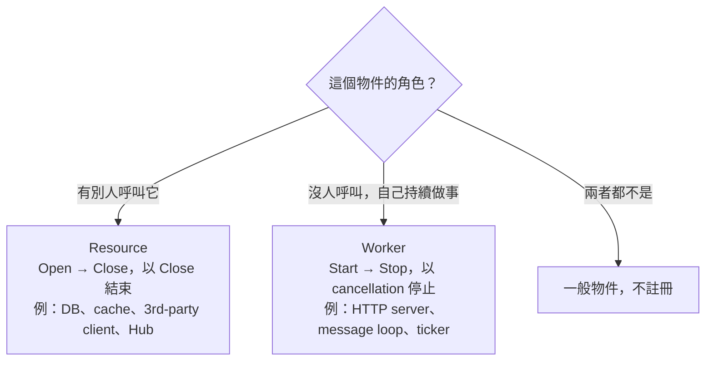

- Resource 可以有內部 concurrency unit（flush、health check、Hub 的 task executor），條件是只處理呼叫者交辦的事，並在 `close` 時結束；主動向外拉取工作的是 Worker
- Worker 最後啟動、最先停止、彼此 concurrent、沒有人依賴它；Worker 自己擁有的資源在 `start` 內以 scoped cleanup 關閉
- Worker 間不能有依賴；需要共用時改用 Resource

### 2.2 兩組 lifecycle verb

元件的本質有兩種，各對應一組 verb：

- **resource channel**：靜態資源。被建立、被持有、被釋放的東西，例如 connection pool、file descriptor、socket
- **primary execution**：動態運算。主動做事、持續運行直到結束的那條 execution（Worker 的 `start`、connection 的 runner）

verb：

- **Open / Close（verb）**：作用於 resource channel；Open 建立它，Close 釋放它，並結束只為該 channel 服務的 subordinate execution（Resource 的 flush、Hub 的 task executor）
- **Start / Stop（verb）**：作用於 primary execution；Worker 的 `start` 開始這條 execution 並阻塞到它結束；停止的完成條件是 execution 已不存在，不是做完哪幾個動作
- **Shutdown** = 停止 primary execution → 關閉 resource channel（Stop verb → Close verb），指 Host、Hub 或單一 connection 的整個停止過程

各元件用到哪組 verb，取決於它本身是 resource channel、execution，還是兩者都有：

- Resource 本身是 resource channel，沒有 primary execution，所以只有 Open / Close verb；另可選一個 phase 通知 `onStop`（見 [§3.6](#36-shutdown-的-stop-phase-與-close-phase)），它不是 verb，Resource 沒有 Stop verb
- Worker 本身是 execution，所以只有 Start / Stop verb；它在 `start` 內自己建立的資源由 scoped cleanup 釋放，不是獨立的註冊單位
  - 例：Consumer 的 subscription 是 Worker 的內部資源，由 `connect` 在 `start` 內建立，離開 `start` 時由 `close(sub)` 關閉，不向 Host 註冊
- 兩者都有的單位是 Hub 管理的 connection，四個 verb 都用到（見 [§6.2](#62-補完-shutdown-的四個-step)）

shutdown 對每種 unit 都是「停止 → 關閉」，差別只在哪一半是空的、或由誰驅動：

- Host：Stop phase（所有 Worker）→ Close phase（所有 Resource，`dependsOn` 反向）
- Worker：停止 = Cordon → Drain，終點是 `start` 返回；關閉是 `start` 內的 scoped cleanup，框架不驅動
- 一般 Resource：沒有 primary execution，停止為空；關閉 = `close`
- connection 與 Hub：見 §6.2

**同一個詞的五種意思，寫法固定**

文件裡的 Open、Start、Stop、Close 有不同層次，用不同寫法區分：

- **phase**（Host 的階段）：一律寫成「Open phase」「Start phase」「Stop phase」「Close phase」，不寫單獨的 Start、Stop
- **hook**（元件的 config 欄位）：寫成 `open`、`start`、`stop`、`onStop`、`close`（小寫、code font）；同一句裡可能和 phase 混淆時，寫明擁有者，例如「Worker 的 `stop`」「Resource 的 `close`」
- **verb**（元件層級的概念，也就是上面 Open / Close、Start / Stop 的定義）：只在本節與 Glossary 定義；其他章節描述單一元件的動作時，寫成「停止」「關閉」，不寫單獨的 Stop、Close
- **step**（停止流程的步驟）：Cordon、Drain、SignOff，以及第四個「Close step」（見 [§6.2](#62-補完-shutdown-的四個-step)）
- **request**（Trigger 提出的請求）：寫成 startup request、shutdown request，不寫「Start 請求」「Stop 請求」

以 Worker 為例，同一次停止出現的名詞：


### 2.3 Host 與 static topology

- **Host**：管理 static topology 的 lifecycle 引擎
- **static topology**：`host.startup` 之後不再增減的元件集合，也就是所有註冊的 Resource 與 Worker
- **Registry**：Host 提供的註冊入口；`host.startup` 之後 frozen（見 [§3.2](#32-registry-與註冊錯誤)）

```
Host  ← static topology：host.startup 之後不再增減
├── Resource
│   └── mysql、redis、3rd-party client：互不依賴時 open 彼此 concurrent
└── Worker
    ├── HTTP server：處理 request
    ├── message loop（Kafka 等）：用 Consumer Helper 或手寫
    └── ticker loop
```

- startup = Open phase → Start phase；shutdown = Stop phase → Close phase，兩者互為鏡像
- Host 只接收 cancellation，不直接依賴 OS signal；signal 轉成 cancellation 在 entrypoint 處理（Trigger、Host、元件的分工見 [§2.5](#25-三層責任與退出條件)）
- 執行期增減的 connection 不屬於 static topology，由 Hub 管理（見 [§6.1](#61-為什麼需要-hub)）

### 2.4 語言需要的 primitive

- **cancellation**：可附 **deadline**，傳給長時間執行的函式
- **detached context**：從現有 cancellation 衍生，不受上游 cancel 影響，可另設 deadline
- **concurrency unit**：同時執行多個 `start` 並等待結束
- **scoped cleanup**：離開函式時一定執行
- **panic / exception recovery**：轉成錯誤並附 stack
- **error aggregation**：多個錯誤合成一個，仍可逐一比對

對照：Go 是 context / goroutine / defer / recover / `errors.Join`；Python 是 asyncio cancellation / task / try-finally / except / ExceptionGroup；JVM 是 interrupt 或 coroutine Job / try-finally。

### 2.5 三層責任與退出條件

Host 的生命週期請求只有兩種：startup request 與 shutdown request；Reload 是 Non-goal（見 [§1](#1-goals--non-goals)）。Host 前後各有一層，三層責任分開：

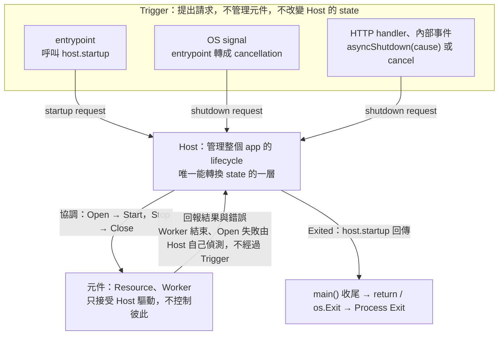

- **Trigger**：提出請求（startup request 或 shutdown request）
  - startup request：entrypoint 呼叫 `host.startup`
  - shutdown request：OS signal 由 entrypoint 轉成 cancellation（見 [§3.8](#38-signalexit-codereadiness)）；HTTP handler、內部事件呼叫 `asyncShutdown(cause)`，或呼叫外部 cancellation 的 cancel（cause 為空）
- **Host**：決定何時開始、何時停止，也是唯一能轉換 state 的一層（state 見 [§3.1](#31-state-與-phase)）
  - 入口只有 cancellation 與 `asyncShutdown`，不認識 signal 或 HTTP
  - 自己偵測到的 Worker 結束與 Open 失敗，也會觸發 shutdown，不經過 Trigger（見 [§3.5](#35-觸發-shutdown-與-cause)）
- **元件**（Resource、Worker）：真正提供服務的一層，只接受 Host 驅動（`open`、`start`、`stop`、`onStop`、`close`）
  - Resource 之間的 `dependsOn` 是「呼叫」依賴，不是控制；Worker 之間沒有依賴
  - Host 在 Stop phase 開始時，也會通知設定了 `onStop` 的 Resource，讓它持有的長連線與 Worker 的 stop 同時結束（見 [§6.4](#64-長連線對-stop-phase-與-close-phase-的影響)）；元件之間沒有任何直接控制，也沒有例外

一句話：Trigger 提出請求，Host 協調，元件執行。

**退出條件**

唯一真正的退出條件是：**Host 已進入 Exited state（`host.startup` 已回傳）**，而不是「是否收到 signal」。

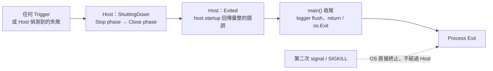

- 收到 signal 只是 Trigger 的一種：它讓 Host 進入 ShuttingDown，不會讓 process 直接結束；所有正常路徑都經過 Exited，不存在「收到 signal 就直接 exit」的路徑
- exit code 由 Host 依結束的原因決定，不看關閉階段的錯誤（見 [§3.8](#38-signalexit-codereadiness)）
- 第二次 signal 或 SIGKILL 不屬於正常退出路徑（見 [§3.7](#37-abort-與-time-budget)）

### 2.6 Walkthrough：一輪完整的 startup 到 shutdown

先看一輪正常的流程；Hub、unwind、Abort 在這張圖先省略，分別見 [§6](#6-hub)、[§3.4](#34-啟動失敗與-unwind)、[§3.7](#37-abort-與-time-budget)。

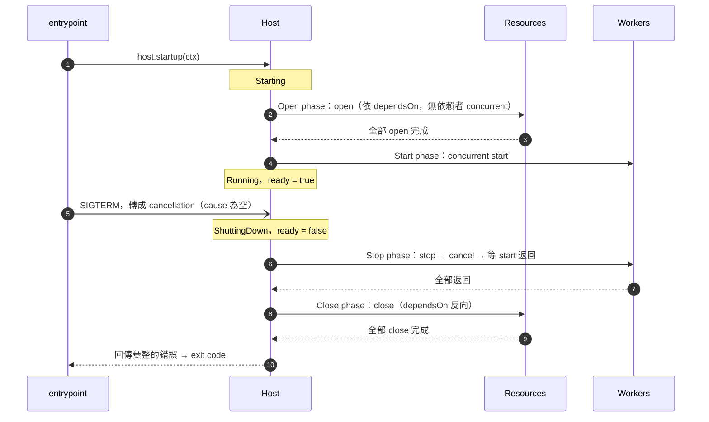

- Resource 比所有 Worker 先 open、後 close：Worker 不會看到未 open 的 Resource，shutdown 期間 Resource 也仍可用
- 第一個觸發 shutdown 的事件成為 cause（見 [§3.5](#35-觸發-shutdown-與-cause)）
- 錯誤由 Host 彙整後回傳；exit code 由 Host 決定（見 [§3.8](#38-signalexit-codereadiness)），entrypoint 以它 exit

## 3. Host

### 3.1 state 與 phase

**Host 的入口：一對動詞**

- `host.startup(ctx)`：startup request 的入口；呼叫後 Host 依序經歷 startup、Running、shutdown，阻塞到 Host 進入 Exited，回傳彙整的錯誤與 exit code；只接收 cancellation
- `host.asyncShutdown(cause)`：shutdown request 的入口；只提出請求，立即返回（見 [§3.5](#35-觸發-shutdown-與-cause)）
- `startup` 在文件裡有兩個層次：「`host.startup`」是整個生命週期的入口，「startup = Open phase → Start phase」只是它的第一段流程；`host.startup` 的名稱取自 startup request，不是只涵蓋 Start phase

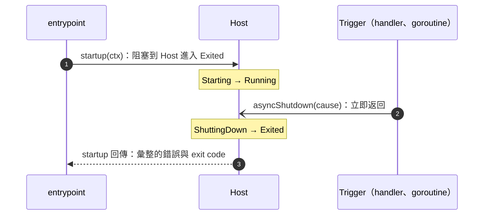

- **state** 是 Host 目前所處的狀態，只回答「Host 現在是什麼狀況」，不做任何事；對外只透過 `ready` 反映
- **phase** 是 Host 處於某個 state 期間，對相應元件各做一輪的動作（Open phase、Start phase、Stop phase、Close phase）
- Open phase、Stop phase、Close phase 各有自己的 time budget（見 [§3.7](#37-abort-與-time-budget)）；Start phase 只 launch concurrency unit，沒有 budget

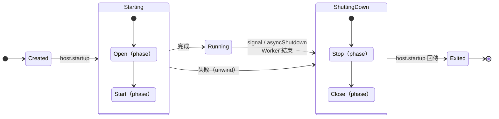

- state
  - **Created**：只有此 state 允許註冊（見 [§3.2](#32-registry-與註冊錯誤)）
  - **Starting**：執行 Open phase、Start phase
    - **unwind**：啟動失敗時，依反向順序停止並 close 已啟動的部分（類比 stack unwinding）
  - **Running**：`ready=true`
  - **ShuttingDown**：進入時立即 `ready=false`，執行 Stop phase、Close phase
  - **Exited**：`host.startup` 已回傳彙整的錯誤
- phase（Host 執行的動作）
  - **Open phase**：依 `dependsOn` 呼叫 Resource 的 `open`
  - **Start phase**：concurrent 啟動所有 Worker 的 `start`
  - **Stop phase**：對所有 Worker concurrent 停止，並同時通知設定了 `onStop` 的 Resource（見 [§3.6](#36-shutdown-的-stop-phase-與-close-phase)）
  - **Close phase**：依 `dependsOn` 反向呼叫 Resource 的 `close`
- 啟動中（Starting）收到失敗、signal 或 `asyncShutdown`：直接進入 ShuttingDown，只停止並 close 已啟動的部分（見 [§3.4](#34-啟動失敗與-unwind)）

### 3.2 Registry 與註冊錯誤

- 只有 Created state 允許註冊
- **programming error**：註冊內容與依賴宣告的錯誤等開發期錯誤；不 panic，由 Registry 依種類記錄，`host.startup` 一開始就以彙整後的錯誤回傳，不啟動任何元件；錯誤因此能走 structured logger 與 exit code 流程
  - Resource：`InvalidResource`，原因是重名、`dependsOn` 指向不存在的名稱或形成循環
  - Worker：`InvalidWorker`，原因是重名、第二個 oneshot、必填欄位為空
  - 名稱在整個 Host 內唯一（Resource 與 Worker 共用），跨種類重名時，錯誤種類依後註冊的那一個
- `host.startup` 之後註冊：該次註冊被忽略，錯誤寫 log 並加入 `host.startup` 回傳的錯誤，種類依被註冊的元件
- `dependsOn` 的錯誤只能在 `host.startup` 時檢查（允許先註冊依賴者），處理方式相同，回報為 `InvalidResource`
- build 的錯誤不屬於 Host，不在這裡處理（見 [§3.8](#38-signalexit-codereadiness)）
- 第二次 `host.startup` 回傳 `AlreadyStarted`

### 3.3 Startup 的 Open phase 與 Start phase

```
Open phase  ：Resource.open 依 dependsOn（無依賴關係者 concurrent）
Start phase ：Worker concurrent
Close phase ：Resource.close 依 dependsOn 反向（無依賴關係者 concurrent）
```

註冊順序不影響執行順序。

**Resource 的 open**

- **open 可以使用 `dependsOn` 列出的 Resource**：例如 Redis 當 config server 時，`mysql` 宣告 `dependsOn: ["redis"]`，`mysql.open` 就能先讀 Redis 取得 DSN
- **open 建立自己的 resource channel**（pool、ping、載入檔案），並做 channel 建好之後的初始化（驗證 schema 版本、載入設定）；初始化失敗時，`open` 要自行清理已建立的 channel，因為 open 失敗的那一個不會被 close
- 一次性的共享狀態預熱（例如把資料寫進 Redis）不屬於 app 啟動流程，改用 [oneshot 指令](#39-oneshotcli)
- 有依賴關係的 open 串成 critical path，`openTimeout` 要涵蓋最長的那條鏈

**Open（phase）**

- Resource 依 `dependsOn` 排序 open（無依賴關係者 concurrent），共用 `openTimeout`
- 失敗的那一個不會被 close（自行清理），依賴它的 Resource 不會開始 open
- 不檢查 3rd-party 服務

**Start（phase）**

- 所有 Resource open 完成後才 concurrent 啟動 Worker，所以 Worker 不會看到未 open 的 Resource
- Start phase 只 launch concurrency unit，沒有 budget
- Worker 啟動失敗（例如 port 衝突）就是一般的 Worker 結束
- 沒有任何 Worker 是合法的：Open phase 完成後直接進入 Running，`ready` 轉為 true，等待 cancellation 或 `asyncShutdown`；測試與只需要 Resource 的程式常這樣用（見 [附錄 D](#附錄-d-測試案例) 的 D4）

### 3.4 啟動失敗與 unwind

- Open 失敗（Open phase 中任一 Resource 的 `open` 失敗）：cancel 進行中的 open、不啟動尚未開始的 open，等進行中的 open 都返回後，close 已成功 open 的 Resource
- Open phase 期間收到 signal 或 `asyncShutdown`：與 Open 失敗一樣 unwind，但它是請求型 cause（為空或為 `asyncShutdown` 帶入的 cause），經 `resolveExitCode` 對應 exit code（見 [§3.8](#38-signalexit-codereadiness)）
  - `open` 收到的 ctx 衍生自 `host.startup` 的 ctx，所以外部 cancellation 會直接 cancel 進行中的 open（Worker 的 `start` 不同，見 [§4.2](#42-兩個不同的-cancellation)）
  - `open` 因 cancel 而回傳的 cancellation 錯誤，與 Worker 的 `start` 同規則，視為正常，不列入錯誤
  - unwind 一定等進行中的 `open` 都返回才開始 close：否則依賴者還在用 dependency，dependency 就先被 close
  - 被 cancel 但仍成功返回的 `open` 視為已 open，會被 close；回傳錯誤的 open 不會被 close（自行清理）
- unwind 的 close 一律依 `dependsOn` 反向，共用 `closeTimeout`（從 unwind 開始計時）；Open 失敗不經過 Stop phase，不使用 `stopTimeout`
- `dependsOn` 指向不存在的名稱或形成循環：programming error，`host.startup` 不啟動任何元件就回傳 `InvalidResource`（見 [§3.2](#32-registry-與註冊錯誤)）
- 多個 Resource 同時失敗：第一個成為 cause（失敗型，見 §3.5）

下圖：`payment-api` 的 open 失敗，`mysql`（`dependsOn redis`）還在 open。

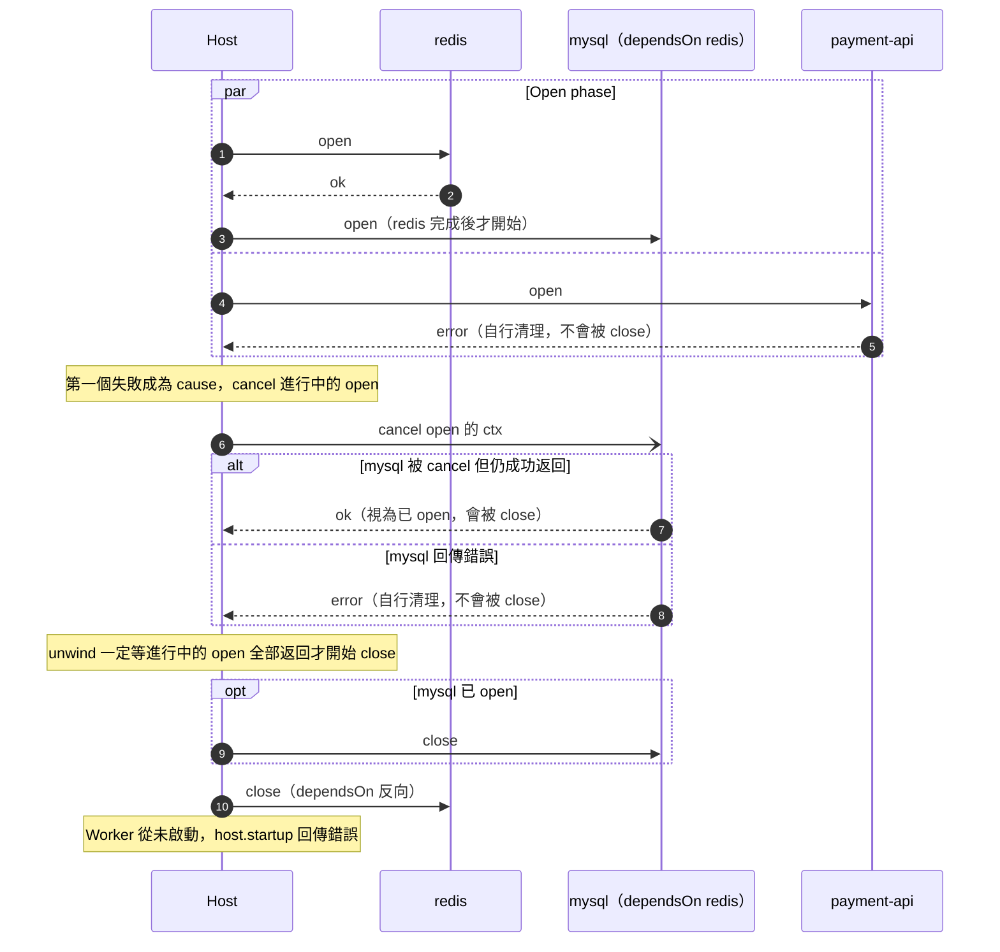

### 3.5 觸發 shutdown 與 cause

**cause** 是第一個讓 Host 結束正常運行（或結束啟動）的事件；exit code 只由它決定（見 [§3.8](#38-signalexit-codereadiness)）。第一個事件成為 cause，之後的事件寫 log 並加入回傳的錯誤。

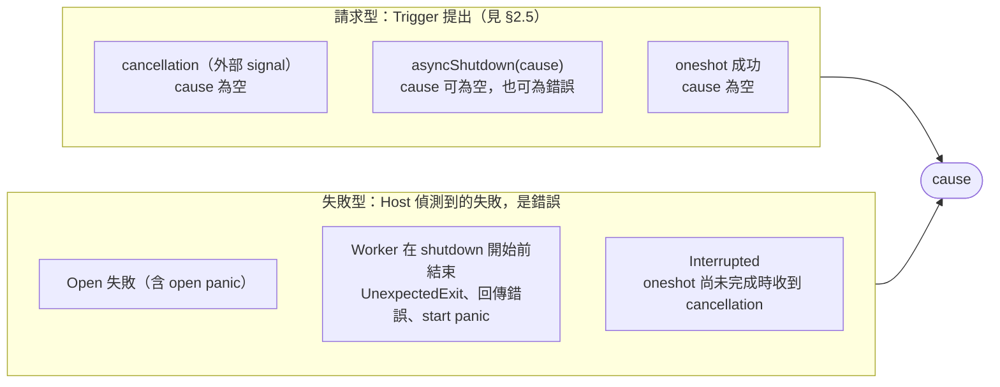

- 一般 Worker 在 shutdown 開始前結束，一律異常（無錯誤時記為 `UnexpectedExit`）；oneshot 失敗時 cause 為該錯誤
- 命名與歸類以這張圖為準，exit code 怎麼對應見 [§3.8](#38-signalexit-codereadiness)

**`asyncShutdown(cause)`：為什麼非阻塞，使用時的注意事項**

- 它是 Trigger 向 Host 提出的請求：只提出請求就立即返回，不等 shutdown 完成；名稱裡的 async 就是這個意思
- 為什麼不阻塞：呼叫者常常正是 shutdown 要等的對象。例如管理端的 HTTP handler 是 `srv.Shutdown` 等待的 in-flight request，Worker 的 goroutine 是 Stop phase 等待返回的 `start`；若呼叫阻塞到 shutdown 完成，兩邊就互等到 `stopTimeout`
- 與 `Hub.shutdown(ctx)` 的差異：`Hub.shutdown` 由 Host 呼叫，Host 本來就要等它走完，所以阻塞；`asyncShutdown` 由 Trigger 呼叫，不能等
- 兩個入口：cancellation（被動，由 ctx 通知）與 `asyncShutdown`（主動，帶 cause）；第一個到達的成為 cause，之後的寫 log 並加入回傳的錯誤
- 注意事項：
  - 返回只代表請求已提出，不代表 Host 已停止；要等結果，看 `host.startup` 是否返回（Host 進入 Exited）
  - 可重複、可並行呼叫；只有第一個事件成為 cause
  - exit code 的對應見 [§3.8](#38-signalexit-codereadiness)；要讓 `asyncShutdown(err)` 以非 0 結束，設定 `resolveExitCode`
  - `asyncShutdown(nil)` 允許：代表任務順利完成、正常關閉（server 正常停止、CLI 結束），預設 exit code 0；shutdown 開始後再呼叫只寫 log（第一個事件成為 cause）
  - 需要區分不同的停止原因時，傳入使用者自訂的非空 cause（例如 sentinel），由 `resolveExitCode` 對應；cancellation 與 `asyncShutdown(nil)` 的 cause 都是空，無法互相區分
  - 以 method value 注入需要它的元件（`host.AsyncShutdown`），元件不必 import `lifecycle`
  - 在 `host.startup` 之前呼叫：cause 被記錄，`host.startup` 不啟動任何元件，直接以該 cause 回傳；仍是請求型，exit code 的規則同 [§3.8](#38-signalexit-codereadiness)

**Worker 結束的判定（進入 ShuttingDown 之後）**

進入 ShuttingDown 之後，`start` 的回傳值這樣判定：

- 正常（不列入錯誤）：nil、cancellation 錯誤、語言 mapping 明列的 sentinel
- 其餘一律異常：加上元件名稱，列入回傳的錯誤；不成為 cause（cause 仍是第一個讓 Host 結束正常運行的事件）
  - 包含 Drain 期間的真實錯誤
- shutdown 開始前結束，一律異常（見上）

有沒有設定 `stop` 不影響這個判定。

### 3.6 Shutdown 的 Stop phase 與 Close phase

**Stop（phase）**

- 進入時 `ready` 已為 false；所有 Worker concurrent 停止，共用 `stopTimeout`；Resource 不會被 close，仍存活
- 同時，Host 通知所有已成功 `open` 且設定了 `onStop` 的 Resource：與 Worker 的停止序列 concurrent 進行，彼此沒有順序保證（見 [§6.4](#64-長連線對-stop-phase-與-close-phase-的影響)）
- 對每個 Worker 執行以下固定順序，單向、不會反過來：
  1. Worker 設定了 `stop` 就先呼叫它，並等它回傳；沒有設定則略過這一步
  2. 對 Worker 的 `start` 送出 cancellation：通知它不再拿新工作並返回；沒有 `stop` 時這是唯一的停止訊號，有 `stop` 時只是保險
  3. 等待 Worker 的 `start` 返回
- cancellation 的目的、作用與它跟外部 cancellation 的區別見 [§4.2](#42-兩個不同的-cancellation)；兩種停法見 [§4.3](#43-兩種停法與何時設定-stop)
- Stop phase 在所有 Worker 的 `start` 返回、且所有 `onStop` 返回後結束；`onStop` 的規則見 [§6.4](#64-長連線對-stop-phase-與-close-phase-的影響)

**Close（phase）**

- Resource 依 `dependsOn` 反向 close，共用 `closeTimeout`
- 一個 Resource 要等所有依賴它的 Resource 都 close 後才 close
- 每個 `close` 在獨立 concurrency unit 執行並 recover

**Exited（state）**

- `host.startup` 回傳彙整的錯誤
- logger 在 lifecycle 外層，`host.startup` 回傳後才 flush
- 若語言的 process exit 會略過 scoped cleanup，收尾寫在它之前

### 3.7 Abort 與 time budget

Abort 是 time budget 用盡時的升級，不是另一條路徑：

- 放棄等待該 phase（或該 connection termination）尚未完成的工作，略過尚未執行的 SignOff
- connection 的 Abort 是 Close step 先於停止流程完成的唯一情況：先 Close step（關 socket），再等 runner 返回（見 [§6.3](#63-connection-termination-pipeline)）
- 繼續下一個 phase；Close phase 一定執行，剩下的 `close` 仍會呼叫，並傳入已到期的 deadline
- 錯誤含 `StopTimeout` 或 `CloseTimeout`；它們屬於關閉階段的錯誤，不影響 exit code（見 [§3.8](#38-signalexit-codereadiness)）
- 不屬於 Abort：啟動失敗（unwind）、使用者函式 panic（recover 成錯誤）、第二次 signal 或 SIGKILL（process 直接終止）

Time budget：

```
stopTimeout + closeTimeout + log flush < terminationGracePeriodSeconds
Hub.stopTimeout < Host.stopTimeout
```

預設 15 + 10 = 25s，小於 k8s 預設 30s。Start phase 沒有 budget（它只 launch concurrency unit）。若在 Worker 的 `stop` 內加入等待（見 [§13.1](#131-workerconfigstop)），要同步調高 `stopTimeout` 與 `terminationGracePeriodSeconds`。

**各 phase 的 budget 與 Abort 路徑**

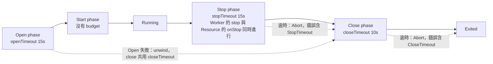

### 3.8 Signal、exit code、readiness

**Signal**

- entrypoint 把 SIGINT、SIGTERM 轉為 cancellation；第一次 signal 後立即解除攔截，第二次走 OS 預設行為直接終止 process

**exit code**

一句話：exit code 只由 **cause** 決定，cause 之後發生的一切只記 log。

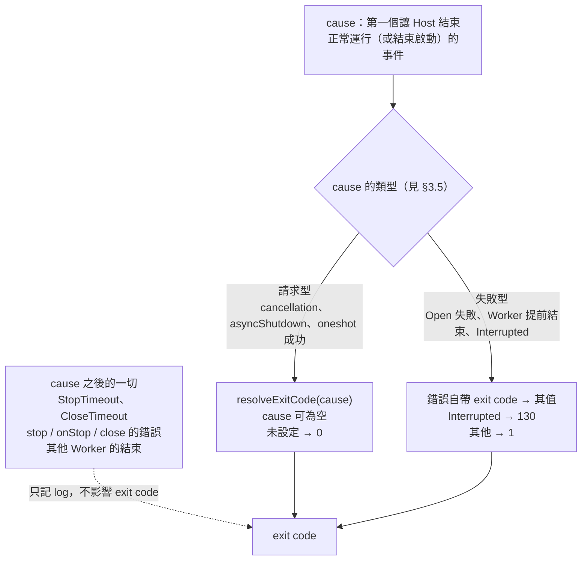

- `resolveExitCode` 在 Host 進入 Exited 時，對請求型 cause（含空 cause）呼叫一次；它是純函式，不做 I/O、不阻塞；panic 依一般規則 recover 成錯誤，exit code 為 1
- cause 之後的一切仍列入 `host.startup` 回傳的錯誤與 log，只是不影響 exit code
  - 例：signal 觸發的 shutdown 中 Stop phase 逾時 → exit code 0，回傳的錯誤與 log 含 `StopTimeout`
  - 例：Worker 因 port 衝突結束（cause）後，其他元件 close 失敗 → exit code 由 port 衝突的錯誤決定，close 的錯誤只記 log
  - 例：oneshot 被 Ctrl-C 中斷後又 Stop phase 逾時 → exit code 130
  - 需要讓它們影響 exit code 時，由 entrypoint 自行檢查 `host.startup` 回傳的錯誤，不使用 Host 決定的 exit code
- 不區分啟動失敗與運作中失敗：Start phase 只 launch concurrency unit，Worker 失敗與 Host 轉為 Running 的先後不確定，以 Running 為界線會有 race；穩定的界線是「cause 是誰」，也就是第一個事件。需要區分時，由 Worker 以自帶 exit code 的錯誤標明（例如 port 衝突回傳 exit code 2 的錯誤），Host 不另設界線
- build 的錯誤（例如 config 讀不到）不屬於 Host：`build` 回傳錯誤、不呼叫 `host.startup`，由 entrypoint 以 `ExitCode(err)` 處理（自帶 exit code 取其值，其他為 1）；不要用 `asyncShutdown` 回報 build 錯誤
- `host.startup` 的回傳值帶著 exit code，entrypoint 以它 exit：
  - 回傳 nil：沒有錯誤且 exit code 為 0
  - 回傳非 nil：exit code 以 `ExitCode(err)` 為準，可能是 0（例如 cause 為空、關閉階段只有逾時）
  - `resolveExitCode` 回傳非 0 而沒有任何錯誤時，回傳一個只帶 exit code 的錯誤

**Readiness**

- `ready` 只反映 Host state，不檢查依賴健康，也不代表 listener 已綁定（Worker 無法在 Open phase 提前綁定 port）；shutdown 開始時立即轉 false
- 不提供 liveness：綁定依賴的 liveness 會在依賴短暫故障時引發整批重啟

### 3.9 Oneshot（CLI）

- 一個 Host 最多一個 oneshot，可與一般 Worker 共存；任務完成後其他 Worker 正常停止
- exit code 的規則見 [§3.8](#38-signalexit-codereadiness)：成功時 cause 為空（請求型，預設 0）；失敗時 cause 為該錯誤；被 signal 中斷時 cause 為 `Interrupted`（130）
- `stopTimeout` 不限制任務執行時間，需要上限時在 `start` 內設 deadline
- 多個子指令：signal、logger、exit code 在最外層，每個子指令各建一個 Host
- 參數錯誤在建立 Host 前處理；進度寫 stderr；長任務定期檢查 cancellation；設計成可重跑

## 4. Worker 怎麼停

### 4.1 Cordon 與 Drain

一個單位要 shutdown，需要做兩件事：先停止它的 primary execution，再關閉它擁有的 resource channel。本文件把這兩件事拆成四個 step 依序進行：前三個 step（Cordon、Drain、SignOff）屬於停止，最後一個 step（Close step）屬於關閉。

Worker 只有 execution，所以只走前兩個 step；SignOff 與 Close step 在 [§6.2](#62-補完-shutdown-的四個-step) 與 Hub 一起引入。

- **Cordon**：我方停止「受理」新工作（新 request、broker 新投遞的訊息），已受理的不受影響（借用 k8s `cordon`）
- **Drain**：讓已經受理、但還沒完成的工作（**in-flight work**）做完，再進入下一個 step；Cordon 已擋住新的受理，所以這批做完後不會再有新的進來（借用「排乾」：等水流完）
  - 例：處理中的 HTTP request、已收到但還沒 ack 的訊息

```
Cordon              → Drain
擋住進來的新工作       做完 in-flight work
```

- **Cordon**：listener、pull、subscription 都在這一步停止
- **Drain**：in-flight work 用 detached context 做完；Resource 仍可用
- Worker 沒有 SignOff（沒有要通知的 stream），也沒有框架驅動的 Close step：`start` 返回即結束；Worker 自己建立的資源由 `start` 內的 scoped cleanup 關閉
  - 例：Consumer 的 `close(sub)` 就是這個 cleanup，由 Helper 在 `start` 離開時呼叫
- 停止的完成條件是 primary execution 已不存在（Worker 的 `start` 返回）；Abort 見 [§3.7](#37-abort-與-time-budget)

### 4.2 兩個不同的 cancellation

**Host 手上有兩個 cancellation，名字很像，用途不同**

- **外部 cancellation**：`host.startup` 的輸入（signal 由 entrypoint 轉成的那一個）。它唯一的作用是通知 Host「開始 shutdown」
- **`start` 的 cancellation**：Host 為每個 Worker 另外建立、自己持有，Worker 的 `start` 收到的是這一個。Host 只在 Stop phase 第 2 步（`stop` 回傳之後）才送出
- 兩者沒有連動：外部 cancellation 不是 `start` 的 cancellation 的上游，SIGTERM 到達時，`start` 的 ctx 不會被 cancel

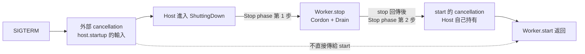

**為什麼要分開：以設了 `cordon` 的 Consumer 為例**

- 如果合併（SIGTERM 直接 cancel `start` 的 ctx）：`receive` 立刻中止，broker 已經投遞、躺在 client 緩衝區的訊息沒人處理，要等 close 之後才重新投遞；`stop` 裡的 `cordon` 與 Drain 還沒做就結束了
- 分開：SIGTERM 到達後 Host 先呼叫 `stop`（`cordon` 取消訂閱）→ `receive` 繼續收完緩衝區的訊息並 `handle` → `stop` 回傳 → Host 才送出 `start` 的 cancellation（此時 `start` 通常已經返回）
- 一句話：順序是 Cordon → Drain → cancellation，不能讓 cancellation 跑在前面；沒有設 `stop` 的 Worker 沒有這個問題，因為 cancellation 本身就是它的停止訊號

**目的與作用**

- 目的：告訴 `start`「不再拿新工作，然後返回」
- 設定了 `stop` 的 Worker：Cordon 與 Drain 由 `stop` 做，cancellation 不是必要步驟，只是保險；若 `start` 已經因為 `stop` 返回，這一步沒有作用
  - HTTP server：`stop` 是 `srv.Shutdown`
  - 設定了 `cordon` 的 Consumer：見 [§5](#5-consumer-helper)
  - 需要這份保險的情況：
    - `start` 裡除了被 `stop` 解除的那個阻塞呼叫，還有接受 ctx 的其他迴圈或 goroutine，要靠 cancellation 才會結束
    - `stop` 提前回傳錯誤：沒有 cancellation，`start` 只能等到 Stop phase 的 deadline 走 Abort；有 cancellation，接受 ctx 的 `start` 還有機會自己返回
- 沒有設定 `stop` 的 Worker：cancellation 是唯一的停止訊號。`start` 裡接受 ctx 的阻塞呼叫（例如自己的輪詢迴圈、等待 `<-ctx.Done()` 的 `select`）因它返回，就是 Cordon；手上 in-flight 的那一筆用 detached context 做完，就是 Drain
  - `cordon` 為空的 Consumer 屬於這種：沒有 unsubscribe 的 client（例如 kafka-go）以 cancel 阻塞中的 `receive`（停止拉取）作為 Cordon
- 不會中斷 in-flight 工作：單筆工作用 detached context（[使用者規則 2](#7-使用者規則)），不受它影響

**與 `stop` 的先後**

- `stop` 與 cancellation 沒有誰觸發誰：兩者都由 Host 依 Stop phase 的順序送出
- 以 `http.Server` 為例：`start` 是 `ListenAndServe`，不接受 ctx，cancellation 對它沒有作用；`stop` 是 `Shutdown`，它一被呼叫，`ListenAndServe` 就先返回，`Shutdown` 繼續等進行中的 request 做完才回傳；之後 Host 才送出 cancellation，此時 `start` 已經結束

### 4.3 兩種停法與何時設定 `stop`

**兩種停法**

- **`stop` 為空（預設）**：Host 送出 cancellation；阻塞呼叫因 cancellation 返回 = Cordon；in-flight work 用 detached context 做完 = Drain
  - `cordon` 為空的 Consumer 屬於這種
- **設定 `stop`**：Host 呼叫 `stop()`（Cordon + Drain），回傳後才送出 cancellation
  - `cordon` 有值的 Consumer 屬於這種，Helper 替你產生 `stop`

兩種最後都是 `start` 返回。

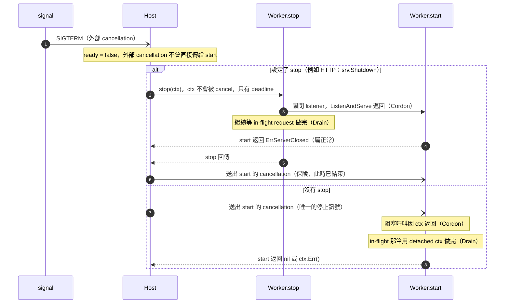

**何時設定 `stop`**

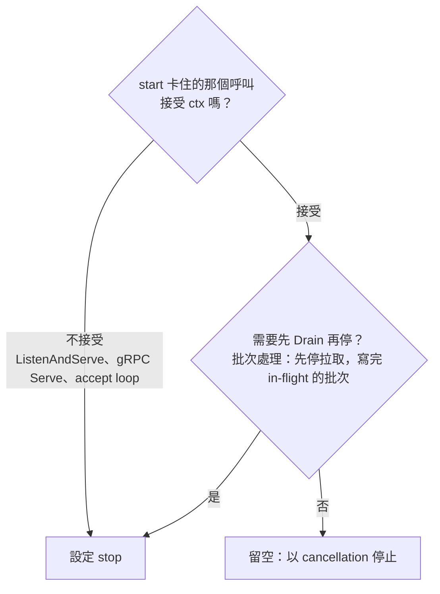

**`stop` 的語意**

1. 呼叫 `stop`，傳入不會被 cancel、deadline 為 Stop phase 結束時間的 context
2. `stop` 回傳（或 deadline 到）後，才對 `start` 送出 cancellation
3. 等待 `start` 結束

- `start` 結束的判定見 [§3.5](#35-觸發-shutdown-與-cause)；`stop` 自己的錯誤也列入結果
- `stop` 必須在 ctx deadline 到時返回（[使用者規則 8](#7-使用者規則)）；忽略 deadline 的 `stop` 會讓 Host 到期後放棄等待，它的 concurrency unit 留到 process 結束（見 [§8 框架保證](#8-框架保證invariant) 第 10 點）
- 不用 `stop` 關閉 Worker 自己的資源（用 scoped cleanup）或共用資源（那是 Resource）
- `stop` 需要的物件在 `start` 內才建立時，改用 Consumer Helper（`stop` 與 `start` 在 Helper 內共享 subscription）；非 consumer 的情況，自己用 closure 共享

## 5. Consumer Helper

Consumer Helper 是 Worker `start` 的固定模板：以 `ConsumerConfig` 產生一個 `WorkerConfig`，仍以 `registry.worker` 註冊，沒有自己的停止模型。Helper 擁有 for loop，使用者只提供每一步的函式；ack / nack 與是否可重試屬於業務邏輯，由 `handle` 與 `onError` 決定。Kafka、AMQP、NATS 都適用。

- **consumer**：message loop 的角色（receive → handle），是一種 Worker；可用 Consumer Helper 產生 `WorkerConfig`，也可手寫
- 模板固定「依序 receive → handle」；批次、concurrent 處理或特殊停止順序套不進去時，有兩個選擇：多次呼叫 Consumer Helper 註冊多個 Worker，或手寫成一般 Worker（它仍是 consumer，只是不經過 Helper）

**展開成 Worker**

- `start`：固定迴圈，離開時 `close(sub)`（scoped cleanup）
- `stop`：
  - `cordon` 為空：不產生 `stop`，等同 Worker 的「`stop` 為空」
  - `cordon` 有值：產生 `stop`，等同 Worker 的「設定 `stop`」
- `oneshot`：永遠 false

展開後的 `start`：

```
connect → receive（start 的 ctx）→ handle（detached context）→ receive …
                                   └ 失敗 → onError：空或回傳空 → 繼續；回傳錯誤 → start 返回該錯誤
receive 回報 ok == false → start 返回 nil
任何路徑離開 start → close(sub)
```

**為什麼 `cordon` 有值時要有 `stop`**

- 只 cancel 本地的 `receive` 不夠：broker 仍持續投遞，這些訊息會留在 client 緩衝區，要等 close 之後才被重新投遞
- 設定了 `cordon`（取消訂閱，通知 broker 停止投遞）後，Drain 是 `receive` 到 subscription 結束，並 `handle` 完已經收到的訊息

`cordon` 有值時，Helper 產生的 `stop`：

1. 若 `connect` 尚未完成，等它完成（或 ctx deadline）
2. 若 `connect` 成功，呼叫 `cordon(sub)`
3. 等 `start` 的迴圈結束（`receive` 回報 `ok == false`，且最後一筆 `handle` 完成）或 ctx deadline

`stop` 回傳後 Host 才送出 cancellation，與 [§4.3](#43-兩種停法與何時設定-stop) 的語意一致，此時 cancellation 只是保險。

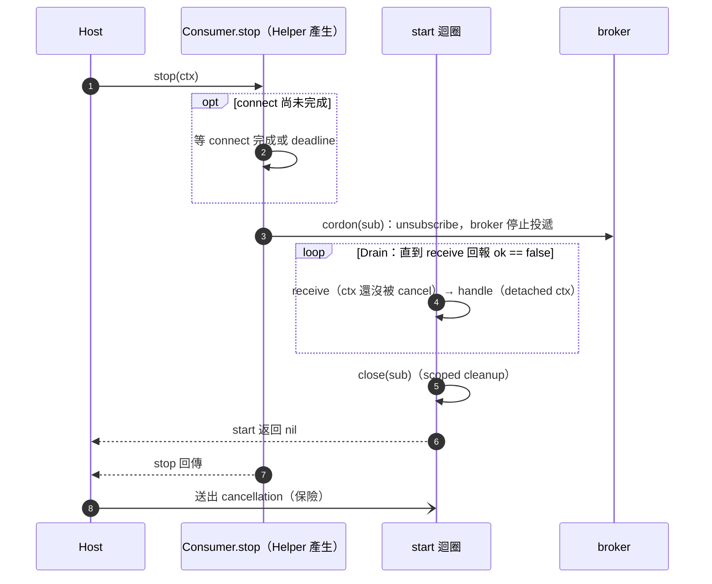

Config：

- `connect`：必填，在 `start` 內建立 subscription
- `receive(sub)`：必填，取得下一則訊息，或回報 subscription 已結束
- `handle(sub, msg)`：必填，處理單筆並自行決定是否 ack；收到 detached context（[使用者規則 2](#7-使用者規則)）
- `onError(sub, msg, err)`：可為空，空時忽略並繼續下一則；收到與 `handle` 相同的 context
- `cordon(sub)`：可為空
  - 空：不產生 `stop`，以 cancellation 停止；cancel 阻塞中的 `receive` 就是 Cordon
  - 有值：產生 `stop`，呼叫 `cordon`（例如 unsubscribe），再等 `start` 把已收到的訊息 receive 並 handle 完
- `close(sub)`：可為空，使用 subscription 本身的關閉方法（若有）
- `handleTimeout`：可為 0，不另設 deadline

規則：

- 停止方式只有 [§4.3](#43-兩種停法與何時設定-stop) 的兩種，Helper 不新增第三種
- context：`receive` 直接使用 `start` 的 ctx，不另外衍生；`handle` 與 `onError` 使用 detached context，`handleTimeout` 套用在其上。這是兩種停法的直接結果：
  - `cordon` 為空：cancellation 是唯一停止訊號，cancel `receive` 就是 Cordon
  - `cordon` 有值：cancellation 要等 `stop` 回傳才送，所以 Drain 期間 `receive` 不會被 cancel，可以繼續收完 client 緩衝區裡的訊息
- `start` 結束的判定與一般 Worker 相同（[§3.5](#35-觸發-shutdown-與-cause)）：shutdown 開始前結束一律異常，包含 `receive` 回報 `ok == false`
- `receive` 回傳錯誤時：若 `start` 的 ctx 已被 cancel，`start` 返回 `ctx.Err()` 並將原錯誤寫 log（library 把 cancel 翻成自己錯誤的差異由 Helper 吸收）；否則原樣返回，由 [§3.5](#35-觸發-shutdown-與-cause) 列入結果
- stop 在 `connect` 完成前到達：不進入迴圈；`connect` 若成功仍呼叫 `cordon`（若有）與 `close`
- 訊息依序處理

## 6. Hub

### 6.1 為什麼需要 Hub

Host 管 static topology，但 WebSocket、SSE、gRPC streaming 的 connection 在執行期隨時增減，不能逐一向 Host 註冊。Hub 集中管理這些 dynamic connections，不影響 static topology。

```
Host  ← static topology：host.startup 之後不再增減
├── Resource
│   ├── mysql、redis、3rd-party client：互不依賴時 open 彼此 concurrent
│   └── Hub
│       └── roster  ← dynamic connections，不向 Host 註冊
└── Worker
    ├── HTTP server：處理 request；WebSocket / SSE handler 以 join 交給 Hub（carrier Worker）
    ├── message loop（Kafka 等）：用 Consumer Helper 或手寫；需要時經 Hub dispatch
    └── ticker loop
```

- Hub 是 static topology 與 dynamic connections 唯一的接點：對 Host 它是 Resource（`close` 即 Hub 的 `shutdown`），內部以 roster 管 connection
- static / dynamic 的切分與 Resource / Worker 無關：兩者都屬於 static topology
- Hub 不知道 Host 存在：在模組內邏輯獨立，不引用 Host 或 Registry，由使用者以 `registry.resource` 註冊
- **Hub 是 Resource 中唯一的特例**：Hub 註冊為 Resource 時，`close` 的實作是 `shutdown`
  - 理由：Hub 擁有 execution（runner），它的 `close` 必須先停止這些 execution
  - Host 在 Close phase 呼叫 Resource 的 `close`，等於呼叫 `hub.shutdown`，由它結束所有 connection
  - 另外，Hub 可同時設為 Resource 的 `onStop`：Host 在 Stop phase 開始時就呼叫 `hub.shutdown`，原因與細節見 [§6.4](#64-長連線對-stop-phase-與-close-phase-的影響)

**Hub 的名詞**

- **roster**：Hub 內部的 connection 名冊（不指 Hub 本身）
- **runner**：connection 的讀取迴圈；只讀；它是 connection 的 primary execution
- **task**：派發給 connection 的寫入工作
- **task executor**：依提交順序逐一執行 connection 的 task 的 concurrency unit；只處理交辦的事，屬於 `close` 時結束的 subordinate execution
- **termination**：Hub 對單一 connection 走完四個 step 的過程；停止以 runner 返回為終點，Close step 關閉 socket 並結束 task executor，保證剛好一次
- **reason**：connection 的終止原因；對應 Host 的 **cause**（第一個讓 Host 結束正常運行的事件）
- **push**：經 Hub 送給 client 的資料
- **carrier Worker**：handler 以 `join` 把 connection 交給 Hub 的 Worker（WebSocket / SSE 的 HTTP server、server streaming 的 gRPC server）
- **shutdown（Hub）**：Hub 自己的停止與關閉（對每條 connection）；Host 的 shutdown 指從 `ready=false` 到 Close phase 結束的整個過程。Hub 的操作 `shutdown(ctx)` 是阻塞的，可重複呼叫：第一次呼叫觸發，之後的呼叫只等待

### 6.2 補完 shutdown 的四個 step

[§4.1](#41-cordon-與-drain) 引入了 Cordon、Drain。同時有 execution 與 resource channel 的單位，才會走完四個 step，也就是 Hub 管理的 connection：socket 是 resource channel（Open / Close verb），runner 是 execution（Start / Stop verb；runner 返回是停止的終點）。

四個 step 的完整定義（前兩個補上 connection 的情況）：

- **Cordon**：我方停止「受理」新工作（新 connection、新 request、broker 新投遞的訊息、新 dispatch），已受理的不受影響
  - Cordon 只管是否受理新工作，不管 stream 的讀寫：connection 的 runner 在 Drain 期間仍會讀到對端傳來的訊息，這些訊息的回覆若經 `dispatch` 會被 `NotAccepting` 拒絕
- **Drain**：讓已經受理、但還沒完成的工作做完，再進入下一個 step；例如已排進 queue 的 task
  - connection 的 runner 在 Drain 期間讀到的 inbound 訊息不是 Drain 的等待對象，runner 由停止流程的最後一步負責結束
- **SignOff**：我方關閉 stream 的「寫入端」：宣告之後不再傳送資料；stream 的「讀取端」仍開著，等對端回應（借用廣播的「收播」）。只有 Hub 管理的 connection 有 SignOff，可省略
- **Close step**：同時關閉讀寫兩端，銷毀自己擁有的 resource channel

停止的完成條件是 primary execution 已不存在（connection 的 runner 返回）；Close step 在停止完成之後才關閉 resource channel，Abort 除外（見 [§3.7](#37-abort-與-time-budget)）。

shutdown 在 connection 與 Hub 的樣子：

- connection：停止 = Cordon → Drain → SignOff → runner 返回；Close step = 關閉 socket、task executor 結束
- Hub：`shutdown` = 對每條 connection 做 shutdown

**Worker、Resource、Hub 各走哪些 step、由誰觸發**

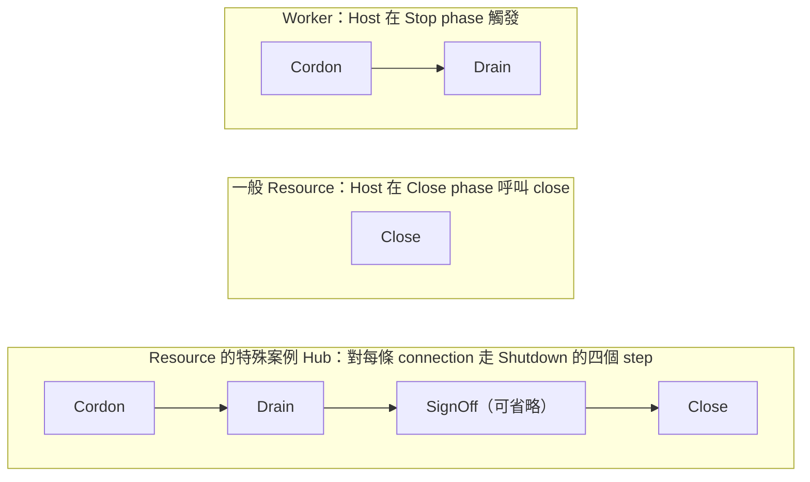

- Worker：由 Host 在 Stop phase 觸發，走 Cordon → Drain。沒有 SignOff，也沒有框架驅動的 Close step
- 一般 Resource：沒有 primary execution，停止為空，由 Host 在 Close phase 呼叫 `close`，只做 Close step
- Hub（Resource 的特殊案例）：Hub 的 `close` 就是 `shutdown`，對每條 connection 走完四個 step（停止流程 → Close step）。Hub 可同時設定 `onStop = shutdown`，由 Host 在 Stop phase 開始時提早觸發；Host 在 Close phase 再呼叫一次（作為 `close`），等待剩下的 connection，到期 Abort（見 [§6.4](#64-長連線對-stop-phase-與-close-phase-的影響)）

**connection 的 Cordon 與 SignOff：差別是方向，不是「有沒有通知對端」**

- **Cordon 管「受理」**：我方停止受理新工作，例如新 connection（`join` 回 `NotAccepting`）、新的 `dispatch`；不碰已建立 stream 的讀寫兩端。runner 在 Drain 期間仍會讀到 inbound 訊息，它們的回覆經 `dispatch` 會被 `NotAccepting` 拒絕（見 [§10 設計取捨](#10-設計取捨)）；Drain 只等已受理的工作，也就是已在 queue 的 task
- **SignOff 管「傳送」**：我方在已建立的 stream 上停止傳送資料，也就是關閉寫入端；讀取端仍開著
- 兩者都可能需要通知對端，所以不能用「有沒有通知」分類：GOAWAY 是「請不要再對我開新 stream」，我方停止受理新 stream，屬於 Cordon；close frame 是「我不會再傳資料了」，我方停止傳送，屬於 SignOff
- SignOff 是應用層的 half-close（類似 TCP `shutdown(SHUT_WR)`）：我方關閉寫入端，讀取端仍開著，等對端回應後 runner 才返回、才進入 Close step；對端收到 close frame 後回一個 close frame 是協定的連帶行為，不是請求
- SSE 是單向流，SignOff 只是寫一個下線事件；防止 client 自動重連打回來的是 Cordon（Hub 不再接受 `join`，加上 `ready=false` 讓 LB 不再導流）
- 順序：close frame 之後不可再送資料（RFC 6455），SignOff 時 resource channel 必須仍暢通；SignOff 在 Drain 之後，已接受的 task 要先寫完，才宣告不再送出

### 6.3 Connection termination pipeline

shutdown(connection) = 停止流程 → Close step：

```
Opening ─open 成功→ Live ─觸發→ Stop：Cordon → Drain → SignOff → runner 返回
   │                                                      └ SignOff 之後 cancel runner 並等它返回
   │                           → Close：關 socket、task executor 結束
   └─ open 失敗 / Hub 已在 shutdown → Close（runner 尚未啟動，Stop 為空）
                      deadline 到 → Abort：略過 SignOff，cancel runner，先 Close（關 socket），再等 runner 返回
                                    （Close 先於 Stop 完成）
```

觸發 termination 的事件：`kick`、頂替（同 id 新 connection）、`shutdown`、runner 結束、對端斷線、queue 滿、panic。

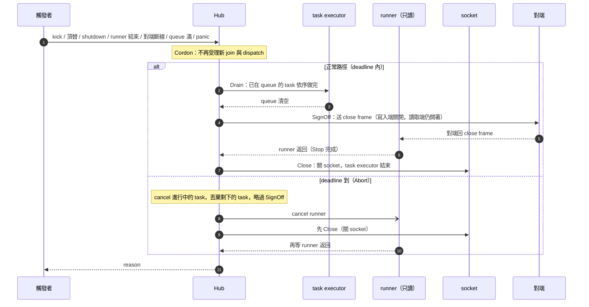

設計理由：

- **open 成功才登記 roster**：open 期間不會有 task 寫入；失敗也不會頂替舊 connection
- **runner 只讀**；寫入一律是 task，同一 connection 依提交順序執行
- **停止先於 Close step**：SignOff 送出 close frame 後，runner 還要繼續讀才收得到對端回應；等 runner 返回（停止完成）再關 socket（Close step），runner 不會讀到已關閉的 socket 而產生雜訊錯誤，`join` 回傳時也保證 runner 已結束
- **SignOff 在 cancel runner 之前**：有些 library 在 read 被 cancel 時會自行 close connection
- **為什麼不是送完 close frame 就直接 close**：接收緩衝區若有未讀資料，關 socket 可能送出 RST，對端看到 1006（abnormal closure）而非 1001，close frame 也可能被丟掉。代價是無回應的對端最多多佔這條 connection 到 `stopTimeout`，到期走 Abort；每條 connection 獨立，不拖累其他 connection
- **每條 connection 獨立走完**，不互相拖累（不用全域 barrier）

### 6.4 長連線對 Stop phase 與 Close phase 的影響

Hub 管理的長連線，在 Host 的 Stop phase → Close phase 順序下需要特別處理。

**兩種 connection**

依「server 有沒有把 handler 視為 in-flight work」分成兩類：

- **server 追蹤型**：SSE、gRPC server streaming。handler 停在 `join`，是 `http.Server` / gRPC server 的 in-flight work，`srv.Shutdown`、`GracefulStop` 會等它返回
- **hijack 型**：被 server 接管（hijack）的 WebSocket。它不再是 `http.Server` 追蹤的 in-flight work，`srv.Shutdown` 不等它

**對 Stop phase、Close phase 的影響**

- Hub 是 Resource，依[框架保證](#8-框架保證invariant)第 5 點，Resource 比所有 Worker 活得久；Host 要到 Close phase 才呼叫 Hub 的 `close`（= `shutdown`）
- 但 carrier Worker 的停止（`stop` 與 Drain）要等 server 追蹤型 connection 的 handler 返回，而 handler 要等 Hub 結束 connection
- server 追蹤型：Stop phase 等 handler、handler 等 Hub、Hub 等 Close phase、Close phase 等 Stop phase，互等到 `stopTimeout`，走 Abort
- hijack 型：不互等；但 Hub 若只在 Close phase 才開始 termination，client 晚收到 1001，並佔用 `closeTimeout`

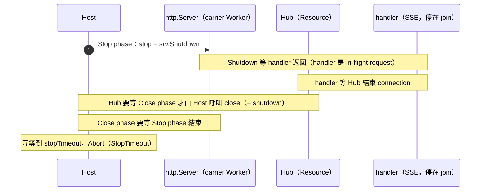

**解決方案**：採用 Resource 的 `onStop`，讓 Host 在 Stop phase 開始時通知 Hub。

**`onStop` 的定義**

- 欄位：`onStop(ctx)`，可為空 → 不通知
- `onStop` 是 **phase 通知**，不是 verb：它只代表「Host 進入 Stop phase」，不代表 Resource 有 Stop verb；Resource 仍只有 Open / Close verb
- 時機：Stop phase 開始時，與每個 Worker 的停止序列同時啟動（concurrent），彼此沒有順序保證，也不依 `dependsOn` 排序；`onStop` 不得假設 Worker 已停止
- 對象：只通知已成功 `open` 的 Resource；啟動失敗的 unwind 不呼叫（沒有 Worker 啟動，也不會有長連線）
- ctx：不會被 cancel，deadline 為 Stop phase 結束時間（與 Worker 的 `stop` 相同）；必須在 deadline 到時返回（[使用者規則 8](#7-使用者規則)）
- 錯誤與 panic：panic recover 成帶元件名稱與 stack 的錯誤；錯誤以 `resource "<name>": onStop: <err>` 列入結果，不成為 cause
- Stop phase 在所有 Worker 的 `start` 返回、且所有 `onStop` 返回後結束；用盡 `stopTimeout` 走 Abort
- 不取代 `close`：Resource 仍在 Close phase 依 `dependsOn` 反向 `close`，剛好一次
- Hub 的註冊：`onStop` 與 `close` 都設為 `hub.shutdown`；`shutdown` 可重複呼叫，Close phase 的那次只等待殘留的 connection

**依 connection 類型決定是否設定 `onStop`**

- server 追蹤型（SSE、gRPC streaming）：必須設定，否則 Stop phase 逾時；同時接受最後一批 push 不保證送達（見下）
- hijack 型（WebSocket）：建議設定，termination 在 Stop phase 開始，client 早收到 1001，也不佔用 `closeTimeout`；不設定也正確，termination 晚到 Close phase 才開始
- 取捨（已接受）：設定 `onStop` 後，Stop phase 期間 Hub 不再受理 `dispatch` 與 `broadcast`，這期間的呼叫一律被 `NotAccepting` 拒絕，包括 consumer 在 Drain 時處理的最後一批訊息，以及處理中的 HTTP request（例如 `POST /notify` 要推給 WebSocket 的內容），不保證送達（見 [§10](#10-設計取捨)）。server 追蹤型必須設定，所以這個代價必須接受；這類 client 本來就靠重連補資料（例如 SSE 的 `Last-Event-ID`）

**執行流程**

```
Stop phase ：Worker 的 stop 與 Resource 的 onStop 同時開始
             api     ：srv.Shutdown（等 in-flight request）
             ws-hub  ：onStop = Hub.shutdown → 每條 connection Stop（Cordon → Drain → SignOff → runner 返回）→ Close
             → server 追蹤型：handler 全部返回 → srv.Shutdown 回傳
               hijack 型：srv.Shutdown 不等它，由 onStop 等到它們走完
             → 所有 stop 與 onStop 返回，Stop phase 結束
Close phase：ws-hub.close（= Hub.shutdown，第二次呼叫，只等待殘留的 connection）
```

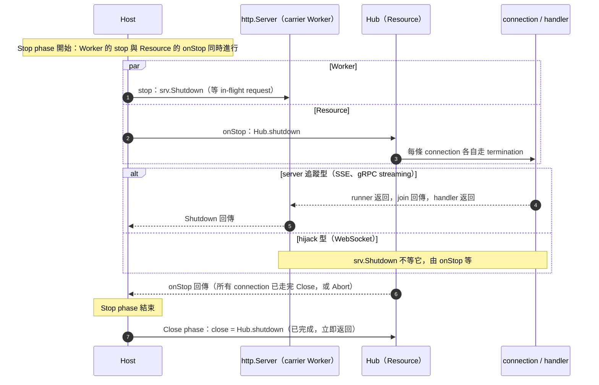

- `Hub.stopTimeout < Host.stopTimeout` 仍須成立：Stop phase 的長度是 Worker 的 Drain 與 Hub 的 termination 中較長的那個

### 6.5 Config 與操作

Config：

- `open(conn)`：可為空，不做 handshake
- `signOff(conn, reason)`：可為空，略過 SignOff；reason 為空代表 runner 正常結束
- `close(conn)`：可為空，使用 connection 本身的關閉方法（若有）
- `queueSize`：可為 0，預設 256
- `taskTimeout`：可為 0，預設 10s；套用於 `open` 與每個 task
- `stopTimeout`：可為 0，預設 5s；Cordon 到 Close step 的上限
- `logger`：可為空

操作：

- `join(requestCancellation, id, conn, runner) → reason`：取得 conn 的所有權，在呼叫端阻塞執行 runner，直到 connection 完全關閉
- `kick(id, reason)`、`kickMany(ids, reason)`：觸發 termination，立即返回；reason 為空時用 `Kicked`；不在 roster 時回傳 `ConnNotFound`（還在 Opening 的 connection 也不在 roster，見 [§6.8](#68-kick-與-opening-中的-connection)）
- `dispatch(ids, maxConcurrency, task)`、`broadcast(maxConcurrency, task)`：排入 queue，立即返回；shutdown 後回傳 `NotAccepting`
- `exists(id)`：只反映 roster（Live 的 connection），Opening 中的不算
- `shutdown(ctx)`：停止接受 `join` 與 dispatch，觸發所有 connection 的 termination，阻塞到所有 connection 走完 Close step；ctx 到期或被 cancel 則 Abort 剩餘的 connection；可重複、可並行呼叫（第一次觸發，其餘只等待）；Hub 註冊為 Resource 時以它為 `close`，也可同時設為 `onStop`

### 6.6 Hub 的行為細節

#### join

- Hub 已在 shutdown：close conn，回傳 `NotAccepting`
- `open` 失敗（`taskTimeout`）：close conn，回傳錯誤
- `open` 期間 Hub 開始 shutdown：`signOff(ShuttingDown)` → close，回傳 `NotAccepting`
- 否則登記 roster（同 id 舊 connection 以 `Replaced` 終止）→ 啟動 task executor → 執行 runner → termination → 回傳 reason
- `join` 一經呼叫，conn 的 `close` 保證剛好一次

#### Termination 細節

- 每條 connection 的 deadline = 觸發時間 + `stopTimeout`；任何一次進行中的 `shutdown` 呼叫，其 ctx 到期或被 cancel 時，尚未結束的 connection 也立即 Abort
- deadline 到時（Abort）：cancel 進行中的 task、丟棄剩下的 task、略過 SignOff、cancel runner、close，再等 runner 結束
- `signOff` 對每種 reason 都會被呼叫，是否真的送出由使用者決定
- reason：`kick` 給的值（空時 `Kicked`）、`Replaced`、`ShuttingDown`、`Disconnected`（request cancellation 觸發）、runner 的錯誤（正常結束為空）、`SlowConnection`、panic 錯誤

#### Dispatch

- 同一 connection 的 task 依提交順序逐一執行；不同 connection concurrent
- `maxConcurrency` 限制單次呼叫的 concurrent 數，各次呼叫分開計算；≤ 0 不限制
- task 有 `taskTimeout`；termination 開始時不 cancel task，只有 deadline 到才 cancel
- queue 滿：該 connection 以 `SlowConnection` 終止（不做無上限的 buffer）
- task 錯誤寫 log；task panic 結束該 connection

#### Exception isolation

- `open` panic：視為 open 失敗
- runner / task panic：以帶 stack 的錯誤終止該 connection
- `signOff` panic：視為錯誤，繼續 close
- `close` panic：寫 log

### 6.7 Protocol 對應

- **WebSocket，close frame 與關 socket 分開的 library**：`signOff` 送 close frame，`close` 關 socket
- **WebSocket，兩者合一的 library**：合一的呼叫放 `signOff`，`close` 用不做 handshake 的強制 close
- **SSE**：runner 等待 cancellation；`signOff` 寫下線事件並 flush；`close` 留空
- **gRPC server streaming**：runner 等待 cancellation；`signOff` 送最後一則訊息或留空

### 6.8 kick 與 Opening 中的 connection

**事實**

- Hub 只在 `open` 成功後才登記 roster（[§6.3](#63-connection-termination-pipeline) 的設計理由：open 期間不會有 task 寫入，失敗也不會頂替舊 connection）
- `open`（handshake）最長 `taskTimeout`（預設 10s）；這段期間 connection 是 Opening，不在 roster
- `kick`、`kickMany`、`exists` 只看 roster，所以對 Opening 中的 connection 一律當作「不存在」
- `ConnNotFound` 的意思是「不在 roster」，不等於「不在線上」

**會發生什麼**

```
t0  user-42 通過 auth，Upgrade 完成，join 開始，open（handshake）進行中
t1  管理端封鎖 user-42，呼叫 kick("user-42") → ConnNotFound（不在 roster）
t2  open 成功，登記 roster → user-42 Live，被封鎖的使用者連上線了
```

**決定**

- 不改 Hub 的機制（不追蹤 Opening 中的 id）；`kick` 的語意只涵蓋已 Live 的 connection
- 封鎖由驗證層負責，`kick` 只負責踢掉已經在線的

**封鎖的做法**

1. 先寫入封鎖狀態（source of truth，例如 DB 或 Redis），再呼叫 `kick`。順序不能反過來，否則 `kick` 之後、封鎖狀態寫入之前，使用者可以重連
2. handler 在 Upgrade 之前的驗證（`auth.UserID`）檢查封鎖狀態，擋住之後新的連線
3. 需要補洞時，在 Hub 的 `open(conn)` hook 內再檢查一次封鎖狀態；回傳錯誤時 `join` close conn 並回傳該錯誤。這個 hook 用到的 Resource（如 redis）要列進 Hub 的 `dependsOn`（[使用者規則 4](#7-使用者規則)）
4. 需要硬保證時：`kick` 回傳 `ConnNotFound` 後，等 `taskTimeout` 再加一小段餘裕，再 `kick` 一次。原因：
   - 封鎖狀態寫入之後才開始的 `open` hook，會被第 3 步擋下
   - hook 在寫入之前就開始的 connection，最晚在寫入後 `taskTimeout` 內 `open` 結束，不是登記進 roster 就是失敗，所以第二次 `kick` 一定看得到它

下圖是第 4 步要補的情況：hook 在寫入封鎖狀態之前就已通過檢查。

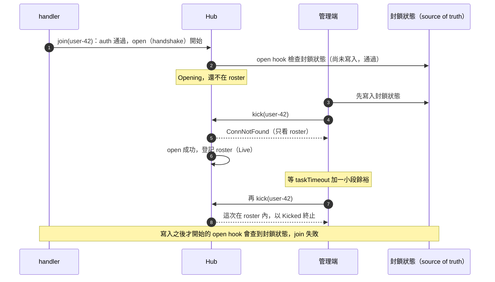

**沒做到的**

- 只做第 1、2 步：「已通過 auth、尚在 handshake」的 connection 不受封鎖影響，會短暫連上線（最長一個 `taskTimeout`），直到下一次 `kick`
- 做到第 3 步但沒有第 4 步：仍有一個極小的空窗，介於 `open` hook 檢查完與登記 roster 之間
- 若需要不靠重試的保證，必須讓 Hub 追蹤 Opening 中的 id，`kick` 命中時在 `open` 完成後立刻以 `Kicked` 終止；目前不採用，因為多一個結構，而封鎖本來就屬於驗證層

## 7. 使用者規則

[框架保證](#8-框架保證invariant)建立在這八條規則上：

1. **在 `dependsOn` 宣告依賴**：Resource 在 `open`、執行期或 `close` 會呼叫的其他 Resource 都要列進去
2. **單筆工作用 detached context**：cancellation 代表「不再拿新工作」，不是「中斷 in-flight work」
3. **logger 在 lifecycle 外層**：由 entrypoint 建立，`host.startup` 回傳後才 flush，不註冊為 Resource
4. **Hub 的 `dependsOn` 列出 hook 與 task 會用到的 Resource**
5. **Hub 承載 SSE、gRPC streaming 時，Hub 的 Resource 註冊必須設定 `onStop`（= `hub.shutdown`）**：否則 Stop phase 與 handler 互等到 `stopTimeout`；並接受最後一批 push 不保證送達；承載 hijack 的 WebSocket 時建議設定（讓 termination 在 Stop phase 開始）。carrier Worker 不需要、也不應該呼叫 Hub（見 [§6.4](#64-長連線對-stop-phase-與-close-phase-的影響)）
6. **Hub 的 runner 只讀**：寫入一律透過 `dispatch` / `broadcast`
7. **`start` 響應 cancellation 時回傳 nil 或 `ctx.Err()`**（Consumer Helper 替你做）
8. **`stop` 與 `onStop` 必須在 ctx deadline 到時返回**：ctx 不會被 cancel，deadline 是它們唯一的結束訊號；底層呼叫不接受 ctx 時要自己包一層（例如 [`WorkerConfig.Stop`](#131-workerconfigstop) 的 gRPC `GracefulStop`）

## 8. 框架保證（invariant）

遵守[使用者規則](#7-使用者規則)的前提下：

1. **static topology 固定**：`host.startup` 之後 Resource / Worker 集合不變；connection 增減只發生在 roster
2. **啟動順序**：Resource `open`（依 `dependsOn`）→ Worker（concurrent）→ ready
3. **shutdown 順序**：not ready → Stop phase（Worker 的 stop 與 Resource 的 `onStop` 同時進行）→ Close phase（Resource `close`，依 `dependsOn` 反向）
4. **unwind**：已啟動的都會被停止；open 失敗的那一個不會被 close
5. **下游存活**：dependency 比依賴者先完成 `open`、晚 `close`；所有 Resource 比所有 Worker 活得久
6. **Stop phase 期間所有 Resource 都不會被 close**：Host 在 Stop phase 不呼叫任何 Resource 的 `close`，Resource 與其 `dependsOn` 都維持 open 到 Close phase 才開始 close。設定了 `onStop` 的 Resource 在 `onStop` 之後可能停止受理新工作（例如 Hub 的 `dispatch` 回傳 `NotAccepting`）。connection 不是 Resource，它的 Close（關 socket）可以發生在 Stop phase
7. **connection 的 Drain → SignOff → runner 返回 → Close step**：已接受的 task 一定在 SignOff 前完成，之後不再執行 task；runner 一定在 socket 關閉前返回
8. **single writer**：同一 connection 的 task 依序執行；SignOff 不與 task 並行
9. **exactly once**：每個已 open 的 Resource 的 `close`、每條交給 `join` 的 connection 的 Close step，剛好一次
10. **終止有界**：每個等待都有 budget，用盡即 Abort 並繼續；例外有兩類：同時忽略 cancellation 與 connection close 的 runner、忽略 deadline 的 `stop` 或 `onStop`（規則 8）。它們的 concurrency unit 留到 process 結束，但 `shutdown` 與 `host.startup` 仍會返回
11. **exception isolation**：使用者函式 panic 轉為帶元件名稱與 stack 的錯誤；單一 connection 的 panic 只結束該 connection
12. **exit code 由結束的原因決定**：請求型經 `resolveExitCode`（預設 0），失敗型依錯誤本身；關閉階段的錯誤不影響 exit code

budget 用盡走 Abort 時：第 5 點不保證（被放棄的 Worker 可能用到已 close 的 Resource；Close phase 逾時時，dependency 可能早於依賴者 close），第 7 點不保證，第 6 點不受影響。

## 9. 邊界情況

**Host**

- 在 `host.startup` 之前呼叫 `asyncShutdown`：不啟動任何元件，直接以該 cause 回傳（請求型）
- 啟動前或啟動中收到 signal 或 `asyncShutdown`：cancel 進行中的 open，等它們返回後 unwind 已啟動的部分（見 [§3.4](#34-啟動失敗與-unwind)）
- `stop` 尚未回傳，`start` 就先結束：依 [§3.5](#35-觸發-shutdown-與-cause) 判定（nil、cancellation、明列 sentinel 為正常，其他錯誤列入結果），兩種情況都仍等 `stop` 回傳
- 沒有任何 Worker：Open phase 完成後直接進入 Running，只等待 cancellation 或 `asyncShutdown`
- 被放棄的 Worker 在 Close phase 用到已 close 的 Resource：錯誤只寫 log
- `onStop` 被呼叫時，Worker 可能仍在處理 in-flight work：兩者 concurrent，沒有順序

**Hub**

- 同 id 快速重連：open 成功才頂替
- 頂替與 `kick` 同時發生：只觸發一次，reason 為先到者
- `shutdown` 之後才 `join`：close 後回傳 `NotAccepting`
- Hub 的 Resource 沒有設定 `onStop`：hijack 的 WebSocket 仍正確，但 termination 晚到 Close phase 才開始，client 晚收到 1001 且佔用 `closeTimeout`；SSE 與 gRPC streaming 會讓 Stop phase 逾時（有對應測試，見 [§15 測試](#15-測試)）
- `kick` 時 connection 還在 Opening：回傳 `ConnNotFound`，connection 之後仍會登記成功（見 [§6.8](#68-kick-與-opening-中的-connection)）

## 10. 設計取捨

**已知代價**

**Host 與 Resource**

- Worker 無法在 Open phase 提前綁定 port，`ready` 可能短暫為 true
- Worker 間不能有依賴，需要共用時改用 Resource
- 有依賴關係的 open 串成 critical path，Resource 多或依賴鏈長時要調高 `openTimeout`
- channel 建好之後的初始化失敗，清理由 `open` 負責（open 失敗的那一個不會被 close）；`openTimeout` 要涵蓋這段初始化，一次性的共享狀態預熱改用 oneshot 指令
- `dependsOn` 要手動宣告；漏宣告時 close 順序可能錯誤（例如 buffered writer 晚於 MySQL close）
- build 整包建立基礎設施，部分指令或測試也會啟動全部 Resource
- 框架不提供「shutdown 前等待 LB 移除」：`ready=false` 之後 Stop phase 立即開始；需要時在 HTTP Worker 的 `stop` 內等待，或用 k8s `preStop`（見 [§13.1](#131-workerconfigstop)）
- 同一 process 的 Worker 失敗互相影響，需要隔離時拆成不同 binary

**Worker 與 Consumer**

- 同時忽略 cancellation 與 connection close 的 runner、忽略 deadline 的 `stop` 或 `onStop`，其 concurrency unit 留到 process 結束
- 設定了 `cordon` 的 Consumer，Drain 受 Stop phase 的 budget 限制；broker 不結束 subscription 就會走 Abort
- Helper 吸收 cancel 當下 `receive` 的錯誤，與 cancel 同時發生的真實錯誤只留在 log
- Drain 期間的真實錯誤會列入回傳的錯誤，但不影響 exit code；`start` 仍要自己把 library 的停止錯誤轉成 nil 或 `ctx.Err()`，否則回傳的錯誤與 log 會帶雜訊

**Hub 與長連線**

- shutdown 中的 push 被拒絕（`NotAccepting`；設定 `onStop` 時從 Stop phase 開始），範圍包括 consumer Drain 時與處理中的 HTTP request 呼叫的 `dispatch` / `broadcast`，換取 termination 在 Stop phase 就開始、各 protocol 的 Cordon 時機一致；因此最後的 push 不保證送達（此代價已接受）
- connection 的 runner 在 Drain 期間仍會讀到 inbound 訊息，回覆它們的 `dispatch` 會被 `NotAccepting` 拒絕
- Hub 的 Resource 漏設 `onStop` 時，SSE 與 gRPC streaming 會逾時；接線只在 Hub 註冊的一處，不再散在每個 carrier Worker
- hijack 的 WebSocket 不被 `srv.Shutdown` 等待：設定 `onStop` 時 termination 在 Stop phase 內走完；沒設定時可能延伸到 Close phase，佔用 `closeTimeout`
- ResourceConfig 多一個可選的 `onStop`：它是 phase 通知，不是 verb；Stop phase 因此同時包含 Worker 的 stop 與 Resource 的 `onStop`，兩者沒有順序保證
- `kick` 與 `exists` 看不到 Opening 中的 connection；封鎖要靠驗證層，必要時搭配 `open` hook 重查與延後重試（見 [§6.8](#68-kick-與-opening-中的-connection)）

**exit code**

- 關閉階段的錯誤不影響 exit code：避免一次乾淨的 signal 關閉只因為 Stop phase 逾時就被視為失敗；代價是這類錯誤只能從 log 與回傳的錯誤看到，需要時由 entrypoint 自行檢查
- 請求型 shutdown 預設不處理，exit code 為 0（含 `asyncShutdown(err)`）；需要非 0 時設定 `resolveExitCode`。失敗型不受影響，仍然非 0

**參考**

- uber fx：註冊順序啟動、反序停止、啟動失敗時 unwind
- .NET Generic Host：Host 與 Worker
- oklog/run：任一 Worker 結束即觸發整體 shutdown
- Spring Boot：分段的 shutdown budget、readiness 與 lifecycle 連動
- Guava Service：內部 state machine
- systemd：`oneshot`、`After=` / `Requires=`
- Go net/http：`Shutdown` 命名；`Shutdown` 不等待 hijack 的 connection
- RFC 6455 §7：WebSocket closing handshake

---

## 附錄 A. Config 參考

**HostConfig**（皆可為空）

- `logger`：預設 logger
- `openTimeout`：0 → 15s
- `stopTimeout`：0 → 15s
- `closeTimeout`：0 → 10s
- `resolveExitCode`：可為空 → 預設不處理，請求型 shutdown（含空 cause）的 exit code 為 0；失敗型不經過它；Host 進入 Exited 時，對請求型 cause 呼叫一次，輸入 cause（可為空），回傳 exit code；不做 I/O、不阻塞

**ResourceConfig**

- `open`：可為空 → 立即成功；建立自己的 resource channel 並做建好之後的初始化，可使用 `dependsOn` 列出的 Resource；失敗時自行清理
- `onStop`：可為空 → 不通知；Stop phase 開始時與 Worker 的停止同時呼叫，是 phase 通知，不是 verb（見 [§6.4](#64-長連線對-stop-phase-與-close-phase-的影響)）
- `close`：可為空 → Close phase 不做事（極少見）
- `dependsOn`：可為空 → 沒有 dependency；名稱不存在或循環是 programming error

**WorkerConfig**

- `start`：必填；Worker 的主迴圈，Host 在 Start phase 呼叫，阻塞到停止
- `stop`：可為空 → 以 cancellation 停止
- `oneshot`：預設 false

**ConsumerConfig**、**HubConfig**：見 [§5](#5-consumer-helper)、[§6.5](#65-config-與操作)

**操作**：`host.startup(cancellation)`、`host.asyncShutdown(cause)`、`host.ready()`、`registry.resource(name, config)`、`registry.worker(name, config)`

**Helper**

- 模板型：以被產生的東西命名，輸入物件或 config，回傳 `WorkerConfig`，以 `registry.worker` 註冊（`HTTP`、`Consumer`）
  - `HTTP`：Worker 的 `start` = serve，`stop` = graceful shutdown
  - `Consumer`：由 `ConsumerConfig` 產生 `WorkerConfig`（見 [§5](#5-consumer-helper)）
- 轉接型：以被轉接的形狀命名，把既有的關閉方法轉成 `close`（`Closer`、`NoErr`）

## 附錄 B. 命名規則

- **大小寫**：phase、step、元件種類、錯誤種類用 PascalCase（`Cordon`、`NotAccepting`）；操作與 config 欄位用 lowerCamel（`kickMany`、`openTimeout`）；各語言只轉寫大小寫與分隔符（Go `KickMany`、Python `kick_many`）
- **用詞唯一**
  - Open / Close 只用於 resource channel（以及只服務該 channel 的 subordinate execution），Start / Stop 只用於 primary execution（這是 verb 的定義，見 [§2.2](#22-兩組-lifecycle-verb)）
  - 同一個詞在不同層次的寫法固定：phase 寫「Open phase」「Start phase」「Stop phase」「Close phase」；hook 寫 `open`、`start`、`stop`、`onStop`、`close`；step 寫「Close step」；request 寫 startup request、shutdown request；不寫單獨的 Start、Stop
  - `onStop` 是 phase 通知，不是 Resource 的 verb
  - Worker 內部的 resource channel 由 Worker 自己在 `start` 內建立與關閉（Consumer 的 `connect` / `close`），不是 Host 的 phase；Consumer 的 `connect` 刻意不叫 `open`，`open` 保留給 Host 在 Open phase 呼叫的 Resource hook
  - 小寫 `close` 一律指 config hook；invariant 與錯誤訊息不得使用裸的「Close」，必須寫 Close phase 或 Close step
  - SignOff 只指停止傳送的通知；GOAWAY 類屬於 Cordon
  - `async` 前綴表示操作立即返回、只提出請求（`asyncShutdown`）；阻塞到完成的是 Hub 的 `shutdown(ctx)`，由 Host 在 Stop phase 與 Close phase 呼叫
  - Host 的入口是成對動詞 `startup` 與 `asyncShutdown`：`startup` 接收 cancellation，阻塞到 Host 進入 Exited；`asyncShutdown` 立即返回。不用 `run` 或 `start` 命名入口，避免與 Start phase、Worker 的 `start` 混淆
  - Trigger 只指向 Host 提出生命週期請求的來源（entrypoint 的 `host.startup`、OS signal、HTTP handler、內部事件）；Host state 沿用 Created / Starting / Running / ShuttingDown / Exited，不使用 Stopping、Stopped；元件指 Resource 與 Worker，不另稱 Runtime Components
  - 一個物件一個名字：Hub 不稱 shell；connection 不寫「長連線」；不使用 transport，依語意寫 carrier Worker、protocol 或 connection
  - Host、Hub 或 connection 的整個停止過程只叫 shutdown（= 停止 → 關閉）；close 只指 Close
  - Hub 註冊為 Resource 時 `close` 的實作是 `shutdown`，這是 Resource 中唯一的特例（理由見 [§6.1](#61-為什麼需要-hub)）
  - 元件描述寫本質工作（message loop 處理訊息，不是送 push）
- **Config**
  - 每個註冊動作與可獨立使用的物件各有一個 config：`HostConfig`、`ResourceConfig`、`WorkerConfig`、`ConsumerConfig`、Hub 的 `HubConfig`；Helper 是產生 `WorkerConfig` 的函式，不是第三個註冊入口
  - 每個欄位標明可否為空與空值行為；必填欄位為空是 programming error，依註冊的種類以 `InvalidResource` 或 `InvalidWorker` 回報（見 [§3.2](#32-registry-與註冊錯誤)）
  - 提供行為的欄位以 verb 或 step 命名（`open`、`start`、`stop`、`close`、`signOff`）；phase 通知以 `on<Phase>` 命名（`onStop`），代表 Host 進入該 phase，不代表元件有該 verb
  - 分類欄位是 boolean 形容詞（`oneshot`）；依賴是名稱清單（`dependsOn`）
  - 時間欄位 `<phase 或 step>Timeout`（`openTimeout`、`handleTimeout`、`taskTimeout`）；0 → 預設值；Start phase 沒有 budget（它只 launch concurrency unit）
  - config 是純資料，沒有方法
- **操作是否阻塞**
  - 接收 cancellation / deadline 的操作阻塞到完成或到期：`host.startup`、Worker 的 `start`、`shutdown`、Resource / Worker 的 `open` / `stop` / `close`
  - 不接收的操作立即返回，或只做不阻塞的釋放：`asyncShutdown`、`kick`、`kickMany`、`dispatch`、`broadcast`、connection 的 `close`
- **模組**：只有一個 `lifecycle`；Hub 與測試輔助都在其內。Hub 不引用 Host、Registry；測試輔助不被正式程式碼呼叫。同一模組內以前綴區分類別（`HubConfig`、`NewHub`），名稱不重複模組名
- **元件名稱字串**：kebab-case，同一個 Host 內唯一；Resource 以系統命名（`mysql`、`ws-hub`），Worker 以做的事命名（`api`、`kafka-orders`）
- **錯誤**
  - 以狀況命名，各語言以可比對的方式表達（sentinel、exception class、enum）；訊息以模組名開頭（`lifecycle: ...`）
  - Host 包裝格式：`<kind> "<name>": <operation>: <err>`，operation 是 config 欄位名（`open`、`start`、`stop`、`onStop`、`close`），例如 `resource "mysql": close: ...`
  - 核心：`AlreadyStarted`、`InvalidResource`、`InvalidWorker`、`StopTimeout`、`CloseTimeout`、`UnexpectedExit`、`Interrupted`（exit code 130）
  - Hub 回傳給呼叫端：`NotAccepting`、`ConnNotFound`；終止 reason：`Kicked`、`Replaced`、`ShuttingDown`、`Disconnected`、`SlowConnection`

## 附錄 C. Glossary

查表用：每個 term 一行定義，加上「在哪一節引入」。完整解釋以該節為準。

**元件關係**

```mermaid
classDiagram
    direction TB

    class Host {
        <<engine>>
        +startup()
        +asyncShutdown(cause)
        +ready()
    }
    class Registry {
        +resource(name, config)
        +worker(name, config)
    }
    class Resource {
        +open()
        +close()
        +dependsOn
    }
    class Worker {
        +start()
        +stop()
        +oneshot
    }
    class ConsumerHelper {
        <<function>>
        ConsumerConfig → WorkerConfig
    }
    class Hub {
        +join()
        +kick()
        +dispatch()
        +shutdown(ctx)
    }
    class Connection {
        <<dynamic>>
        socket : resource channel
        runner : 只讀
        task executor
    }

    Host *-- Registry : 持有 Registry，host.startup 時從中取出 Resource、Worker 驅動
    Registry "1" *-- "0..*" Resource : 持有已註冊的 Resource
    Registry "1" *-- "0..*" Worker : 持有已註冊的 Worker
    Worker <.. ConsumerHelper : 產生 WorkerConfig
    Resource ..> Resource : dependsOn
    Resource <|-- Hub : 特殊案例
    Hub "1" *-- "0..*" Connection : roster
```

**元件**

- **Host**：管理 static topology 的 lifecycle 引擎（[§2.3](#23-host-與-static-topology)）
- **Trigger**：向 Host 提出生命週期請求（startup request、shutdown request）的來源（entrypoint 的 `host.startup`、OS signal、HTTP handler、內部事件）；不管理元件（[§2.5](#25-三層責任與退出條件)）
- **asyncShutdown**：Trigger 向 Host 提出 shutdown 請求的主動入口，帶 cause，立即返回（[§3.5](#35-觸發-shutdown-與-cause)）
- **resolveExitCode**：使用者自訂「請求型 cause → exit code」的函式；cause 可為空；預設不處理（exit 0）；失敗型與關閉階段的錯誤不經過它（[§3.8](#38-signalexit-codereadiness)）
- **請求型 / 失敗型 cause**：Trigger 提出的 shutdown（cancellation、`asyncShutdown`）/ Host 偵測到的失敗（Open 失敗、Worker 結束等）（[§3.5](#35-觸發-shutdown-與-cause)）
- **Registry**：Host 提供的註冊入口；`host.startup` 之後 frozen（[§3.2](#32-registry-與註冊錯誤)）
- **Resource**：被呼叫的元件（DB、cache、3rd-party client、Hub）；hook 為 `open` → `close`（[§2.1](#21-resource-還是-worker)）
- **Worker**：主動做事的元件（HTTP server、message loop、ticker）；hook 為 `start` → `stop`（[§2.1](#21-resource-還是-worker)）
- **consumer**：message loop 的角色（receive → handle），是一種 Worker（[§5](#5-consumer-helper)）
- **Consumer Helper**：以 `ConsumerConfig` 產生 `WorkerConfig` 的函式，是 Worker `start` 的固定模板，沒有自己的停止模型（[§5](#5-consumer-helper)）
- **Hub**：管理 dynamic connections 的 Resource；不知道 Host 存在（[§6.1](#61-為什麼需要-hub)）
- **carrier Worker**：handler 以 `join` 把 connection 交給 Hub 的 Worker（[§6.4](#64-長連線對-stop-phase-與-close-phase-的影響)）
- **server 追蹤型 / hijack 型**：handler 被 server 視為 in-flight work 的長連線（SSE、gRPC streaming）/ 被 server 接管、不被等待的長連線（WebSocket）（[§6.4](#64-長連線對-stop-phase-與-close-phase-的影響)）
- **onStop**：Resource 的可選 phase 通知，Stop phase 開始時與 Worker 的停止同時呼叫；不是 verb（[§6.4](#64-長連線對-stop-phase-與-close-phase-的影響)）
- **static topology / dynamic connections**：`host.startup` 之後不再增減的元件集合 / 執行期隨時增減、由 Hub 管理的 connection（[§2.3](#23-host-與-static-topology)、[§6.1](#61-為什麼需要-hub)）

**Lifecycle verb 與 step**

- **resource channel / primary execution**：被持有與釋放的資源 / 主動做事的那條 execution（[§2.2](#22-兩組-lifecycle-verb)）
- **Open / Close（verb）**：作用於 resource channel（[§2.2](#22-兩組-lifecycle-verb)）
- **Start / Stop（verb）**：作用於 primary execution（[§2.2](#22-兩組-lifecycle-verb)）
- **Shutdown**：停止 → 關閉，Host、Hub 或單一 connection 的整個停止過程（[§2.2](#22-兩組-lifecycle-verb)）
- **Cordon**：停止受理新工作（[§4.1](#41-cordon-與-drain)）
- **Drain**：讓已受理、未完成的 in-flight work 做完（[§4.1](#41-cordon-與-drain)）
- **SignOff**：關閉 stream 的寫入端，讀取端仍開著；只有 Hub 的 connection 有（[§6.2](#62-補完-shutdown-的四個-step)）
- **Close step**：同時關閉讀寫兩端，銷毀自己擁有的 resource channel（[§6.2](#62-補完-shutdown-的四個-step)）
- **in-flight work**：已接受、尚未完成的工作（[§4.1](#41-cordon-與-drain)）
- **Abort**：phase 或 connection termination 的 deadline 用盡時的升級（[§3.7](#37-abort-與-time-budget)）

**Host**

- **state / phase**：Host 目前的狀態 / 處於某個 state 期間對相應元件執行的動作（[§3.1](#31-state-與-phase)）
- **unwind**：啟動失敗時，依反向順序停止並 close 已啟動的部分（[§3.4](#34-啟動失敗與-unwind)）
- **Open 失敗**：Open phase 中，某個 Resource 的 `open` 回傳錯誤或 panic（[§3.4](#34-啟動失敗與-unwind)）
- **cause**：第一個讓 Host 結束正常運行（或結束啟動）的事件；exit code 只由它決定（[§3.5](#35-觸發-shutdown-與-cause)、[§3.8](#38-signalexit-codereadiness)）
- **programming error**：註冊內容與依賴宣告的錯誤等開發期錯誤，不 panic（[§3.2](#32-registry-與註冊錯誤)）
- **oneshot**：任務完成後讓 Host 結束的 Worker，一個 Host 最多一個（[§3.9](#39-oneshotcli)）
- **dependsOn**：Resource 在 `open`、執行期或 `close` 時會呼叫的其他 Resource；config 欄位名稱（[§3.3](#33-startup-的-open-phase-與-start-phase)）
- **start**：Worker 的主迴圈，Host 在 Start phase 呼叫，阻塞到 Worker 停止（[§2.2](#22-兩組-lifecycle-verb)）
- **startup / asyncShutdown**：Host 的一對入口動詞：`host.startup` 阻塞到 Host 進入 Exited，`host.asyncShutdown` 立即返回（[§3.1](#31-state-與-phase)）
- **build / entrypoint**：建立並註冊物件的程式碼 / 程式進入點（[§3.2](#32-registry-與註冊錯誤)、[§3.8](#38-signalexit-codereadiness)）
- **外部 cancellation / start 的 cancellation**：通知 Host 開始 shutdown / Host 在 Stop phase 第 2 步才送給 `start`（[§4.2](#42-兩個不同的-cancellation)）

**Hub**

- **roster / runner / task / task executor / termination / reason / push / shutdown（Hub）**：見 [§6.1](#61-為什麼需要-hub)

**語言 primitive**

- **cancellation / deadline / detached context / concurrency unit / scoped cleanup**：見 [§2.4](#24-語言需要的-primitive)
- **concurrent / sequential**：同時開始並等待全部結束 / 前一個完成才開始下一個（[§0](#0-overview)）

**其他**

- 直接使用英文：handshake、topology、protocol

## 附錄 D. 測試案例

這一章用來準備測試。每個案例依固定的四個欄位寫：

- **Force**：遇到的問題，也就是互相拉扯的力量（為什麼需要這個設計）
- **設計**：用什麼設計處理（連到對應章節）
- **情境**：案例當下的具體設定與事件順序
- **預期**：最終應該觀察到的反應（順序、錯誤、log、exit code、時間）

案例與語言無關；Go 實作逐項驗收的清單在 [§15](#15-測試)。除非特別說明，情境都建立在 §14 的基準服務上：

- Resource：`mysql`、`redis`、`audit-writer`、`payment-api`、`ws-hub`（`onStop` 與 `close` 都是 `hub.shutdown`）
- Worker：`api`（HTTP、SSE、WebSocket）、`kafka-orders`（`cordon` 為空的 Consumer）
- timeout 為預設值：`openTimeout` 15s、`stopTimeout` 15s、`closeTimeout` 10s、Hub 的 `stopTimeout` 5s、`taskTimeout` 10s

### D.1 Host：啟動與註冊

#### D1 Resource 依賴順序

- **Force**：mysql 的 DSN 要先從 redis 讀；audit-writer 關閉時要把剩餘資料 flush 進 mysql；沒有依賴的 Resource 又不該被迫排隊
- **設計**：`dependsOn` 決定 open 順序，close 反向；沒有依賴關係者 concurrent（[§3.3](#33-startup-的-open-phase-與-start-phase)、[§3.6](#36-shutdown-的-stop-phase-與-close-phase)）
- **情境**：在基準服務上讓 `mysql` 宣告 `dependsOn: [redis]`、`audit-writer` 宣告 `dependsOn: [mysql]`；redis 的 `open` 需要 2s
- **預期**：
  - Open phase：`redis`、`payment-api`、`ws-hub` 同時開始；`mysql` 在 redis 完成後才開始；`audit-writer` 在 mysql 完成後才開始
  - Worker 在所有 Resource open 完成後才啟動，`ready` 在那之後才為 true
  - Close phase：`audit-writer` 先 close，`mysql` 在它之後，`redis` 在 `mysql` 之後；無依賴者（`payment-api`、`ws-hub`）與它們並行

#### D2 Open 失敗與 unwind

- **Force**：部分 Resource 已經 open，不能洩漏；依賴者還在用 dependency 時，dependency 又不能先被關掉
- **設計**：Open 失敗就 cancel 進行中的 open，等它們都返回後，依 `dependsOn` 反向 close 已 open 的；失敗的那一個不會被 close（[§3.4](#34-啟動失敗與-unwind)）
- **情境**：t=0 開始 open；t=1s `payment-api` 的 `open` 回傳錯誤 E；此時 `redis` 已完成，`mysql`（`dependsOn redis`）的 `open` 還在進行
- **預期**：
  - cause 是 E（失敗型），其他之後的事件只寫 log
  - `mysql` 的 `open` 收到 cancel；Host 等它返回才開始 close
  - `mysql` 若成功返回，視為已 open 並被 close；若回傳錯誤，不被 close（自行清理）
  - `redis` 在 `mysql` 之後 close；`payment-api` 不被 close
  - 沒有任何 Worker 啟動，`onStop` 也不會被呼叫
  - unwind 的 close 共用 `closeTimeout`；`host.startup` 回傳 E；exit code 1

#### D3 註冊錯誤與 build 錯誤

- **Force**：開發期的錯誤不能 panic（會跳過 logger 與收尾），但要在任何元件啟動之前就失敗
- **設計**：Registry 記錄註冊錯誤，`host.startup` 一開始回傳；build 的錯誤在 Host 之外由 entrypoint 處理（[§3.2](#32-registry-與註冊錯誤)）
- **情境**：A. 註冊兩個名為 `mysql` 的 Resource，且 `audit-writer` 的 `dependsOn` 寫成不存在的 `mysqll`；B. `build` 讀 config 失敗
- **預期**：
  - A：`host.startup` 立即回傳，沒有任何 `open` 或 `start` 被呼叫；回傳的錯誤可比對到每一個 `InvalidResource`；exit code 1；錯誤經 structured logger 輸出，沒有 panic
  - B：`build` 回傳錯誤，`host.startup` 不被呼叫；exit code 依 `ExitCode(err)`（自帶 code 取其值，否則 1）
  - 第二次呼叫 `host.startup`：回傳 `AlreadyStarted`

#### D4 只有 Resource，沒有 Worker

- **Force**：測試常常只想驗證 route handler 的函式，這些函式需要 Resource，但不需要真的啟動 HTTP server 或 consumer，也不想占用 port
- **設計**：Worker 是可選的；沒有 Worker 時，Host 在 Open phase 完成後直接進入 Running，等待 cancellation 或 `asyncShutdown`（[§3.3](#33-startup-的-open-phase-與-start-phase)）；`StartForTest` 以真正的 Host 啟動，測試結束時走完整個 shutdown（[§15](#15-測試)）
- **情境**：測試只建立 Resource 與 Service，不註冊任何 Worker，用 `StartForTest` 啟動；測試內直接呼叫 handler 的函式（或用 `httptest`），handler 透過 Service 使用 `mysql`、`redis`。變體：測試自己只註冊 `audit-writer`，漏掉它 `dependsOn` 的 `mysql`
- **預期**：
  - 已註冊的 Resource 依 `dependsOn` open（順序同 D1）；沒有任何 Worker 啟動，沒有 listener
  - Open phase 完成後 `ready` 為 true，`StartForTest` 返回，測試可以直接使用 Resource
  - 測試結束時以 cancellation 觸發 shutdown（cause 為空）：沒有 Worker 要停，Hub 的 `onStop`（若有設定）仍會被通知；Resource 依 `dependsOn` 反向 close；`host.startup` 回傳 nil
  - 沒有 Worker 時，shutdown 只會由 cancellation、`asyncShutdown` 或 Open 失敗觸發
  - 變體：`host.startup` 立即回傳 `InvalidResource`，沒有任何 `open` 被呼叫，`StartForTest` 讓測試失敗；子集合必須包含它們 `dependsOn` 的 Resource

### D.2 Worker：停止

#### D5 Worker 的兩種停法

- **Force**：`ListenAndServe` 不接受 ctx；kafka-go 沒有 unsubscribe，兩者無法用同一種方式停止
- **設計**：有 `stop` 的 Worker 由 `stop` 做 Cordon 與 Drain；沒有 `stop` 的 Worker 以 cancellation 作為 Cordon，in-flight 用 detached context 做完（[§4.3](#43-兩種停法與何時設定-stop)）
- **情境**：SIGTERM 到達時，`api` 有一個還要 3s 的 HTTP request，`kafka-orders` 正在處理一則還要 2s 的訊息
- **預期**：
  - 新的 HTTP 連線立刻被拒絕；那個 request 在 3s 內完成
  - `kafka-orders` 處理中的那則訊息做完並 commit，之後的 `receive` 被 cancel，`start` 回傳 `ctx.Err()`
  - `ErrServerClosed` 與 `context.Canceled` 都不列入錯誤；Stop phase 約 3s，沒有 `StopTimeout`；exit code 0

#### D6 外部 cancellation 不直接傳給 start

- **Force**：若 SIGTERM 直接 cancel `start`，`start` 會在 `stop` 之前被 cancel，Cordon、Drain 的順序就亂了
- **設計**：Host 自己持有 `start` 的 cancellation，只在 Stop phase 第 2 步送出（[§4.2](#42-兩個不同的-cancellation)）
- **情境**：`api` 設定 `stop = srv.Shutdown`，測試記錄事件順序；SIGTERM 到達
- **預期**：
  - 事件順序：`stop` 被呼叫 → `stop` 回傳 → `start` 的 ctx 被 cancel
  - `stop` 執行期間，`start` 的 ctx 還沒有被 cancel
  - `start` 回傳 `ErrServerClosed`，不列入錯誤

#### D7 Stop phase 逾時走 Abort，Close phase 一定執行

- **Force**：不能無限等一個卡住的 Worker，但 Close phase 一定要走，否則 Resource 洩漏
- **設計**：每個 phase 有 time budget，用盡即 Abort 並繼續；Close phase 一定執行（[§3.7](#37-abort-與-time-budget)）
- **情境**：`kafka-orders` 設定了 `cordon`，但 broker 不結束 subscription；t0 收到 SIGTERM。另一個變體：t0+5s 收到第二次 SIGTERM
- **預期**：
  - 第一次 SIGTERM：t0+15s 後 Stop phase Abort；回傳的錯誤與 log 含 `StopTimeout`；Close phase 照常 close 全部 Resource；被放棄的 Worker 留在背景到 process 結束；`host.startup` 仍返回；exit code 0（cause 是 signal）
  - 第二次 SIGTERM：OS 預設行為直接終止 process，Host 不介入，不執行 close，也不屬於 Abort

#### D8 panic 隔離

- **Force**：單一元件的 panic 不能讓整個 process 在沒有收尾的情況下崩潰，錯誤也不能失去元件資訊
- **設計**：使用者函式的 panic 轉成帶元件名稱與 stack 的錯誤；單一 connection 的 panic 只結束該 connection（[§8 框架保證](#8-框架保證invariant)第 11 點、[§6.6](#66-hub-的行為細節)）
- **情境**：A. `kafka-orders` 的 `Handle` 在執行期 panic；B. Hub 的某個 task panic，此時還有 100 條其他 connection
- **預期**：
  - A：錯誤帶元件名稱 `kafka-orders` 與 stack；它是 shutdown 開始前結束的 Worker，成為 cause（失敗型），其餘元件依序進入 Stop phase、Close phase；exit code 1
  - B：只有該 connection 以帶 stack 的錯誤終止（`signOff` 照常呼叫，Close step 剛好一次）；其他 connection 與 Host 不受影響

### D.3 Hub：長連線

#### D9 SSE 與 Stop phase 互等

- **Force**：SSE 的 handler 停在 `join`，是 `srv.Shutdown` 要等的 in-flight request，而 handler 要等 Hub 結束 connection，Hub 又要等 Close phase
- **設計**：Hub 的 Resource 設定 `onStop`，Host 在 Stop phase 開始時與 Worker 的 `stop` 同時呼叫（[§6.4](#64-長連線對-stop-phase-與-close-phase-的影響)）
- **情境**：一個 SSE client 連線中，收到 SIGTERM。變體：拿掉 `ws-hub` 的 `onStop`
- **預期**：
  - 有 `onStop`：Hub 開始 termination，client 收到下線事件（SignOff），handler 返回，`srv.Shutdown` 回傳；Stop phase 在 budget 內完成，沒有 `StopTimeout`；exit code 0
  - 拿掉 `onStop`：`srv.Shutdown` 等 handler、handler 等 Hub，互等到 `stopTimeout`；Stop phase Abort，錯誤與 log 含 `StopTimeout`；之後 Close phase 的 `ws-hub.close` 才結束 connection；exit code 仍是 0（cause 是 signal）

#### D10 hijack WebSocket 的 termination 時機

- **Force**：`srv.Shutdown` 不等 hijack 的 WebSocket，Hub 若只在 Close phase 才開始，client 會晚收到 close frame，並佔用 `closeTimeout`
- **設計**：`onStop` 對 hijack 型是建議，不是必須（[§6.4](#64-長連線對-stop-phase-與-close-phase-的影響)）
- **情境**：一條 WebSocket 連線中，`kafka-orders` 還要 3s 才能 Drain 完；收到 SIGTERM。比較設定與不設定 `onStop`
- **預期**：
  - 設定 `onStop`：t≈0 client 就收到 close frame 1001；connection 在 Stop phase 內走完 Close step
  - 不設定：Stop phase 因 `srv.Shutdown` 不等它而先結束；close frame 1001 在 Close phase 才送出，比設定時晚約 3s
  - 兩種都沒有 `StopTimeout`，exit code 0

#### D11 Stop phase 期間 dispatch 被拒絕

- **Force**：Hub 提早停止受理，是為了讓長連線能在 Stop phase 結束；但同一時間還有工作要透過 Hub 推送
- **設計**：接受這個代價；Stop phase 期間 `dispatch`、`broadcast` 一律回傳 `NotAccepting`（[§6.4](#64-長連線對-stop-phase-與-close-phase-的影響)、[§10](#10-設計取捨)）
- **情境**：SIGTERM 後 1s，`kafka-orders` 仍在處理最後一則訊息，它的 `Handle` 呼叫 `hub.dispatch` 推給 SSE client；同時有一個處理中的 `POST /notify` 也呼叫 `hub.broadcast`
- **預期**：
  - 兩個呼叫都回傳 `NotAccepting`；Hub 不會排入任何新 task
  - `Handle` 把錯誤回傳，訊息不 commit，重啟後由 broker 重新投遞；push 沒有送達，client 靠重連補資料
  - 這個錯誤只寫 log，不阻塞 shutdown，exit code 0

#### D12 connection termination 的順序

- **Force**：close frame 之後不可再送資料；runner 不能讀到已關閉的 socket；寫入不能並行
- **設計**：停止流程（Cordon → Drain → SignOff → runner 返回）先於 Close step；寫入一律是 task，依序執行（[§6.3](#63-connection-termination-pipeline)）
- **情境**：一條 WebSocket 的 queue 裡有 3 個已接受的 task，此時對它 `kick("user-1", nil)`
- **預期**：
  - 3 個 task 依提交順序、一次一個執行完
  - `signOff` 在第 3 個 task 完成後剛好呼叫一次，reason 為 `Kicked`（送 close frame 1008）
  - 對端回應 close frame 後 runner 才返回；之後 socket 才進入 Close step，剛好一次
  - `join` 回傳 reason `Kicked`；`exists("user-1")` 為 false；close frame 之後沒有任何寫入

#### D13 對端不回應

- **Force**：不回應的對端不能讓這條 connection 與整個 shutdown 無限期卡住
- **設計**：每條 connection 有自己的 deadline（`stopTimeout`），到期 Abort：略過尚未執行的 SignOff，cancel runner，先 Close step 再等 runner 返回（[§6.3](#63-connection-termination-pipeline)）
- **情境**：對 connection 觸發 termination，`signOff` 已送出 close frame，但對端永遠不回應；其他 connection 正常
- **預期**：
  - 5s（Hub 的 `stopTimeout`）後這條 connection Abort：先關 socket，再等 runner 返回，`join` 回傳
  - 其他 connection 不受影響，各自正常結束
  - 若是 `Hub.shutdown(ctx)` 觸發，`shutdown` 在所有 connection 結束後返回，且小於 Host 的 `stopTimeout`

#### D14 同 id 重連與頂替

- **Force**：新 connection 的 handshake 還沒成功前，不能把舊 connection 踢掉
- **設計**：`open` 成功才登記 roster 並頂替（[§6.3](#63-connection-termination-pipeline)、[§6.6](#66-hub-的行為細節)）
- **情境**：`user-1` 已有 Live 的 connection A；新 connection B 的 `open` hook 失敗；之後 connection C 成功
- **預期**：
  - B 的 `join` 回傳該錯誤，conn 被 close；A 仍然 Live，`exists("user-1")` 為 true
  - C 成功後，A 以 `Replaced` 終止（`signOff`、Close step 各一次），roster 只剩 C
  - 頂替與 `kick` 同時發生時只觸發一次，reason 為先到者

#### D15 kick 遇到 Opening 中的 connection

- **Force**：Opening 的 connection 不在 roster，`kick` 看不到它，被封鎖的使用者可能短暫連上線
- **設計**：封鎖由驗證層負責：先寫封鎖狀態、`open` hook 重查、必要時等 `taskTimeout` 後再 `kick` 一次（[§6.8](#68-kick-與-opening-中的-connection)）
- **情境**：t0 `user-42` 通過 auth，`join` 開始，`open` hook 檢查封鎖狀態（尚未寫入，通過）；t1 管理端寫入封鎖狀態並 `kick("user-42")`；t2 `open` 成功
- **預期**：
  - t1 的 `kick` 回傳 `ConnNotFound`
  - t2 `user-42` 登記進 roster，短暫 Live
  - 等 `taskTimeout`（10s）加餘裕後第二次 `kick`：在 roster 內，以 `Kicked` 終止
  - 封鎖狀態寫入之後才開始的 `join`：`open` hook 重查失敗，`join` close conn 並回傳錯誤

#### D16 慢 connection

- **Force**：一個不讀資料的 client 不能讓 queue 無限成長，也不能拖慢其他 connection
- **設計**：queue 有上限（`queueSize`），滿了就以 `SlowConnection` 終止該 connection（[§6.6](#66-hub-的行為細節)）
- **情境**：`queueSize` 為 256；某個 client 停止讀取，`broadcast` 在短時間內送出超過 256 個 task
- **預期**：
  - 該 connection 以 `SlowConnection` 終止（`signOff` 被呼叫，reason 為 `SlowConnection`），Close step 剛好一次
  - `broadcast` 立即返回，沒有阻塞
  - 其他 connection 的 task 照常依序執行

### D.4 exit code 與 Trigger

#### D17 關閉階段的錯誤只記 log

- **Force**：一次乾淨的 signal 關閉，不應該只因為 Stop phase 逾時或某個 close 失敗，就被視為失敗而觸發告警或重啟
- **設計**：exit code 只由 cause 決定；cause 之後的一切只記 log，但仍列入回傳的錯誤（[§3.8](#38-signalexit-codereadiness)）
- **情境**：SIGTERM 觸發 shutdown；`kafka-orders` 的 Stop phase 逾時，`redis` 的 `close` 回傳 connection reset
- **預期**：
  - `host.startup` 回傳非 nil 的錯誤，可比對到 `StopTimeout` 與 `resource "redis": close: ...`
  - log 含這兩個錯誤
  - exit code 0（cause 是 signal，`resolveExitCode` 未設定）

#### D18 第一個事件決定 exit code

- **Force**：多個事件幾乎同時發生（Worker 崩潰與 signal），exit code 不能依賴誰的 log 先印出來
- **設計**：第一個讓 Host 結束正常運行的事件成為 cause；之後的事件寫 log 並加入回傳的錯誤（[§3.5](#35-觸發-shutdown-與-cause)）
- **情境**：A. t0 `api` 因 port 衝突回傳自帶 exit code 2 的錯誤，t0+10ms 收到 SIGTERM；B. t0 先收到 SIGTERM，t0+10ms `api` 在 Drain 期間回傳錯誤
- **預期**：
  - A：cause 是 port 衝突的錯誤（失敗型），exit code 2；SIGTERM 寫 log
  - B：cause 為空（signal），exit code 0；`api` 的錯誤只寫 log、列入回傳的錯誤
  - 兩種情況下，其餘元件都依序進入 Stop phase、Close phase

#### D19 Worker 啟動失敗（port 衝突）

- **Force**：Start phase 只 launch concurrency unit，Worker 的失敗與 Host 轉為 Running 的先後不確定，不能用 Running 當界線
- **設計**：不區分啟動失敗與運作中失敗；cause 是誰就依誰決定 exit code（[§3.8](#38-signalexit-codereadiness)）
- **情境**：`api` 的 port 已被占用，`ListenAndServe` 在 Start phase 後立刻回傳 `address already in use`
- **預期**：
  - 不論當下 Host 是 Starting 還是 Running，cause 都是這個錯誤（失敗型），帶元件名稱 `api`
  - `ready` 可能短暫為 true 後轉 false；其餘元件依序進入 Stop phase、Close phase
  - exit code 為 1；若 Worker 回傳自帶 exit code 的錯誤，則取其值

#### D20 oneshot：成功、失敗、被中斷

- **Force**：CLI 需要用 exit code 表達結果，且被 Ctrl-C 中斷時資源仍要正確收尾
- **設計**：oneshot 成功時 cause 為空；失敗時 cause 是該錯誤；任務未完成時收到 cancellation，cause 為 `Interrupted`（[§3.5](#35-觸發-shutdown-與-cause)、[§3.9](#39-oneshotcli)）
- **情境**：`backfill` 為 oneshot Worker，三個變體：A. 正常跑完；B. 回傳錯誤；C. 跑到一半 Ctrl-C，且之後 Stop phase 逾時
- **預期**：
  - A：其他 Worker 正常停止，Resource 反向 close；exit code 0
  - B：cause 是該錯誤，exit code 1 或錯誤自帶的 code
  - C：cause 是 `Interrupted`，exit code 130；回傳的錯誤與 log 仍含 `StopTimeout`；第二次 Ctrl-C 由 OS 直接終止 process

#### D21 asyncShutdown 非阻塞

- **Force**：呼叫者常常正是 shutdown 要等的對象；若 `asyncShutdown` 阻塞到 shutdown 完成，兩邊會互等
- **設計**：`asyncShutdown(cause)` 只提出請求並立即返回；exit code 由 `resolveExitCode` 對應（[§3.5](#35-觸發-shutdown-與-cause)、[§3.8](#38-signalexit-codereadiness)）
- **情境**：管理端 handler `POST /admin/shutdown` 呼叫 `asyncShutdown(nil)` 後回傳 202。變體：Worker 偵測到不可恢復的錯誤，呼叫 `asyncShutdown(ErrFatalConfig)`，並設定 `resolveExitCode` 把它對應成 3
- **預期**：
  - 呼叫立即返回，handler 回傳 202；`srv.Shutdown` 不需要等到 `stopTimeout`
  - Host 進入 ShuttingDown，`ready` 轉 false，依序進入 Stop phase、Close phase
  - `asyncShutdown(nil)`：exit code 0
  - `asyncShutdown(ErrFatalConfig)`：設定了 `resolveExitCode` 時 exit code 為 3；沒設定時為 0，錯誤仍列入回傳的錯誤與 log
  - shutdown 開始後再呼叫，只寫 log，不改變 cause

---

# Part 2　Go 實作

## 11. Go mapping

- cancellation / deadline → `context.Context`，函式第一個參數 `ctx`
- detached context → `context.WithoutCancel` + `context.WithTimeout`
- concurrency unit → goroutine + `sync.WaitGroup`
- scoped cleanup → `defer`
- panic recovery → `recover()` + `debug.Stack()`
- error aggregation → `errors.Join`；以 `errors.Is` / `errors.As` 比對
- Host 對 `start` 的 cancellation：每個 Worker 的 ctx 由 `context.WithCancel(context.WithoutCancel(ctx))` 建立，不受外部 ctx 影響；Host 保存 cancel 函式，在 Stop phase 的第 2 步才呼叫
- Resource 的 `Open` 收到的 ctx 衍生自 `Startup` 的 ctx，外部 cancellation 會直接 cancel 進行中的 `Open`（[§3.4](#34-啟動失敗與-unwind)）
- programming error → `error`，不 panic：Registry 依種類記錄 `ErrInvalidResource` 或 `ErrInvalidWorker`，`Host.Startup` 一開始以 `errors.Join` 回傳，不啟動任何元件（panic 無法走 structured logger，也會跳過 `main` 的 `closeLog`）
- process exit：`os.Exit` 不執行 `defer`，收尾寫在它之前
- 名詞對照：Go `http.Server` 的 `Shutdown` 只相當於停止流程（Cordon + Drain，見 [§4.1](#41-cordon-與-drain)），它的 `Close` 是立即強制關閉，對應 Abort，與本文件定義的 Close phase、Close step 不同
- Trigger 如何接到 Host：OS signal 由 `SignalContext` 轉成 cancellation；HTTP handler 等內部 Trigger 以 method value 注入 `host.AsyncShutdown`（cause 為該錯誤），或持有 `SignalContext` 回傳的 cancel 函式請求正常 shutdown（cause 為空）
- Worker 結束的正常回傳值（[§3.5](#35-觸發-shutdown-與-cause)）：`nil`、`errors.Is(err, context.Canceled)`、`http.ErrServerClosed`
  - 清單是封閉的：要增加屬於 spec 變更，不是使用者 config
  - 其他 library 的停止錯誤（如 `net.ErrClosed`、gRPC 的 `codes.Canceled`）由 `start` 自己轉成 nil 或 `ctx.Err()`

命名：

- package：只有 `lifecycle`；Hub 相關型別加 `Hub` 前綴（`HubConfig`、`NewHub`、`HubTask`），測試輔助為 `StartForTest`
- 註冊：`(*Registry).Resource(name, ResourceConfig)`、`(*Registry).Worker(name, WorkerConfig)`；Helper 回傳 `WorkerConfig`，不接收 Registry
- Helper 發現的設定錯誤（必填欄位為 nil）：產生的 `WorkerConfig` 帶著該錯誤（unexported 欄位），由 `Registry.Worker` 記錄為 `ErrInvalidWorker`
- config 欄位 PascalCase；函式欄位為 nil、數值欄位為 0 時套用註解寫明的行為；必填欄位為 nil 時依種類記錄 `ErrInvalidResource` 或 `ErrInvalidWorker`
- 錯誤：`ErrXxx` sentinel；自帶 exit code 的錯誤實作 `ExitCode() int`
- `Host.Startup` 回傳的錯誤帶著 Host 依結束的原因決定的 exit code（`ExitCode()`），`errors.Is` / `errors.As` 仍可比對其中每一個錯誤
- `close` 形狀：`func(ctx context.Context) error`；轉接 Helper `Closer`（`io.Closer`）、`NoErr`（`func()`）
- `asyncShutdown` / `ready` 以 method value 注入（`host.AsyncShutdown`、`host.Ready`），元件不必 import `lifecycle`
- entrypoint：`SignalContext`、`ExitCode`

## 12. Go API

### 12.1 lifecycle

```go
package lifecycle

type HostConfig struct {
    Logger       *slog.Logger  // nil: slog.Default()
    OpenTimeout  time.Duration // 0: 15s
    StopTimeout  time.Duration // 0: 15s
    CloseTimeout time.Duration // 0: 10s
    ResolveExitCode func(cause error) int // nil: 不處理，請求型 shutdown 的 exit code 為 0；失敗型不經過它。Host 進入 Exited 時，對請求型 cause 呼叫一次（cause 可為 nil，代表正常）；不做 I/O、不阻塞
}

type ResourceConfig struct {
    Open      func(ctx context.Context) error // nil: 立即成功；可使用 DependsOn 列出的 Resource；失敗時自行清理
    OnStop    func(ctx context.Context) error // nil: 不通知；Stop phase 開始時與 Worker 的 Stop 同時呼叫，ctx 不會被 cancel，deadline 為 Stop phase 結束；phase 通知，不是 Resource 的 verb
    Close     func(ctx context.Context) error // nil: Close phase 不做事
    DependsOn []string                        // nil: 沒有 dependency；不存在或循環時 Startup 回傳 ErrInvalidResource
}

type WorkerConfig struct {
    Start   func(ctx context.Context) error // 必填，阻塞到停止：nil 時 Worker() 記錄 ErrInvalidWorker，Host.Startup 回傳
    Stop    func(ctx context.Context) error // nil: 以 cancel ctx 停止
    Oneshot bool
}

type Host struct{ /* unexported */ }

func NewHost(cfg HostConfig) *Host
func (h *Host) Registry() *Registry
func (h *Host) Startup(ctx context.Context) error // 阻塞到 Host 進入 Exited；回傳彙整的錯誤，帶著 exit code
func (h *Host) AsyncShutdown(cause error) // cause 可為 nil（正常關閉）；立即返回，只提出 shutdown 請求，不等 shutdown 完成
func (h *Host) Ready() bool

type Registry struct{ /* unexported */ }

func (r *Registry) Resource(name string, cfg ResourceConfig)
func (r *Registry) Worker(name string, cfg WorkerConfig)

// entrypoint
func SignalContext(parent context.Context) (context.Context, context.CancelFunc)
func ExitCode(err error) int // nil → 0；err 帶 ExitCode()（含 Host.Startup 回傳的錯誤）→ 其值；其他 → 1

// Helper：模板型，回傳 WorkerConfig，以 reg.Worker(name, ...) 註冊
func HTTP(srv *http.Server) WorkerConfig // Start: ListenAndServe；Stop: srv.Shutdown
func Consumer[S, M any](cfg ConsumerConfig[S, M]) WorkerConfig

// Helper：其他
func ReadyHandler(ready func() bool) http.Handler // ready 200，否則 503
func Closer(c io.Closer) func(ctx context.Context) error
func NoErr(f func()) func(ctx context.Context) error

type ConsumerConfig[S, M any] struct {
    Connect       func(ctx context.Context) (S, error)                         // 必填：在 start 內建立 subscription
    Receive       func(ctx context.Context, sub S) (msg M, ok bool, err error) // 必填：ctx 是 start 的 ctx；ok == false 代表 subscription 已結束
    Handle        func(ctx context.Context, sub S, msg M) error                // 必填：detached ctx；是否 ack 由 Handle 決定
    OnError       func(ctx context.Context, sub S, msg M, err error) error     // nil: 忽略並繼續；ctx 同 Handle
    Cordon        func(ctx context.Context, sub S) error                       // nil: 無 stop，cancel Receive 即 Cordon
    Close         func(sub S) error                                            // nil: S 實作 io.Closer 時呼叫 Close()
    HandleTimeout time.Duration                                                // 0: 不另設 deadline
}

var (
    ErrAlreadyStarted     = errors.New("lifecycle: Startup called more than once")
    ErrInvalidResource = errors.New("lifecycle: invalid resource")
    ErrInvalidWorker   = errors.New("lifecycle: invalid worker")
    ErrStopTimeout    = errors.New("lifecycle: stop timeout")
    ErrCloseTimeout   = errors.New("lifecycle: close timeout")
    ErrUnexpectedExit = errors.New("lifecycle: worker exited unexpectedly")
    ErrInterrupted    error // ExitCode() 回傳 130
)
```

### 12.2 Hub

```go
package lifecycle // hub.go：不引用 Host、Registry

type HubConfig[C any] struct {
    Open        func(ctx context.Context, conn C) error               // nil: 不做 handshake
    SignOff     func(ctx context.Context, conn C, reason error) error // nil: 略過 SignOff
    Close       func(conn C) error                                    // nil: C 實作 io.Closer 時呼叫 Close()
    QueueSize   int                                                   // 0: 256
    TaskTimeout time.Duration                                         // 0: 10s
    StopTimeout time.Duration                                         // 0: 5s
    Logger      *slog.Logger                                          // nil: slog.Default()
}

type HubTask[C any] func(ctx context.Context, id string, conn C) error

type Hub[C any] struct{ /* unexported */ }

func NewHub[C any](cfg HubConfig[C]) *Hub[C]

func (h *Hub[C]) Join(rctx context.Context, id string, conn C, runner func(ctx context.Context, conn C) error) error
func (h *Hub[C]) Kick(id string, reason error) error
func (h *Hub[C]) KickMany(ids []string, reason error) int
func (h *Hub[C]) Dispatch(ids []string, maxConcurrency int, task HubTask[C]) error
func (h *Hub[C]) Broadcast(maxConcurrency int, task HubTask[C]) error
func (h *Hub[C]) Exists(id string) bool
func (h *Hub[C]) Shutdown(ctx context.Context) error // 阻塞；可重複、可並行呼叫：第一次觸發，其餘只等待

var (
    ErrNotAccepting   = errors.New("lifecycle: hub not accepting")
    ErrConnNotFound   = errors.New("lifecycle: connection not found")
    ErrKicked         = errors.New("lifecycle: connection kicked")
    ErrReplaced       = errors.New("lifecycle: replaced by a new connection with the same id")
    ErrShuttingDown   = errors.New("lifecycle: hub shutting down")
    ErrDisconnected   = errors.New("lifecycle: peer disconnected")
    ErrSlowConnection = errors.New("lifecycle: connection too slow, task queue full")
)
```

### 12.3 測試輔助

```go
// StartForTest（testing.go）以真正的 Host 啟動並等到 ready；t.Cleanup 時走完整個 shutdown，
// 啟動或 shutdown 失敗都讓測試失敗。
func StartForTest[T any](t testing.TB, cfg HostConfig, build func(host *Host) (T, error)) T
```

## 13. Go 寫法：`Stop`、Consumer、CLI

由小到大：先看單一 snippet，最後的 §14 才整合成完整服務。

### 13.1 `WorkerConfig.Stop`

判斷方式：`start` 卡住的那一行有沒有接受 `ctx`（規則見 [§4.3](#43-兩種停法與何時設定-stop)）。

```go
// HTTP：ListenAndServe 不接受 ctx；Stop 後回傳的 http.ErrServerClosed 在明列的 sentinel 中，不需處理
// 承載 SSE / gRPC streaming 時，Hub 的 Resource 設定 OnStop（規則 5），這裡不需要接線
reg.Worker("api", lifecycle.WorkerConfig{
    Start: func(context.Context) error { return srv.ListenAndServe() },
    Stop:  srv.Shutdown,
})

// gRPC：GracefulStop 會等所有 stream；deadline 到時改用 Stop 強制關閉
reg.Worker("grpc", lifecycle.WorkerConfig{
    Start: func(context.Context) error { return gs.Serve(ln) },
    Stop: func(ctx context.Context) error {
        // server streaming 由 Hub 管理時（規則 5）：Hub 的 Resource 設定 OnStop，Stop phase 一開始就結束 stream，GracefulStop 才不會等 stream
        done := make(chan struct{})
        go func() { gs.GracefulStop(); close(done) }()
        select {
        case <-done:
            return nil
        case <-ctx.Done():
            gs.Stop()
            return ctx.Err()
        }
    },
})

// 自己的 TCP accept loop：關閉 listener 讓 Accept 回傳
reg.Worker("tcp-ingest", lifecycle.WorkerConfig{
    Start: func(context.Context) error {
        if err := acceptLoop(ln); !errors.Is(err, net.ErrClosed) {
            return err
        }
        return nil // listener 被 Stop 關閉，屬正常停止
    },
    Stop: lifecycle.Closer(ln),
})

// 先 Drain 再停：批次 Worker 先停止拉取，寫完並 commit in-flight 的這批
reg.Worker("kafka-batch", lifecycle.WorkerConfig{
    Start: c.Start,
    Stop: func(ctx context.Context) error {
        c.StopFetching()           // Cordon
        return c.FlushPending(ctx) // Drain
    },
})
```

**等待 LB 移除**

`ready=false` 之後 Stop phase 立即開始，`srv.Shutdown` 會馬上關閉 listener。LB 尚未移除這個 instance 的那段時間，新連線會被拒絕。需要避免時：

- k8s `preStop` 加 `sleep 5`，不動程式碼
- 在 HTTP Worker 的 `stop` 內等待後再 `Shutdown`，等待期間 server 仍照常服務：

```go
Stop: func(ctx context.Context) error {
    select {
    case <-time.After(5 * time.Second):
    case <-ctx.Done():
    }
    return srv.Shutdown(ctx)
},
```

### 13.2 Consumer 或手寫

- 用 Consumer Helper：迴圈結構固定，要統一的停止行為與錯誤處置
- 手寫：需要批次或 concurrent 處理

需要先通知 broker 停止投遞的 subscription，設定 `Cordon`，並讓 `Receive` 把已收到的訊息收完：

```go
Cordon: func(ctx context.Context, sub *mq.Subscription) error {
    return sub.Unsubscribe(ctx)
},
Receive: func(ctx context.Context, sub *mq.Subscription) (mq.Message, bool, error) {
    select {
    case msg, ok := <-sub.Messages():
        return msg, ok, nil // Unsubscribe 後已收到的訊息送完，channel 關閉，ok == false
    case <-ctx.Done(): // ctx 在 stop（含 Cordon）回傳前不會被 cancel
        return mq.Message{}, false, ctx.Err()
    }
},
```

手寫成一般 Worker，自己負責迴圈與規則 2、規則 7：

```go
reg.Worker("kafka-orders", lifecycle.WorkerConfig{Start: func(ctx context.Context) error {
    r := kafka.NewReader(kafka.ReaderConfig{Brokers: cfg.Brokers, GroupID: cfg.Group, Topic: cfg.Topic})
    defer r.Close()
    for {
        msg, err := r.FetchMessage(ctx) // cancel ctx = Cordon
        if err != nil {
            return err
        }
        mctx, cancel := context.WithTimeout(context.WithoutCancel(ctx), cfg.MsgTimeout) // 規則 2
        err = order.Handle(mctx, msg)
        if err == nil {
            err = r.CommitMessages(mctx, msg)
        }
        cancel()
        if err != nil {
            return err
        }
    }
}})
```

### 13.3 CLI

單一指令只換 build；多個子指令時每個子指令各建一個 Host。

```go
func buildBackfill(host *lifecycle.Host) error {
    reg := host.Registry()
    infra, err := NewInfra(cfg, reg)
    if err != nil {
        return err
    }
    job := NewBackfillJob(NewService(infra).Order, cfg.Backfill)
    reg.Worker("backfill", lifecycle.WorkerConfig{Start: job.Start, Oneshot: true})
    return nil
}

// cobra：signal、logger、exit code 在 main
func runHost(cmd *cobra.Command, cfg lifecycle.HostConfig, build func(*lifecycle.Host) error) error {
    host := lifecycle.NewHost(cfg)
    if err := build(host); err != nil {
        return err
    }
    return host.Startup(cmd.Context())
}

backfillCmd := &cobra.Command{
    Use: "backfill",
    RunE: func(cmd *cobra.Command, _ []string) error {
        return runHost(cmd, lifecycle.HostConfig{Logger: logger}, buildBackfill)
    },
}
```

- 完成：Open phase（Infra）→ backfill → Close phase（Infra 反序）→ exit 0；Ctrl-C：exit 130
- 需要 exit code 2：回傳實作 `ExitCode() int { return 2 }` 的錯誤
- 只需要部分基礎設施的指令（例如 `migrate` 只需要 MySQL）：直接呼叫 `adapters` 的 constructor 並自行註冊
- 共享狀態的一次性預熱（例如 `app warmup`）同樣是這個模式：註冊需要的 Resource 加一個 `Oneshot: true` 的 Worker，以 k8s Job 或 pre-deploy hook 執行；app 本身不得把預熱當正確性前提（cache miss 要能 read-through）

## 14. Go 範例：長駐服務

HTTP API + WebSocket push（gorilla/websocket）+ Kafka（Consumer Helper），依賴 MySQL、Redis、3rd-party API。

### 14.1 main

```go
func main() {
    logger, closeLog := newLogger(cfg.Log)
    ctx, stop := lifecycle.SignalContext(context.Background())

    host := lifecycle.NewHost(lifecycle.HostConfig{Logger: logger}) // 15 + 10 = 25s，小於 k8s 預設 30s
    err := build(host)
    if err == nil {
        err = host.Startup(ctx)
    }

    stop()
    closeLog() // 規則 3；必須在 os.Exit 之前
    os.Exit(lifecycle.ExitCode(err))
}

func build(host *lifecycle.Host) error {
    reg := host.Registry()
    infra, err := NewInfra(cfg, reg)
    if err != nil {
        return err
    }
    RegisterWorkers(cfg, infra, NewService(infra), reg, host.Ready)
    return nil
}
```

### 14.2 Infra

執行順序只看 `DependsOn`，與註冊順序無關；`adapters` 不 import `lifecycle`，Hub 雖在同一個 package，也不引用 Host 或 Registry。

```go
func NewInfra(cfg Config, reg *lifecycle.Registry) (*Infra, error) {
    db, err := adapters.NewMySQL(cfg.MySQL)
    if err != nil {
        return nil, err
    }
    reg.Resource("mysql", lifecycle.ResourceConfig{Open: db.PingContext, Close: lifecycle.Closer(db)})

    rdb := adapters.NewRedis(cfg.Redis)
    reg.Resource("redis", lifecycle.ResourceConfig{
        Open:  func(ctx context.Context) error { return rdb.Ping(ctx).Err() }, // 只檢查自己
        Close: lifecycle.Closer(rdb),
    })

    audit := adapters.NewAuditWriter(db) // 內部有 flush goroutine
    reg.Resource("audit-writer", lifecycle.ResourceConfig{
        Close:     audit.FlushAndStop, // flush 剩餘資料到 mysql
        DependsOn: []string{"mysql"},  // close 必須早於 mysql
    })

    pay := adapters.NewPaymentClient(cfg.Payment)
    reg.Resource("payment-api", lifecycle.ResourceConfig{Close: lifecycle.NoErr(pay.CloseIdleConnections)}) // 不檢查 3rd-party

    wsHub := lifecycle.NewHub(lifecycle.HubConfig[*websocket.Conn]{SignOff: wsSignOff}) // Close 為 nil：*websocket.Conn 實作 io.Closer
    reg.Resource("ws-hub", lifecycle.ResourceConfig{OnStop: wsHub.Shutdown, Close: wsHub.Shutdown}) // OnStop：Stop phase 開始時就結束 connection（規則 5）；hook 與 task 不呼叫其他 Resource，DependsOn 為空

    return &Infra{MysqlDB: db, Redis: rdb, Audit: audit, Payment: pay, Hub: wsHub}, nil
}

// wsSignOff 在 Drain 之後送 close frame，不關 socket。
func wsSignOff(ctx context.Context, c *websocket.Conn, reason error) error {
    var ce *websocket.CloseError
    if errors.As(reason, &ce) || errors.Is(reason, lifecycle.ErrDisconnected) {
        return nil // 對端已送 close frame（gorilla 已自動回應），或已不在
    }
    code, text := websocket.CloseNormalClosure, "normal closure"
    switch {
    case errors.Is(reason, lifecycle.ErrShuttingDown):
        code, text = websocket.CloseGoingAway, "server shutting down"
    case errors.Is(reason, lifecycle.ErrKicked), errors.Is(reason, lifecycle.ErrReplaced):
        code, text = websocket.ClosePolicyViolation, "session ended"
    case errors.Is(reason, lifecycle.ErrSlowConnection):
        code, text = websocket.CloseTryAgainLater, "too slow"
    }
    deadline, _ := ctx.Deadline() // Hub 給的 ctx 一定帶 deadline
    return c.WriteControl(websocket.CloseMessage, websocket.FormatCloseMessage(code, text), deadline)
}
```

### 14.3 Worker

```go
func RegisterWorkers(cfg Config, infra *Infra, svc *Service, reg *lifecycle.Registry, ready func() bool) {
    mux := http.NewServeMux()
    mux.Handle("/readyz", lifecycle.ReadyHandler(ready))
    mux.Handle("/ws", wsHandler(infra.Hub))
    handler.Mount(mux, svc)

    srv := &http.Server{Addr: cfg.HTTP.Addr, Handler: mux, ReadHeaderTimeout: 5 * time.Second}
    reg.Worker("api", lifecycle.HTTP(srv))

    reg.Worker("kafka-orders", lifecycle.Consumer(lifecycle.ConsumerConfig[*kafka.Reader, kafka.Message]{
        Connect: func(context.Context) (*kafka.Reader, error) {
            return kafka.NewReader(kafka.ReaderConfig{Brokers: cfg.Kafka.Brokers, GroupID: cfg.Kafka.Group, Topic: cfg.Kafka.Topic}), nil
        },
        Receive: func(ctx context.Context, r *kafka.Reader) (kafka.Message, bool, error) {
            msg, err := r.FetchMessage(ctx) // 停止時被 cancel，回傳 context.Canceled，屬正常
            return msg, err == nil, err
        },
        Handle: func(ctx context.Context, r *kafka.Reader, msg kafka.Message) error {
            if err := svc.Order.Handle(ctx, msg); err != nil { // 依需要可能呼叫 Hub.Dispatch
                return err
            }
            return r.CommitMessages(ctx, msg) // 是否 commit 由業務決定
        },
        OnError: func(ctx context.Context, _ *kafka.Reader, msg kafka.Message, err error) error {
            return svc.Order.OnFailed(ctx, msg, err) // 送 DLQ 後回傳 nil；無法處理才回傳錯誤
        },
        HandleTimeout: cfg.Kafka.MsgTimeout,
        // Cordon nil：kafka-go 沒有 unsubscribe，以 cancel FetchMessage 停止拉取
        // Close nil：*kafka.Reader 實作 io.Closer
    }))
}

func wsHandler(h *lifecycle.Hub[*websocket.Conn]) http.HandlerFunc {
    up := websocket.Upgrader{}
    return func(w http.ResponseWriter, r *http.Request) {
        userID, ok := auth.UserID(r) // 驗證在升級之前
        if !ok {
            http.Error(w, "unauthorized", http.StatusUnauthorized)
            return
        }
        conn, err := up.Upgrade(w, r, nil)
        if err != nil {
            return
        }
        _ = h.Join(r.Context(), userID, conn, func(_ context.Context, c *websocket.Conn) error {
            for { // 規則 6：只讀
                if _, _, err := c.ReadMessage(); err != nil {
                    return err
                }
            }
        })
    }
}
```

### 14.4 執行順序

```
Startup：mysql、redis、payment-api、ws-hub concurrent open
         → audit-writer open（dependsOn mysql）
         → api、kafka-orders concurrent 啟動 → ready

Shutdown：ready=false
  Stop     ：以下同時進行
             api           srv.Shutdown（等 in-flight request）
             ws-hub        OnStop = Hub.Shutdown → 每條 connection Stop（Cordon → Drain → SignOff（close frame 1001）→ runner 返回）→ Close
             kafka-orders  cancel FetchMessage，做完 in-flight 那筆並 commit
  Close    ：ws-hub.close = Hub.Shutdown（第二次呼叫，只等待殘留的 connection）、payment-api.close、audit-writer.close、redis.close 並行
             → mysql.close（在 audit-writer 之後）
```

這個例子同時示範「無依賴者 concurrent」與「有依賴者反向 sequential」：close 順序正是 `dependsOn` 要解決的問題。

WebSocket 是 hijack 的，`srv.Shutdown` 不等它；ws-hub 設定了 `OnStop`，connection 的 shutdown 在 Stop phase 開始時就與 `srv.Shutdown` 同時進行，Close phase 的 `ws-hub.close` 只等待殘留的 connection（見 [§6.4](#64-長連線對-stop-phase-與-close-phase-的影響)）。

## 15. 測試

### 15.1 應用層測試

```go
func TestOrderService(t *testing.T) {
    infra := lifecycle.StartForTest(t, lifecycle.HostConfig{CloseTimeout: 2 * time.Second},
        func(host *lifecycle.Host) (*Infra, error) { return NewInfra(testCfg, host.Registry()) })
    svc := NewService(infra)
    // ...
}
```

- 與正式啟動共用 `NewInfra`、`NewService`，只是不呼叫 `RegisterWorkers`
- timeout 設短；logger 寫到 `t.Log`
- HTTP / WebSocket handler 用 `httptest.NewServer` 測，不註冊 HTTP Worker，避免 port 衝突

### 15.2 lifecycle 自身的測試清單

情境化的測試案例（Force、設計、情境、預期）見 [附錄 D](#附錄-d-測試案例)；以下是逐項驗收的清單。

**Config**

- 必填欄位為 nil（`WorkerConfig.Start`、`ConsumerConfig.Connect` / `Receive` / `Handle`）時，`Host.Startup` 回傳 `ErrInvalidWorker`，不啟動任何元件
- 可為空的欄位為 nil 或 0 時，行為符合註解（預設 timeout、不等待、立即成功、`io.Closer` fallback）

**Host**

- Resource `Open` 依 `DependsOn`：無依賴關係者 concurrent；依賴者在 dependency open 完成後才 open（例如從 redis 讀 DSN 再建立 mysql）
- `Open` 一個失敗時：進行中的收到 cancel、未開始的不執行，只 close 已成功 open 的，Worker 不執行
- Open phase 期間收到 cancellation 或 `AsyncShutdown`：進行中的 `Open` 收到 cancel；unwind 等所有進行中的 `Open` 返回後才 close；`Open` 回傳 `context.Canceled` 不列入錯誤；被 cancel 但仍成功返回的 `Open` 會被 close
- close 依 `DependsOn` 反向，無依賴關係者 concurrent；名稱不存在或循環時 `Host.Startup` 回傳 `ErrInvalidResource`，不啟動任何元件
- shutdown 前 Worker 回傳 nil → `ErrUnexpectedExit`；shutdown 中回傳 nil、`context.Canceled`、`http.ErrServerClosed` 不列入錯誤；回傳其他錯誤列入結果，且不成為 cause
- `Stop`：先於 ctx cancel；被呼叫後 `Start` 的回傳依 [§3.5](#35-觸發-shutdown-與-cause) 判定；`Stop` 的錯誤保留；`Stop` 忽略 ctx deadline：Host 到期後放棄等待並繼續 Close phase，`Host.Startup` 仍返回
- `OnStop`：Stop phase 開始時與 Worker 的 `Stop` 同時呼叫（不依 `DependsOn`、無順序保證）；只對已成功 `Open` 的 Resource 呼叫，啟動失敗的 unwind 不呼叫；錯誤列入結果（`resource "x": onStop: ...`）且不成為 cause；忽略 ctx deadline：Host 到期後放棄等待，`Host.Startup` 仍返回；`Close` 仍剛好一次
- `Oneshot`：成功 → nil；失敗 → 該錯誤；被 signal 中斷 → `ErrInterrupted`（130）；被其他錯誤中斷 → 不記錄 `ErrInterrupted`；被 signal 中斷且 Stop phase 逾時 → 錯誤含 `ErrInterrupted` 與 `ErrStopTimeout`，exit code 130
- 第二個 `Oneshot`：`Host.Startup` 回傳 `ErrInvalidWorker`；同名：回傳後註冊的那一個的種類（`ErrInvalidResource` 或 `ErrInvalidWorker`）；`Created` 以外的註冊被忽略，錯誤寫 log 並列入 `Host.Startup` 的結果
- Stop phase 逾時仍 close 全部 Resource（含 `ErrStopTimeout`）；Close phase 逾時剩餘 close 收到過期 ctx（含 `ErrCloseTimeout`）
- panic 都被 recover 並帶元件名稱；`Ready()` 只在 Running 為 true；`Host.Startup` 第二次回傳 `ErrAlreadyStarted`
- exit code：請求型（cancellation、`AsyncShutdown`、oneshot 成功）經 `ResolveExitCode`，cause 可為 nil；未設定時為 0；panic → 1。失敗型（Open 失敗、Worker 結束、programming error）不經過它：自帶 `ExitCode()` 取其值，其他 1；`Interrupted` 130
- `host.startup` 之前呼叫 `AsyncShutdown`：不啟動任何元件，直接以該 cause 回傳；`AsyncShutdown(nil)` 正常關閉，exit code 0；shutdown 開始後再呼叫只寫 log
- `Startup`：exit code 為 0 且沒有任何錯誤時回傳 nil；`ResolveExitCode` 回傳非 0 而沒有任何錯誤時，回傳只帶 exit code 的錯誤
- 關閉階段的錯誤不影響 exit code：signal 觸發 + Stop phase 逾時 → 0，回傳的錯誤含 `ErrStopTimeout`；失敗型 cause + Close phase 逾時 → 1（來自 cause）

**Consumer Helper**

- `Cordon` 為空：cancel `Receive`；in-flight 的 `Handle` 用 detached ctx 完成後 `start` 返回 nil
- `Cordon` 有值：`Stop` 先呼叫 `Cordon`，`Receive` 持續到 `ok == false`，`Stop` 在最後一筆 `Handle` 完成後才回傳
- `Stop` 先於 `Connect` 完成：不進入迴圈；`Connect` 成功時仍呼叫 `Cordon`（若有）與 `Close`
- `Receive` 在 ctx 被 cancel 後回傳任意錯誤：`start` 返回 `ctx.Err()`，不列入結果；ctx 未被 cancel 時的錯誤原樣回傳並列入結果
- stop 之後 `Receive` 回報已結束或回傳 `Canceled` → 不列入錯誤；`OnError` 回傳的錯誤與 `Receive` 的其他錯誤 → 列入結果
- `Handle` 的 ctx 不受 cancel 影響，`HandleTimeout` 生效；`OnError` 的三種行為（空、回傳 nil、回傳錯誤）

**Hub**

- 順序：停止流程（Cordon → Drain → SignOff → runner 返回）→ Close step；Close step 在所有路徑上剛好一次
- 正常路徑先等 runner 返回再關 socket；deadline 到時（Abort）先關 socket 再等 runner
- open 失敗不頂替舊 connection；舊 connection 離開 roster 不刪掉新的
- 同一 connection 的 task 不並行、依序執行；SignOff 在所有已接受的 task 之後
- deadline 到：task ctx 被 cancel、SignOff 被略過
- `Shutdown` 可重複、可並行呼叫：第一次觸發，其餘只等待；任何一次呼叫的 ctx 到期，剩餘 connection 都 Abort；無 deadline 的 ctx 仍受 `StopTimeout` 約束，會返回
- `Kick` 與 `Exists` 對 Opening 中的 connection 回傳 `ErrConnNotFound` / false；`Open` 成功後該 connection 正常 Live
- `Open` hook 回傳錯誤：`Join` close conn 並回傳該錯誤，不進入 roster
- Cordon 後 runner 仍讀得到 inbound 訊息；回覆它們的 `Dispatch` 回傳 `ErrNotAccepting`
- 整合測試：SSE + `lifecycle.HTTP` + Hub 的 Resource 設定 `OnStop: Shutdown`，在 Stop phase 內完成；拿掉 `OnStop` 則出現 `ErrStopTimeout`
- 整合測試：hijack 的 WebSocket + `lifecycle.HTTP`：`srv.Shutdown` 不等它；設定 `OnStop` 時 termination 在 Stop phase 內走完，Close phase 的 `Shutdown` 只等待；拿掉 `OnStop` 仍正確，但 termination 晚到 Close phase 才開始

## 16. 實作備註

### 16.1 檔案配置

```
pkg/lifecycle/
  config.go      // HostConfig、ResourceConfig、WorkerConfig、ConsumerConfig、錯誤
  host.go        // Host、state machine、Startup、AsyncShutdown、Ready
  registry.go    // Registry、註冊驗證、dependsOn 驗證（名稱、循環）與凍結
  open.go        // Resource Open 依 DependsOn（無依賴關係者 concurrent）
  stop.go        // Worker concurrent 停止
  close.go       // 依 dependsOn 反向 close
  signal.go      // SignalContext、ExitCode
  helpers.go     // HTTP、Consumer（回傳 WorkerConfig）、ReadyHandler、Closer、NoErr
  hub.go         // Hub、HubConfig、NewHub、Join、Kick、Shutdown、錯誤
  hub_conn.go    // 單一 connection：queue、task goroutine、termination pipeline
  hub_dispatch.go // Dispatch、Broadcast
  testing.go     // StartForTest
```

### 16.2 內部結構

```go
type Host struct {
    cfg       HostConfig // NewHost 時已套用預設值
    registry  *Registry
    state     atomic.Int32
    causeOnce sync.Once
    cause     error
    trigger   chan struct{} // 只 close 一次
}

type Registry struct {
    mu        sync.Mutex
    frozen    bool       // Startup 開始後為 true，之後註冊被忽略並記錄錯誤
    errs      []error    // 註冊錯誤（ErrInvalidResource、ErrInvalidWorker）；Startup 開始時以 errors.Join 回傳
    resources []resource // 含 DependsOn；Startup 時驗證並排序
    workers   []worker
}

type conn[C any] struct { // hub 內部
    id         string
    c          C
    queue      chan queued[C]     // 長度 QueueSize
    cancel     context.CancelFunc // runner 的 ctx
    taskCancel context.CancelFunc // 只在 deadline 到或 Abort 時呼叫
    termOnce   sync.Once
    reason     error
    runnerDone chan struct{}
    closeOnce  sync.Once
}
```

### 16.3 Protocol library

- **gorilla/websocket**：`SignOff` 用 `WriteControl(CloseMessage, ...)`；`Close` 留空；`ReadMessage` 不接受 ctx，收到對端 close frame 或 socket 被關閉後回傳；只允許一個 writer，由 Hub 的單一 task executor 保證
- **coder/websocket**：`Close(code, reason)` 放 `SignOff`，`Config.Close` 用 `CloseNow()`；`Read(ctx)` 在 ctx 被 cancel 時會自行 close connection
- **SSE**：`C` 包住 `http.ResponseWriter` 與 `http.Flusher`；runner 等待 `<-ctx.Done()`；對端斷線時 `r.Context()` 被 cancel，reason 為 `lifecycle.ErrDisconnected`
- **net/http**：`Shutdown` 不等待被 hijack 的 connection，由 ws-hub 的 `OnStop` 在 Stop phase 處理；未設定 `OnStop` 時，由 Close phase 的 `Shutdown` 等待（termination 因此可能跨到 Close phase）

### 16.4 Go 特有的取捨

- Hub 與核心在同一個 package，「Hub 不引用 Host、Registry」只靠慣例，編譯器不保證；需要時以 lint（例如 depguard 或檢查 `hub*.go` 的引用）補上
