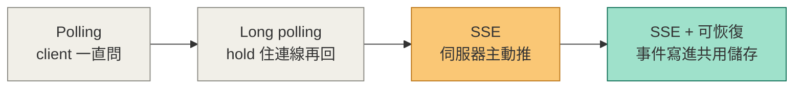
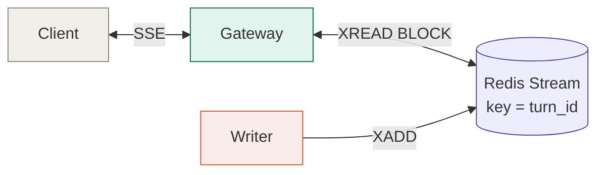
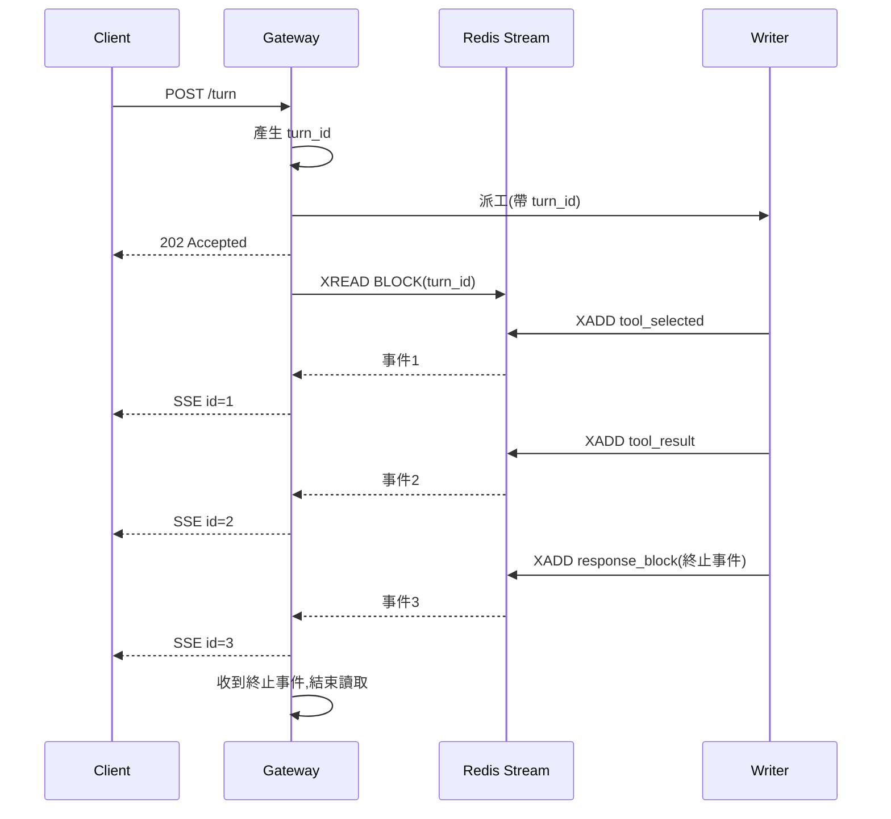
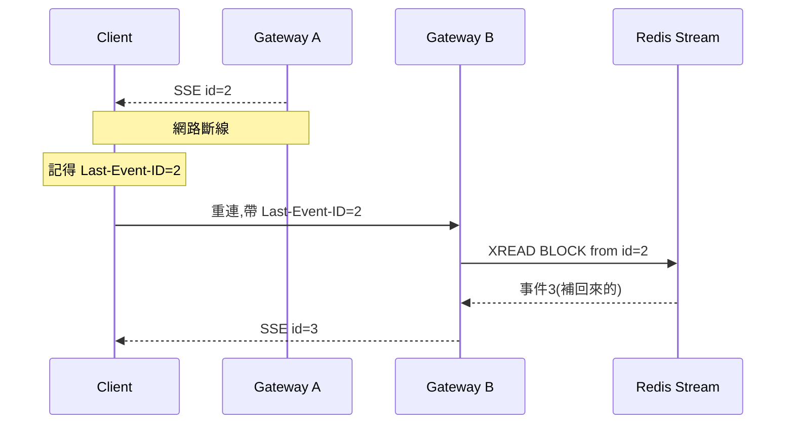
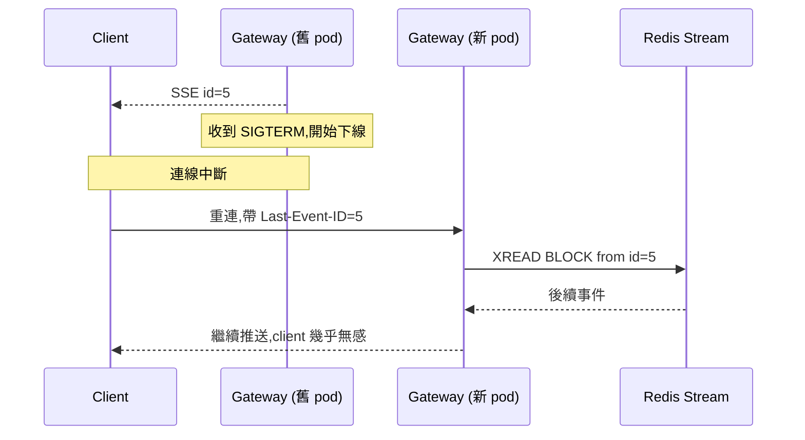
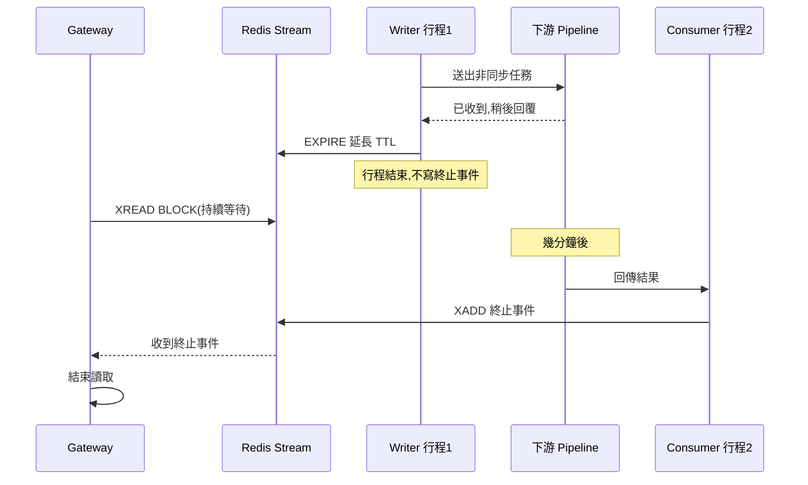

# Server Push 從零到一

如何設計一個可靠、可恢復的伺服器推播系統 — 從最簡單的做法開始,一步步加需求,一步步升級

## 目錄

1. [問題本質:跟 LLM 無關的通用題目](#1-問題本質跟-llm-無關的通用題目)
2. [從零開始:四種做法的演進](#2-從零開始四種做法的演進)
3. [收斂成四個硬性需求](#3-收斂成四個硬性需求)
4. [為什麼是 Redis Stream,不是 WebSocket / gRPC / Kafka](#4-為什麼是-redis-stream不是-websocket--grpc--kafka)
5. [最終架構](#5-最終架構)
   - [5.1 正常流程(Happy Path)](#51-正常流程happy-path)
6. [實作:一步一步寫出來(Go)](#6-實作一步一步寫出來go)
7. [Edge case 全解析](#7-edge-case-全解析)
8. [上線後要盯什麼指標](#8-上線後要盯什麼指標)

---

## 1. 問題本質:跟 LLM 無關的通用題目

拿掉 LLM 的外衣,這其實是個很老的分散式系統題目:

> **執行單位(process / pod)跟恢復單位(你要能重新連上、接續下去的邏輯單位)常常不是同一個東西。**

符合這個模式的場景很多:webhook 回呼、影片轉檔進度、訂單狀態推播、CI/CD 進度條、批次 job 的即時日誌。核心問題都一樣:

- 伺服器要「主動推」資訊給前端,不是前端一直問
- 連線會斷(網路、部署、pod 重啟),斷了要能接得上,不能重頭來過
- 負責處理的行程,可能跟負責推送的行程不是同一個

---

## 2. 從零開始:四種做法的演進

不要一開始就想 Redis Stream。從最土的做法開始,每一步都是因為上一步「卡在哪裡」才往前走。



### 2.1 Polling(輪詢)

```go
for {
    resp := httpGet("/status?id=" + taskID)
    if resp.Done { break }
    time.Sleep(2 * time.Second)
}
```

最簡單,但延遲跟資料庫負載綁在一起:輪得越快,延遲越低,DB QPS 也越高。1000 個進行中的任務、每秒 poll 一次,就是 1000 QPS 打在你的資料庫上,而且大部分查詢都是空的。

### 2.2 Long Polling

伺服器收到請求後不馬上回,而是「hold 住」連線,直到有新資料或逾時才回應。省掉了大部分空轉查詢,但每次回應後 client 還是要重新發一次請求,而且伺服器要同時撐住大量 hold 住的連線。

### 2.3 SSE(Server-Sent Events)— 基本版

伺服器開一條長連線,有新事件就直接往下推,不用 client 一直重新請求。這才是真正的「push」。

```go
func handler(w http.ResponseWriter, r *http.Request) {
    w.Header().Set("Content-Type", "text/event-stream")
    flusher := w.(http.Flusher)
    for event := range eventChan {
        fmt.Fprintf(w, "data: %s\n\n", event)
        flusher.Flush()
    }
}
```

**問題來了**:這條連線斷掉的話呢?`eventChan` 裡面在傳的東西,沒有人接住,直接消失。

### 2.4 SSE 加防護,發現三個新問題

**問題一:斷線後怎麼辦?**
SSE 協定本身有 `Last-Event-ID` 這個機制,client 重連時會帶上它,但**伺服器要自己實作「怎麼從這個 ID 之後把漏掉的事件補回來」**——協定只定義格式,沒有幫你做儲存跟回放。

**問題二:多台 gateway 怎麼辦?**
如果你的 gateway 有好幾台(負載平衡),斷線重連可能連到不同的那一台。新的那一台完全不知道原本的連線推到哪裡了——除非事件有個地方是**所有 gateway 都讀得到的共用位置**,而不是活在某一條連線或某個記憶體裡。

**問題三:負責處理的行程換了怎麼辦?**
如果處理邏輯把工作丟給另一個非同步系統,幾分鐘後才有結果回來,原本開著 SSE 連線的那個 process 可能早就結束或被殺掉了。誰來把遲來的結果接上這條(可能已經斷開又重連的)串流?

這三個問題的共同解法都是同一件事:**事件不能只活在連線裡,要寫進一個共用、可定址、有序的儲存,連線只是從那裡讀出來轉發而已。**

---

## 3. 收斂成四個硬性需求

| 需求 | 白話 |
|---|---|
| 伺服器主動推送 | 不能靠 client 一直問,要主動送 |
| 可從中斷點恢復 | 斷線重連要接續播放,不能重頭來過,也不能漏掉 |
| 無 topology 耦合 | 任何一台 gateway 都能接手任何一個任務,不用知道誰在處理 |
| 撐過部署 / pod 重啟 | rollout 不該打斷所有進行中的推送 |

> 真正決定性的需求是「可從中斷點恢復」。它聽起來像串流需求,其實是**可定址性(addressability)** 需求——你要能對系統說:「給我這個任務從位置 N 之後的事件」。這需要兩個東西:一個**名字**(認得是哪個任務),一個**游標**(認得讀到哪裡了)。

---

## 4. 為什麼是 Redis Stream,不是 WebSocket / gRPC / Kafka

| 方案 | 問題 |
|---|---|
| WebSocket / gRPC streaming | 本質是一條「管子(pipe)」,狀態活在連線裡。連線一斷,「讀到哪裡了」這個資訊也一起消失,無法回答「給我第 47 筆之後的事件」。要支援重連,還是得另外搭一個 replay storage——那既然都要有這個 store,不如一開始就直接讀它,連線本身就變得多餘。而且連線綁定在特定 pod 上,違反「無 topology 耦合」的需求。 |
| Kafka | 可定址單位是 **partition**,你要的可定址單位是**單一任務(turn)**。一個任務一個 partition 不現實(任務量大、生命週期短)。硬塞進共用 partition,就要自己在 offset 之上蓋一層「任務 ID 索引」——等於自己重造一個你原本要的東西。 |
| Redis Stream | 原生用一個 key(字串)當定址單位,每筆訊息自帶遞增 ID 當游標,`XREAD ... BLOCK` 原生支援「有新資料就推、沒有就等」,剛好三個需求都對上。 |

**補充:client ↔ gateway 這一層為什麼用 SSE 不用 WebSocket**

推送方向是單向的(server → client),用不到 WebSocket 的雙向能力。SSE 是純 HTTP,不用額外握手升級,瀏覽器原生 `EventSource` 內建自動重連並自動帶 `Last-Event-ID`。這個自動重連是加分項,但不是決定性因素——就算用 WebSocket 也能自己刻一樣的續傳邏輯,只是要多寫程式碼。真正的決策點是「單向推播不需要雙向協定的複雜度」。

---

## 5. 最終架構



兩個服務之間**沒有長連線,也不共享 topology 資訊**,唯一共同認得的東西是一個字串——`turn_id`(或你的場景裡可能叫 `task_id` / `job_id`)。

### 5.1 正常流程(Happy Path)



看著上面的圖走一遍:

1. **Client 送出請求**(`POST /turn`),不是打開一條長連線等答案,而是先送一個普通的 request。
2. **Gateway 產生 `turn_id`**——注意這一步在 gateway,不是在 agent。因為 gateway 之後要負責監聽這個 key,得先決定好監聽的地址。
3. **Gateway 把工作派給 agent**(帶著 `turn_id`),自己馬上回一個 **202 Accepted** 給 client——這只是「我收到了,開始處理了」的確認,不是最終答案。
4. Gateway 緊接著對同一個 `turn_id` 的 Redis key 發起 **`XREAD BLOCK`**,開始等事件出現。
5. **Agent 在背景非同步跑**它的處理迴圈,每完成一個階段就 **`XADD`** 一筆事件進去(選了什麼工具、工具回什麼、最後答案)。
6. Gateway 讀到一筆,就立刻透過 **SSE** 轉發給 client,並記住這筆事件的 ID。
7. 直到 agent 寫入**終止事件**(最後的答案),gateway 讀到這個標記後才結束這次的讀取迴圈,整個 turn 才算完成。

> **最值得記住的一點**:client 和 agent **從頭到尾沒有直接連線**,兩邊各自跟 Redis Stream 打交道,gateway 只是中間那個「轉發」的角色。這個設計看起來繞了一圈,但正是這個「不直接連線、只認 `turn_id` 這個名字」的安排,讓後面斷線重連、pod 重啟、跨行程接力這些情境都能用同一套機制處理,不用另外寫特殊邏輯。

---

## 6. 實作:一步一步寫出來(Go)

### 6.1 誰產生 ID?—— 一定是讀的那一方

> **ID 要由 gateway(讀者)產生,不是 agent(寫者)。** 因為讀者要先知道去哪裡讀,才不會有「事件先寫進去、但讀者還不知道 key 是什麼」的競態。

```go
func StartTask(ctx context.Context, req Request) (turnID string, err error) {
    turnID = uuid.NewString()
    key := "turn:" + turnID

    // 建立 key 的同時就設定過期時間,兩者必須是同一個原子操作
    pipe := redisClient.TxPipeline()
    pipe.XAdd(ctx, &redis.XAddArgs{
        Stream: key,
        Values: map[string]any{"type": "started"},
    })
    pipe.Expire(ctx, key, 10*time.Minute) // 寬鬆的初始 TTL
    if _, err = pipe.Exec(ctx); err != nil {
        return "", err
    }

    go dispatchToAgent(turnID, req) // 非同步派工,不等它做完
    return turnID, nil
}
```

**為什麼 XADD 跟 EXPIRE 要包在同一個原子操作裡?**
如果分成兩次呼叫,中間 process 被 SIGKILL,`XADD` 成功但 `EXPIRE` 沒執行到,這個 key 就永遠不會過期,變成資源洩漏。

### 6.2 Writer 端(agent 寫事件)

```go
func (a *Agent) Run(ctx context.Context, turnID string, req Request) {
    key := "turn:" + turnID
    emit := func(eventType string, data any) {
        payload, _ := json.Marshal(data)
        redisClient.XAdd(ctx, &redis.XAddArgs{
            Stream: key,
            Values: map[string]any{"type": eventType, "data": payload},
        })
    }

    emit("tool_selected", ToolSelection{Tool: "product_search"})
    result := callTool(ctx, "product_search", req)
    emit("tool_result", result)

    answer := buildAnswer(result)
    emit("response_block", answer) // 這是 terminal event

    redisClient.Expire(ctx, key, 5*time.Minute) // 完成後縮短 TTL 到重連窗口
}
```

### 6.3 Reader 端(gateway 轉發到 SSE)

```go
const terminalType = "response_block"

func RelayToSSE(ctx context.Context, w http.ResponseWriter, turnID, lastEventID string) {
    key := "turn:" + turnID
    cursor := lastEventID
    if cursor == "" {
        cursor = "0-0"
    }
    flusher := w.(http.Flusher)

    for {
        streams, err := redisClient.XRead(ctx, &redis.XReadArgs{
            Streams: []string{key, cursor},
            Block:   30 * time.Second,
        }).Result()

        if err == redis.Nil { // 30 秒內沒有新事件
            if checkTimeout(turnID) {
                fmt.Fprintf(w, "event: timeout\ndata: {}\n\n")
                flusher.Flush()
                return
            }
            continue // 繼續 block,等下一輪
        }
        if err != nil {
            return // client 斷線或 redis 錯誤,結束這次 relay
        }

        for _, msg := range streams[0].Messages {
            fmt.Fprintf(w, "id: %s\ndata: %s\n\n", msg.ID, msg.Values["data"])
            flusher.Flush()
            cursor = msg.ID

            if msg.Values["type"] == terminalType {
                return // 收到終止事件,結束這個 turn 的 relay
            }
        }
    }
}
```

> **關鍵細節:恢復點是 client 回報的 `Last-Event-ID`,不是 gateway 自己記的 cursor。**
> gateway 呼叫 `flusher.Flush()` 只代表寫進了 socket buffer,不代表 client 真的收到了。如果拿 gateway 自己的 cursor 來做重連依據,一個 gateway 剛送出但 client 還沒收到就斷線的事件就會永遠遺失。用 client 自己回報的 ID,最壞情況是**重複收到已經看過的事件**,而不會**靜默漏掉沒看過的事件**。重複可以在前端用 event ID 去重,遺漏則無法挽回。

### 6.4 SSE 端點與 client 重連

```
GET /tasks/{id}/stream
Last-Event-ID: 1755600000871-0   // client 重連時帶上這個 header
```

```go
func StreamHandler(w http.ResponseWriter, r *http.Request) {
    turnID := chi.URLParam(r, "id")
    lastEventID := r.Header.Get("Last-Event-ID")
    w.Header().Set("Content-Type", "text/event-stream")
    w.Header().Set("Cache-Control", "no-cache")
    RelayToSSE(r.Context(), w, turnID, lastEventID)
}
```

```js
// 前端(瀏覽器原生 EventSource 就內建重連機制)
const es = new EventSource(`/tasks/${turnID}/stream`);
es.onmessage = (e) => render(e.data);
// EventSource 斷線會自動重連,並自動帶上收到的最後一筆 event id
// 作為 Last-Event-ID header,不需要自己手刻
```

---

## 7. Edge case 全解析

### 7.1 斷線重連(換了一台 gateway)



重點:新的 gateway 完全是無狀態接手,它不需要知道原本是哪台在處理,只需要 `turn_id` 跟 client 回報的 `Last-Event-ID` 這兩個資訊就能繼續。

### 7.2 Gateway pod 被部署重啟



跟斷線重連本質是同一件事——對 client 來說,「pod 被重啟」看起來就是一次網路中斷,處理方式完全一樣。這正是這個設計的優雅之處:不用為部署場景寫特殊邏輯。

### 7.3 任務被暫停,由完全不同的行程完成



| 做法 | 為什麼 |
|---|---|
| 不寫終止事件(terminal event) | Reader 靠終止事件判斷「結束了嗎」,不寫就代表還沒結束,reader 會持續等 |
| 延長 TTL | Stream 的 key 要撐過非同步等待的那段時間,不能提前過期 |

後續完成的那個行程,靠訊息 payload 跟共用儲存(DB)重建它需要的狀態,寫入同一個 stream key,流程就自然接上了——完全不需要跟原本的行程有任何直接溝通。

### 7.4 Producer 在寫入 TTL 之前就掛了

如果 `XADD` 跟 `EXPIRE` 是兩次分開的呼叫,中間 pod 被 `SIGKILL`,`EXPIRE` 永遠不會執行,key 就會永久存在(記憶體洩漏)。**解法在 6.1 已經示範:用 pipeline / MULTI-EXEC 把兩者包成一個原子操作**,讓「建立 key」跟「設定初始 TTL」不可分割。

### 7.5 Client 消失了,但 producer 還在寫

Gateway 停止讀取(因為連線斷了),但**agent 不會知道**。它可能繼續跑完整個流程、把事件寫進 stream,直到 stream 自己的 TTL 到期才停止。這是**刻意接受的取捨**:讓 producer 主動偵測「有沒有人在讀」會增加系統複雜度,換來的節省通常不值得。真的在意這個成本的話,可以讓 gateway 在偵測到 client 斷線時寫一個 `XADD ... cancel_requested` 事件,agent 端在下一次要花大資源前檢查一下這個訊號。

### 7.6 重複事件 vs 遺漏事件

這個系統是 **at-least-once** 語意,不是 exactly-once。設計上刻意選擇「寧可重複,不可遺漏」:

- 前端用 SSE 的 event ID 天然去重(同個 ID 收兩次,忽略第二次)
- 如果事件內容本身不是幂等操作(例如「扣一次庫存」),不能只靠這層機制,底層業務邏輯要另外設計幂等 key

### 7.7 逾時偵測是輪詢式的,不是精確的

`XREAD ... BLOCK 30000` 每次最多等 30 秒才會回來檢查一次逾時。如果你設定「60 秒沒有事件就判定逾時」,實際觸發時間可能落在 **60~90 秒之間**(取決於在哪個 30 秒窗口內偵測到)。這對「安全網」等級的逾時來說沒問題,但不能拿來當精確 SLA 用。

### 7.8 Backpressure / 慢速消費者

如果 client 端網路很慢,`flusher.Flush()` 寫入 socket 的速度追不上 agent 產生事件的速度,要考慮:

- Gateway 端幫每個連線設一個寫入逾時(write deadline),避免一個慢 client 卡住整個 goroutine
- 如果事件量可能爆炸性成長(例如逐字元的 token stream),考慮在服務邊界做合併,只送「完整、可渲染」的區塊,而不是每個小 delta 都送一次——這正是原文章選擇不做 token-level streaming 的原因

### 7.9 Stream 沒有「關閉」的生命週期,只能靠過期

Redis Stream 是一個 key,不是一個有狀態機的物件,沒有 `close()` 這種操作。設計上把它當「暫時的傳輸層」用,不是永久儲存:

- 建立時設一個寬鬆的初始 TTL(防止行程死掉沒人清理)
- 完成時縮短 TTL 成一個「重連窗口」(例如 5 分鐘),讓合理範圍內的重連還能補到資料
- 過期後 client 再訪問應該收到明確的 `410 Gone`,而不是無限期 hang 住

### 7.10 重連時的 thundering herd

如果部署導致大量連線同時斷開(整批 gateway pod 重啟),所有 client 會在幾乎同一時間重連。緩解方式:

- Client 端重連加上小幅度隨機退避(jitter),避免所有連線在同一毫秒打回來
- 滾動式部署(rolling update),一次只重啟一小部分 pod,而不是全部同時下線

---

## 8. 上線後要盯什麼指標

| 指標 | 為什麼重要 |
|---|---|
| append → 轉發 client 的延遲 | Redis Stream ID 自帶寫入時間戳,可以算出「事件寫入」到「送到 client socket」的延遲,抓中位數跟 p99 |
| 重連率 | 異常升高代表網路或 gateway 部署有問題 |
| Stream key 數量與記憶體用量 | TTL 沒設好會造成 key 堆積,是最常見的營運事故來源 |
| 逾時觸發次數 | 過高代表下游(agent 或它呼叫的服務)普遍變慢 |
| 單一 stream 的事件數量分佈 | 異常大量事件的 turn 可能代表某個工具進入重試迴圈 |

---

> **總結一句話:** 選 transport 要圍繞「你需要恢復的單位」設計,而不是「你程式碼執行的單位」。執行是以 process 為單位,但如果你要的可靠性是以「一個任務 / 一次請求」為單位,那這個任務就需要有一個獨立於任何連線、任何 process 存在的**名字**。

---

*參考來源:

- [Building Resumable Real-Time LLM Streaming with Redis Streams](https://engg.glance.com/building-resumable-real-time-llm-streaming-with-redis-streams-09cfa9e79358) by Aditya Singh, Glance Engineering*

- https://notebook.google.com/notebook/43c9b25f-72c8-479d-8416-7d7be566abd2